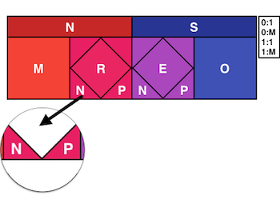

前言
====

### 願景

TEMSIS設計要能滿足未來十年對於資料的需求與變化


### FAQ

Q. 為了實務上能適用於全國，資料庫只能收集到最小的資料？


> 並不會。遵循美國國家EMS資料庫(NEMSIS)資料字典設計精神(National vs State)，以及Utstein資料字典設計精神(Core vs Supplemental)。資料將會分成兩種等級，國家級的(核心的)資料會以104年消防署建議救護紀錄表為標準，縣市等級的(補充的)資料則以北市、新北市、NEMSIS為參考加以制定。

Q. 如何應對未來資料的需求與變化？

> 情況1: 單純項目增加(Ex: 新增airway器材)，但並未增加項目

> 接收方(消防署資料庫)只需在項目列舉項(enumeration) 的介面上增加項目，系統於「上傳驗證資料正確性」即可接受新的項目項目。(註：各列舉項目需滿足互斥Eexclusive)

> 情況2: 縣市等級的(補充的)新項目增加。

> 接收方(消防署資料庫)須有軟體維護的更動代價，但其他縣市上傳方並不需要更改。（註：建議之更改週期為1~2年。ex TEMSIS v1.0 -> v1.1）

> 情況3: 國家級的(核心的)新項目增加。

> 全國各縣市上傳方，以及接收方(消防署資料庫)皆有軟體維護的更動代價。(註：建議之更改週期為10年。ex TEMSIS v1.x -> v2.0）

Q. 救護資料庫是否就是電子版的救護紀錄表？

> 不是。救護資料庫在於建立標準化的國家級EMS資料庫，使用共通的EMS電子記錄標準，來紀錄EMS出勤、人員表現。藉此幫助各項EMS計畫的發展，例如品質改善計畫、教育訓練、財政與倡議。

> 因與救護紀錄表根本目的不盡相同，故各式簽名(病人財務明細簽名、拒絕送醫簽名、傷病患/家屬關係人簽名，醫護人員簽名)並不會收錄救護資料庫。法律對於救護紀錄表規定之權責仍屬於各地消防局(例如：緊急醫療救護法第34條 - 救護紀錄表保存，緊急救護辦法第4條第3項 - 救護服務證明申請)

Q. 救護資料庫與部分縣市現行「OHCA登錄系統(OHCA Registry)」關係為何？

> 現行「OHCA登錄系統(OHCA Registry)」参考國際Utstein標準，建置OHCA資料分析之追蹤平台，特點是有效整合消防及衛生(醫院)單位，個案可追蹤到病人最終之結果

>「救護資料庫」則是參考美國NEMSIS標準，建置全國EMS資料庫，特點是蒐集整體救護資料。而「救護資料庫」當中OHCA相關項目其實也是參考國際Utstein標準，但缺少衛生(醫院)單位有關病人結果之輸入

> 整體來說，救護資料庫專注於整體救護資料（台灣約100萬件/年），而OHCA登錄系統專注於能完整分析與追蹤OHCA患者最終結果(統計上來說，發生率約整體救護案件1~2%，全國最多可收集1~2萬件/年)。建議兩者應同時存在，以期達到最好成效

### Element 屬性介紹


*National V.S. State*

National(N) - 必要

* **要求**此資料**應**被收集(**必要的、強制性的**)
* 就算資料項目空白也要傳，且要解釋(空白原因或補述)
* (軟體系統角度)：有更動代價**大** (沒有向下相容)
  * ex: NEMSIS v2 -> NEMSIS v3
* ex: 出勤單位、發生地點、生命徵象....

State(S) - 非必要

* **建議**此資料**得**被收集(**選擇性的**)
* (軟體系統角度)：有更動代價**小** (有向下相容)

  * ex: NEMSIS v3.3.x -> NEMSIS v3.4.x
* ex: 洛杉磯到院前中風評量LAPSS...


*Usage*

Mandatory(M)

* 屬於National(N) - 必要
* 必要且不可空白（不可使用NOT，後述）
* ex: 出勤單位、發生地點

Required(R)

* 屬於National(N) - 必要
* 必要，但可以留白（使用NOT，後述）
* ex: 生命徵象 => 拒測 Refused(8801019)

Recommended(E)

* 屬於State(S) - 非必要
* 非必要，可以留白
* ex: LAPSS握力測試異常 => 無意識 
Unresponsive (8801021)

Optional(O)

* 屬於State(S) - 非必要
* 非必要，不可留白
* ex: 脈搏測量方式



*空白原因(N) & 補述(P)*

空白原因(N) - NOT Values Accepted

* Not Applicable (7701001) - 此案件不需要填寫此項目
* Not Recorded (7701003) - 任何原因造成此項目空白
* Not Reporting (7701005) - 該EMS機關(軟體系統)並未記錄此項目

補述(P) - Pertinent Negative Values (PN)

* Contraindication Noted(8801001)
* Denied By Order(8801003)
* Exam Finding Not Present(8801005)
* Medication Allergy(8801007)
* Medication Already Taken(8801009)
* No Known Drug Allergy(8801013)
* None Reported(8801015)
* Not Performed by EMS(8801017)
* Refused(8801019)
* Unresponsive(8801021)
* Unable to Complete(8801023)


*Recurrence*

總共有四種組合

* 0:1
  * 該元件非必要(State: Recommended, Optional)，只能出現一次
* 0:M
  * 該元件非必要(State: Recommended, Optional)，可以出現多次
* 1:1
  * 必要(National: Mandatory, Required)，只能出現一次
* 1:M
  * 必要(National: Mandatory, Required)，可以出現多次

### Reference

* [內政部消防署 - 修正：消防機關救護紀錄表填寫作業原則](http://law.ndppc.nat.gov.tw/GNFA/Chi/fn4.asp?id=1392)
  * [104署版建議救護紀錄表](http://law.ndppc.nat.gov.tw/GNFA/Fn/downloadFile.asp?sdMsgId=1392&FileId=2680&His=)
* [美國國家EMS資訊系統 NEMSIS](http://nemsis.org/)
  * [NEMSIS Data Dictionary v3.4.0 Critical Patch 2](http://nemsis.org/media/nemsis_v3/release-3.4.0/DataDictionary/PDFHTML/DEMEMS/index.html)


EMSDataSet
==========

### Overview & Summary

TEMSIS 共19大類 約125項 
(必要項目64項)

* TEMSIS


*NEMSIS VS TEMSIS*

| |Section|NEMSIS|TEMSIS|
|:---|---|:---:|:---:|
|1|eRecord|4|5|
|2|eResponse|24|9|
|3|eDispatch|6|4|
|4|eCrew|3|4|
|5|eTimes|16|9|
|6|ePatient|21|9|
|7|ePayment|57|2|
|8|eScene|23|5|
|9|eSituation|18|7|
|10|eInjury|29|5|
|11|eArrest|18|13|
|12|eHistory|19|8|
|13|eNarrative|1|1|
|14|eVitals|33|21|
|15|eLabs|8|0|
|16|eExam|21|1|
|17|eProtocols|2|0|
|18|eMedications|12|4|
|19|eProcedures|13|2|
|20|eAirway|11|0|
|21|eDevice|12|0|
|22|eDisposition|26|10|
|23|eOutcome|17|6|
|24|eCustomResults|3|0|
|25|eCustomConfiguration|9|0|
|26|eOther|21|0|
|27|eState|1|0|
|||||
|||**428**|**125**|

以Section觀點，相較於NEMSIS

* TEMSIS 不包含： eLabs(8), eProtocols(2), eAirway(11), eDevice(12), eCustomResults(3), eCustomConfiguration(9), eOther(21), eState(1) 

### eRecord

#### eRecord.T01

* 項目名稱：救護紀錄表編號
* TEMSIS tag： recordNumber
* NEMSIS對應項目：eRecord.01
* 消防署填寫作業原則：各消防機關自行編訂

<table class="fixed">
    <col width="60px" />
    <col width="60px" />
    <col width="60px" />
    <col width="60px" />
    <tr>
    	<td height="20px" colspan="2" style="text-align:center; background-color:#C62828; color:#FFFFFF">N</td>
    	<td height="20px" colspan="2" style="text-align:center; background-color:#FFFFFF">S</td>
    </tr>
    <tr>
        <td height="60px" style="text-align:center; background-color:#F44336; color:#FFFFFF">M</td>
        <td height="60px" style="text-align:center; background-color:#FFFFFF">R</td>
        <td height="60px" style="text-align:center; background-color:#FFFFFF">E</td>
        <td height="60px" style="text-align:center; background-color:#FFFFFF">O</td>
    </tr>;
    <tr>
        <td height="20px" style="text-align:center; background-color:#00882B; color:#FFFFFF">1:1</td>
        <td height="20px" style="text-align:center; background-color:#FFFFFF">1:M</td>
        <td height="20px" style="text-align:center; background-color:#FFFFFF">0:1</td>
        <td height="20px" style="text-align:center; background-color:#FFFFFF">0:M</td>
    </tr>
</table>

* 資料型態：字串
* 字串長度：30
* 說明：
  * 上傳方有義務保證編號的唯一性
編碼規則
    * 1~4碼：西元年(4碼)
    * 5~6碼：月(2碼)
    * 7~8碼：日(2碼)
    * 9~14碼：區域(6碼)
    * 15~22碼：自訂碼(8碼)
    
  * 編碼中「區域」是以全國消防署組織上來分類(例如基隆港、臺中港、高雄港、花蓮港)，非地理分區資訊

區域|代碼
---|---
新北市|101001
臺北市|101002
桃園市|101003
臺中市|101004
臺南市|101005
高雄市|101006
宜蘭縣|101007
新竹縣|101008
苗栗縣|101009
彰化縣|101010
南投縣|101011
雲林縣|101012
嘉義縣|101013
屏東縣|101014
臺東縣|101015
花蓮縣|101016
澎湖縣|101017
基隆市|101018
新竹市|101019
嘉義市|101020
金門縣|101021
連江縣|101022
基隆港|101023
臺中港|101024
高雄港|101025
花蓮港|101026

#### eRecord.T02

* 項目名稱：區域
* TEMSIS tag： area
* NEMSIS對應項目：無
* 消防署填寫作業原則：無

<table class="fixed">
    <col width="60px" />
    <col width="60px" />
    <col width="60px" />
    <col width="60px" />
    <tr>
        <td height="20px" colspan="2" style="text-align:center; background-color:#C62828; color:#FFFFFF">N</td>
        <td height="20px" colspan="2" style="text-align:center; background-color:#FFFFFF">S</td>
    </tr>
    <tr>
        <td height="60px" style="text-align:center; background-color:#F44336; color:#FFFFFF">M</td>
        <td height="60px" style="text-align:center; background-color:#FFFFFF">R</td>
        <td height="60px" style="text-align:center; background-color:#FFFFFF">E</td>
        <td height="60px" style="text-align:center; background-color:#FFFFFF">O</td>
    </tr>;
    <tr>
        <td height="20px" style="text-align:center; background-color:#00882B; color:#FFFFFF">1:1</td>
        <td height="20px" style="text-align:center; background-color:#FFFFFF">1:M</td>
        <td height="20px" style="text-align:center; background-color:#FFFFFF">0:1</td>
        <td height="20px" style="text-align:center; background-color:#FFFFFF">0:M</td>
    </tr>
</table>

* 資料型態：字串(代碼)
* 字串長度：30
* 說明：
  * 編碼中「區域」是以全國消防署組織上來分類(例如基隆港、臺中港、高雄港、花蓮港)，非地理分區資訊
  * 資料庫處理上有大量須以區域來選取分組，單獨一個項目來紀錄(foreign key概念)

區域|代碼
---|---
新北市|101001
臺北市|101002
桃園市|101003
臺中市|101004
臺南市|101005
高雄市|101006
宜蘭縣|101007
新竹縣|101008
苗栗縣|101009
彰化縣|101010
南投縣|101011
雲林縣|101012
嘉義縣|101013
屏東縣|101014
臺東縣|101015
花蓮縣|101016
澎湖縣|101017
基隆市|101018
新竹市|101019
嘉義市|101020
金門縣|101021
連江縣|101022
基隆港|101023
臺中港|101024
高雄港|101025
花蓮港|101026

#### eRecord.T03

* 項目名稱：軟體名稱編號
* TEMSIS tag： softwareName
* NEMSIS對應項目：eRecord.03
* 消防署填寫作業原則：無

<table class="fixed">
    <col width="60px" />
    <col width="60px" />
    <col width="60px" />
    <col width="60px" />
    <tr>
    	<td height="20px" colspan="2" style="text-align:center; background-color:#C62828; color:#FFFFFF">N</td>
    	<td height="20px" colspan="2" style="text-align:center; background-color:#FFFFFF">S</td>
    </tr>
    <tr>
        <td height="60px" style="text-align:center; background-color:#F44336; color:#FFFFFF">M</td>
        <td height="60px" style="text-align:center; background-color:#FFFFFF">R</td>
        <td height="60px" style="text-align:center; background-color:#FFFFFF">E</td>
        <td height="60px" style="text-align:center; background-color:#FFFFFF">O</td>
    </tr>;
    <tr>
        <td height="20px" style="text-align:center; background-color:#00882B; color:#FFFFFF">1:1</td>
        <td height="20px" style="text-align:center; background-color:#FFFFFF">1:M</td>
        <td height="20px" style="text-align:center; background-color:#FFFFFF">0:1</td>
        <td height="20px" style="text-align:center; background-color:#FFFFFF">0:M</td>
    </tr>
</table>

* 資料型態：字串
* 字串長度：30
* 說明：
  * 填寫的是軟體名稱的ID。當上傳軟體廠商認證過，會分派一個代表此軟體名稱的ID
  * eRecord.T03~T05 是為了軟體及資料版本控制與分析使用

#### eRecord.T04

* 項目名稱：軟體版本
* TEMSIS tag： softwareVersion
* NEMSIS對應項目：eRecord.04
* 消防署填寫作業原則：無

<table class="fixed">
    <col width="60px" />
    <col width="60px" />
    <col width="60px" />
    <col width="60px" />
    <tr>
    	<td height="20px" colspan="2" style="text-align:center; background-color:#C62828; color:#FFFFFF">N</td>
    	<td height="20px" colspan="2" style="text-align:center; background-color:#FFFFFF">S</td>
    </tr>
    <tr>
        <td height="60px" style="text-align:center; background-color:#F44336; color:#FFFFFF">M</td>
        <td height="60px" style="text-align:center; background-color:#FFFFFF">R</td>
        <td height="60px" style="text-align:center; background-color:#FFFFFF">E</td>
        <td height="60px" style="text-align:center; background-color:#FFFFFF">O</td>
    </tr>;
    <tr>
        <td height="20px" style="text-align:center; background-color:#00882B; color:#FFFFFF">1:1</td>
        <td height="20px" style="text-align:center; background-color:#FFFFFF">1:M</td>
        <td height="20px" style="text-align:center; background-color:#FFFFFF">0:1</td>
        <td height="20px" style="text-align:center; background-color:#FFFFFF">0:M</td>
    </tr>
</table>

* 資料型態：字串
* 字串長度：30
* 說明：
  * 軟體廠商自行編訂，但建議以業界通用版本方式制定 X.Y.Z (Major.Minor.Patch)

#### eRecord.T05

* 項目名稱：TEMSIS交換格式版本
* TEMSIS tag： TEMSISVersion
* NEMSIS對應項目：無
* 消防署填寫作業原則：無

<table class="fixed">
    <col width="60px" />
    <col width="60px" />
    <col width="60px" />
    <col width="60px" />
    <tr>
    	<td height="20px" colspan="2" style="text-align:center; background-color:#C62828; color:#FFFFFF">N</td>
    	<td height="20px" colspan="2" style="text-align:center; background-color:#FFFFFF">S</td>
    </tr>
    <tr>
        <td height="60px" style="text-align:center; background-color:#F44336; color:#FFFFFF">M</td>
        <td height="60px" style="text-align:center; background-color:#FFFFFF">R</td>
        <td height="60px" style="text-align:center; background-color:#FFFFFF">E</td>
        <td height="60px" style="text-align:center; background-color:#FFFFFF">O</td>
    </tr>;
    <tr>
        <td height="20px" style="text-align:center; background-color:#00882B; color:#FFFFFF">1:1</td>
        <td height="20px" style="text-align:center; background-color:#FFFFFF">1:M</td>
        <td height="20px" style="text-align:center; background-color:#FFFFFF">0:1</td>
        <td height="20px" style="text-align:center; background-color:#FFFFFF">0:M</td>
    </tr>
</table>

* 資料型態：字串
* 字串長度：30
* 說明：
  * 根據TEMSIS交換格式版本，例如TEMSIS Data Exchange format 1.0.0版則此項目帶入"1.0.0"

### eResponse

#### eResponse.T01

* 項目名稱：出勤分隊編號(全國)
* TEMSIS tag： EMSAgentNumber
* NEMSIS對應項目：eResponse.01
* 消防署填寫作業原則：無

<table class="fixed">
    <col width="60px" />
    <col width="60px" />
    <col width="60px" />
    <col width="60px" />
    <tr>
    	<td height="20px" colspan="2" style="text-align:center; background-color:#C62828; color:#FFFFFF">N</td>
    	<td height="20px" colspan="2" style="text-align:center; background-color:#FFFFFF">S</td>
    </tr>
    <tr>
        <td height="60px" style="text-align:center; background-color:#F44336; color:#FFFFFF">M</td>
        <td height="60px" style="text-align:center; background-color:#FFFFFF">R</td>
        <td height="60px" style="text-align:center; background-color:#FFFFFF">E</td>
        <td height="60px" style="text-align:center; background-color:#FFFFFF">O</td>
    </tr>;
    <tr>
        <td height="20px" style="text-align:center; background-color:#00882B; color:#FFFFFF">1:1</td>
        <td height="20px" style="text-align:center; background-color:#FFFFFF">1:M</td>
        <td height="20px" style="text-align:center; background-color:#FFFFFF">0:1</td>
        <td height="20px" style="text-align:center; background-color:#FFFFFF">0:M</td>
    </tr>
</table>

* 資料型態：字串
* 字串長度：30
* 說明：
  * 代表的是單位分隊(agent)，例如「新北市社后分隊」的編號ID
  * 全國各分隊編碼，於各縣市導入時需填寫其縣市分隊「分隊資料管理(名稱、縣市、鄉鎮市區、GPS)」入資料庫後會有其分派的ID

#### eResponse.T02

* 項目名稱：出勤車輛號碼
* TEMSIS tag： EMSVehicleNumber
* NEMSIS對應項目：eResponse.13
* 消防署填寫作業原則：無

<table class="fixed">
    <col width="60px" />
    <col width="60px" />
    <col width="60px" />
    <col width="60px" />
    <tr>
        <td height="20px" colspan="2" style="text-align:center; background-color:#FFFFFF">N</td>
        <td height="20px" colspan="2" style="text-align:center; background-color:#283593; color:#FFFFFF">S</td>
    </tr>
    <tr>
        <td height="60px" style="text-align:center; background-color:#FFFFFF">M</td>
        <td height="60px" style="text-align:center; background-color:#FFFFFF">R</td>
        <td height="60px" style="text-align:center; background-color:#FFFFFF">E</td>
        <td height="60px" style="text-align:center; background-color:#3F51B5; color:#FFFFFF">O</td>
    </tr>;
    <tr>
        <td height="20px" style="text-align:center; background-color:#FFFFFF">1:1</td>
        <td height="20px" style="text-align:center; background-color:#FFFFFF">1:M</td>
        <td height="20px" style="text-align:center; background-color:#00882B; color:#FFFFFF">0:1</td>
        <td height="20px" style="text-align:center; background-color:#FFFFFF">0:M</td>
    </tr>
</table>

* 資料型態：字串
* 字串長度：30
* 說明：
  * 出勤車輛號碼(車牌)，可作為出勤車輛方面之研究（ex: 車種可靠度...等）

#### eResponse.T03

* 項目名稱：出勤單位
* TEMSIS tag： EMSUnit
* NEMSIS對應項目：eResponse.14
* 消防署填寫作業原則：以分隊名稱與救護車類別，用文字及數字記載，例龍潭91

<table class="fixed">
    <col width="60px" />
    <col width="60px" />
    <col width="60px" />
    <col width="60px" />
    <tr>
    	<td height="20px" colspan="2" style="text-align:center; background-color:#C62828; color:#FFFFFF">N</td>
    	<td height="20px" colspan="2" style="text-align:center; background-color:#FFFFFF">S</td>
    </tr>
    <tr>
        <td height="60px" style="text-align:center; background-color:#F44336; color:#FFFFFF">M</td>
        <td height="60px" style="text-align:center; background-color:#FFFFFF">R</td>
        <td height="60px" style="text-align:center; background-color:#FFFFFF">E</td>
        <td height="60px" style="text-align:center; background-color:#FFFFFF">O</td>
    </tr>;
    <tr>
        <td height="20px" style="text-align:center; background-color:#00882B; color:#FFFFFF">1:1</td>
        <td height="20px" style="text-align:center; background-color:#FFFFFF">1:M</td>
        <td height="20px" style="text-align:center; background-color:#FFFFFF">0:1</td>
        <td height="20px" style="text-align:center; background-color:#FFFFFF">0:M</td>
    </tr>
</table>

* 資料型態：字串
* 字串長度：30
* 說明：
  * 代表的是車輛Unit，例如「社后91」，純文字字串填入
  * 代表是「任務編號(呼號)」、不是「車輛編號」
  * 雖項目為文字，但使用者介面設計須加以考量不應讓使用者每次填打文字 (例如：可使用下拉式選單或其他合適之使用者介面)

#### eResponse.T04

* 項目名稱：出勤單位地點
* TEMSIS tag： vehicleDispatchLocation
* NEMSIS對應項目：eResponse.16
* 消防署填寫作業原則：無

<table class="fixed">
    <col width="60px" />
    <col width="60px" />
    <col width="60px" />
    <col width="60px" />
    <tr>
    	<td height="20px" colspan="2" style="text-align:center; background-color:#FFFFFF">N</td>
    	<td height="20px" colspan="2" style="text-align:center; background-color:#283593; color:#FFFFFF">S</td>
    </tr>
    <tr>
        <td height="60px" style="text-align:center; background-color:#FFFFFF">M</td>
        <td height="60px" style="text-align:center; background-color:#FFFFFF">R</td>
        <td height="60px" style="text-align:center; background-color:#FFFFFF">E</td>
        <td height="60px" style="text-align:center; background-color:#3F51B5; color:#FFFFFF">O</td>
    </tr>;
    <tr>
        <td height="20px" style="text-align:center; background-color:#FFFFFF">1:1</td>
        <td height="20px" style="text-align:center; background-color:#FFFFFF">1:M</td>
        <td height="20px" style="text-align:center; background-color:#00882B; color:#FFFFFF">0:1</td>
        <td height="20px" style="text-align:center; background-color:#FFFFFF">0:M</td>
    </tr>
</table>

* 資料型態：字串
* 字串長度：100
* 說明：
  * 為派遣當時車輛所在地點，不一定等同駐地地點
  * eResponse.T04~T07 皆為出勤單位(派遣當時車輛所在)之地理資訊欄位，各縣市可依照軟硬體規劃選填精確之GPS資料或粗略區域劃分地點

#### eResponse.T05

* 項目名稱：出勤單位地點GPS
* TEMSIS tag： vehicleDispatchGPSLocation
* NEMSIS對應項目：eResponse.17
* 消防署填寫作業原則：無

<table class="fixed">
    <col width="60px" />
    <col width="60px" />
    <col width="60px" />
    <col width="60px" />
    <tr>
    	<td height="20px" colspan="2" style="text-align:center; background-color:#FFFFFF">N</td>
    	<td height="20px" colspan="2" style="text-align:center; background-color:#283593; color:#FFFFFF">S</td>
    </tr>
    <tr>
        <td height="60px" style="text-align:center; background-color:#FFFFFF">M</td>
        <td height="60px" style="text-align:center; background-color:#FFFFFF">R</td>
        <td height="60px" style="text-align:center; background-color:#FFFFFF">E</td>
        <td height="60px" style="text-align:center; background-color:#3F51B5; color:#FFFFFF">O</td>
    </tr>;
    <tr>
        <td height="20px" style="text-align:center; background-color:#FFFFFF">1:1</td>
        <td height="20px" style="text-align:center; background-color:#FFFFFF">1:M</td>
        <td height="20px" style="text-align:center; background-color:#00882B; color:#FFFFFF">0:1</td>
        <td height="20px" style="text-align:center; background-color:#FFFFFF">0:M</td>
    </tr>
</table>

* 資料型態：字串
* 字串長度：30
* 說明：
  * 格式：緯度,經度(latitude,longitude), Decimal Degree (DD)表示
  * TWD97/WGS84
  * 例內政部消防署位置為 24.983445, 121.541582
  * 可使用google map確認位置。https://www.google.com.tw/maps?q=24.983445,121.541582

#### eResponse.T06

* 項目名稱：出勤單位地點-縣市
* TEMSIS tag： vehicleDispatchCityCounty
* NEMSIS對應項目：eResponse.18
* 消防署填寫作業原則：無

<table class="fixed">
    <col width="60px" />
    <col width="60px" />
    <col width="60px" />
    <col width="60px" />
    <tr>
    	<td height="20px" colspan="2" style="text-align:center; background-color:#FFFFFF">N</td>
    	<td height="20px" colspan="2" style="text-align:center; background-color:#283593; color:#FFFFFF">S</td>
    </tr>
    <tr>
        <td height="60px" style="text-align:center; background-color:#FFFFFF">M</td>
        <td height="60px" style="text-align:center; background-color:#FFFFFF">R</td>
        <td height="60px" style="text-align:center; background-color:#FFFFFF">E</td>
        <td height="60px" style="text-align:center; background-color:#3F51B5; color:#FFFFFF">O</td>
    </tr>;
    <tr>
        <td height="20px" style="text-align:center; background-color:#FFFFFF">1:1</td>
        <td height="20px" style="text-align:center; background-color:#FFFFFF">1:M</td>
        <td height="20px" style="text-align:center; background-color:#00882B; color:#FFFFFF">0:1</td>
        <td height="20px" style="text-align:center; background-color:#FFFFFF">0:M</td>
    </tr>
</table>

* 資料型態：字串(代碼)
* 字串長度：30
* 說明：
  * 編碼採用「內政部地政司土地段名代碼」https://www.land.moi.gov.tw/ngis/chhtml/query4.asp?dnformat=2
  * 例：臺北市縣市代碼 "A"

#### eResponse.T07

* 項目名稱：出勤單位地點-鄉鎮市區
* TEMSIS tag： vehicleDispatchDistrict
* NEMSIS對應項目：eResponse.18
* 消防署填寫作業原則：無

<table class="fixed">
    <col width="60px" />
    <col width="60px" />
    <col width="60px" />
    <col width="60px" />
    <tr>
    	<td height="20px" colspan="2" style="text-align:center; background-color:#FFFFFF">N</td>
    	<td height="20px" colspan="2" style="text-align:center; background-color:#283593; color:#FFFFFF">S</td>
    </tr>
    <tr>
        <td height="60px" style="text-align:center; background-color:#FFFFFF">M</td>
        <td height="60px" style="text-align:center; background-color:#FFFFFF">R</td>
        <td height="60px" style="text-align:center; background-color:#FFFFFF">E</td>
        <td height="60px" style="text-align:center; background-color:#3F51B5; color:#FFFFFF">O</td>
    </tr>;
    <tr>
        <td height="20px" style="text-align:center; background-color:#FFFFFF">1:1</td>
        <td height="20px" style="text-align:center; background-color:#FFFFFF">1:M</td>
        <td height="20px" style="text-align:center; background-color:#00882B; color:#FFFFFF">0:1</td>
        <td height="20px" style="text-align:center; background-color:#FFFFFF">0:M</td>
    </tr>
</table>

* 資料型態：字串(代碼)
* 字串長度：30
* 說明：
  * 編碼採用「內政部地政司土地段名代碼」https://www.land.moi.gov.tw/ngis/chhtml/query4.asp?dnformat=2
  * 例：鄉鎮市區臺北市內湖區代碼"14"

#### eResponse.T08

* 項目名稱：受案單位
* TEMSIS tag： dispatchType
* NEMSIS對應項目：無
* 消防署填寫作業原則：以接獲民眾請求救護之單位，用勾選方式，就「救災救護指揮中心」或「分隊自行受理」單一勾選。若勾選「分隊自行受理」則於旁註記24小時制時間

<table class="fixed">
    <col width="60px" />
    <col width="60px" />
    <col width="60px" />
    <col width="60px" />
    <tr>
    	<td height="20px" colspan="2" style="text-align:center; background-color:#C62828; color:#FFFFFF">N</td>
    	<td height="20px" colspan="2" style="text-align:center; background-color:#FFFFFF">S</td>
    </tr>
    <tr>
        <td height="60px" style="text-align:center; background-color:#F44336; color:#FFFFFF">M</td>
        <td height="60px" style="text-align:center; background-color:#FFFFFF">R</td>
        <td height="60px" style="text-align:center; background-color:#FFFFFF">E</td>
        <td height="60px" style="text-align:center; background-color:#FFFFFF">O</td>
    </tr>;
    <tr>
        <td height="20px" style="text-align:center; background-color:#00882B; color:#FFFFFF">1:1</td>
        <td height="20px" style="text-align:center; background-color:#FFFFFF">1:M</td>
        <td height="20px" style="text-align:center; background-color:#FFFFFF">0:1</td>
        <td height="20px" style="text-align:center; background-color:#FFFFFF">0:M</td>
    </tr>
</table>

* 資料型態：字串(代碼)
* 字串長度：30
* 說明：

受案單位|代碼
---|---
救災救護指揮中心|102001
分隊自行受理|102002

#### eResponse.T09

* 項目名稱：協同處理單位
* TEMSIS tag： otherSupportUnit
* NEMSIS對應項目：無
* 消防署填寫作業原則：依實際支援之單位填寫，如信義91、110、信義11…等

<table class="fixed">
    <col width="60px" />
    <col width="60px" />
    <col width="60px" />
    <col width="60px" />
    <tr>
    	<td height="20px" colspan="2" style="text-align:center; background-color:#C62828; color:#FFFFFF">N</td>
    	<td height="20px" colspan="2" style="text-align:center; background-color:#FFFFFF">S</td>
    </tr>
    <tr>
        <td height="60px" style="text-align:center; background-color:#FFFFFF">M</td>
        <td height="60px" style="text-align:center; background-color:#E91E63; color:#FFFFFF">R</td>
        <td height="60px" style="text-align:center; background-color:#FFFFFF">E</td>
        <td height="60px" style="text-align:center; background-color:#FFFFFF">O</td>
    </tr>;
    <tr>
        <td height="20px" style="text-align:center; background-color:#00882B; color:#FFFFFF">1:1</td>
        <td height="20px" style="text-align:center; background-color:#FFFFFF">1:M</td>
        <td height="20px" style="text-align:center; background-color:#FFFFFF">0:1</td>
        <td height="20px" style="text-align:center; background-color:#FFFFFF">0:M</td>
    </tr>
</table>

* 資料型態：字串
* 字串長度：100
* 說明：
  * 文字輸入，不限格式(free texting)
  * 依實際支援之單位填寫，如信義91、110、信義11…等

### eDispatch

#### eDispatch.T01

* 項目名稱：派遣通報狀況
* TEMSIS tag： dispatchComplaint
* NEMSIS對應項目：eDispatch.01
* 消防署填寫作業原則：無


<table class="fixed">
    <col width="60px" />
    <col width="60px" />
    <col width="60px" />
    <col width="60px" />
    <tr>
    	<td height="20px" colspan="2" style="text-align:center; background-color:#FFFFFF">N</td>
    	<td height="20px" colspan="2" style="text-align:center; background-color:#283593; color:#FFFFFF">S</td>
    </tr>
    <tr>
        <td height="60px" style="text-align:center; background-color:#FFFFFF">M</td>
        <td height="60px" style="text-align:center; background-color:#FFFFFF">R</td>
        <td height="60px" style="text-align:center; background-color:#FFFFFF">E</td>
        <td height="60px" style="text-align:center; background-color:#3F51B5; color:#FFFFFF">O</td>
    </tr>;
    <tr>
        <td height="20px" style="text-align:center; background-color:#FFFFFF">1:1</td>
        <td height="20px" style="text-align:center; background-color:#FFFFFF">1:M</td>
        <td height="20px" style="text-align:center; background-color:#00882B; color:#FFFFFF">0:1</td>
        <td height="20px" style="text-align:center; background-color:#FFFFFF">0:M</td>
    </tr>
</table>

* 資料型態：字串(代碼)
* 字串長度：30
* 說明：
  * 現行署版救護紀錄表 雖有「現場狀況」但基本上填寫的是「經EMT接觸到傷病患後判斷現場狀況」，沒有獨立項目紀錄派遣令紀錄的通報狀況
  * 代碼參考北市「緊急醫療救護派遣手冊_931227」34項
  * 另增加實務派遣可能項目（參考NEMSIS） - 「火場患者」、「現場待命」、「空中救護後轉送」、「流感/疫情」、「其他」

創傷/非創傷|派遣通報狀況|代碼
---|---|---
非創傷|心跳/呼吸停止|103101
|哽塞|103102
|呼吸問題|103103
|腦中風|103104
|抽搐／痙攣|103105
|認識的人意識不清/暈厥|103106
|心臟問題|103107
|糖尿病問題|103108
|胸痛|103109
|腹痛/腹部的問題|103110
|頭痛|103111
|背痛|103112
|認識的有病的人/不明診斷|103113
|藥物過量/中毒|103114
|不認識的人/路倒|103115
|過敏/藥物反應/昆蟲叮咬|103116
|一氧化碳中毒/吸入/危險性物質|103117
|懷孕/生產/流產|103118
|精神/行為問題|103119
|非外傷性出血|103120
創傷|交通傷害意外事件|103201
|落下/跌倒摔傷|103202
|燒傷|103203
|刺/槍傷|103204
|外傷出血|103205
|工業/機械意外事件|103206
|眼睛問題|103207
|攻擊/強姦|103208
|熱/冷暴露|103209
|電擊|103210
|溺斃(溺水)/潛水意外事外|103211
|動物咬傷|103212
|特殊型創傷事件|103213
|頭部外傷|103214
|火場患者|103215
|現場待命|103216
|空中救護後轉送|103217
|流感/疫情|103218
|其他|103219

* (以下為參考資料)

* NEMSIS分類對應表

NEMSIS code|NEMSIS Name|TEMSIS Name
---|---|---
2301001|Abdominal Pain/Problems|腹痛/腹部的問題
2301003|Allergic Reaction/Stings|過敏/藥物反應/昆蟲叮咬
2301005|Animal Bite|動物咬傷
2301007|Assault|攻擊/強姦
2301009|Automated Crash Notification|(無對應)
2301011|Back Pain (Non-Traumatic)|背痛
2301013|Breathing Problem|呼吸問題
2301015|Burns/Explosion|燒傷
2301017|Carbon Monoxide/Hazmat/Inhalation/CBRN|一氧化碳中毒/吸入/危險性物質
2301019|Cardiac Arrest/Death|心跳/呼吸停止
2301021|Chest Pain (Non-Traumatic)|胸痛
2301023|Choking|哽塞
2301025|Convulsions/Seizure|抽搐／痙攣
2301027|Diabetic Problem|糖尿病問題
2301029|Electrocution/Lightning|電擊
2301031|Eye Problem/Injury|眼睛問題
2301033|Falls|落下/跌倒摔傷
2301035|Fire|(火場患者)
2301037|Headache|頭痛
2301039|Healthcare Professional/Admission|(無對應)
2301041|Heart Problems/AICD|心臟問題
2301043|Heat/Cold Exposure|熱/冷暴露
2301045|Hemorrhage/Laceration|外傷出血
2301047|Industrial Accident/Inaccessible Incident/Other Entrapments (Non-Vehicle)|工業/機械意外事件
2301049|Medical Alarm|(無對應)
2301051|No Other Appropriate Choice|(其他)
2301053|Overdose/Poisoning/Ingestion|藥物過量/中毒
2301055|Pandemic/Epidemic/Outbreak|(流感/疫情)
2301057|Pregnancy/Childbirth/Miscarriage|懷孕/生產/流產
2301059|Psychiatric Problem/Abnormal Behavior/Suicide Attempt|精神/行為問題
2301061|Sick Person|(無對應)
2301063|Stab/Gunshot Wound/Penetrating Trauma|刺/槍傷
2301065|Standby|(現場待命)
2301067|Stroke/CVA|腦中風
2301069|Traffic/Transportation Incident|交通傷害意外事件
2301071|Transfer/Interfacility/Palliative Care|(無對應)
2301073|Traumatic Injury|(無對應)
2301075|Well Person Check|(無對應)
2301077|Unconscious/Fainting/Near-Fainting|認識的人意識不清/暈厥
2301079|Unknown Problem/Person Down|不認識的人/路倒
2301081|Drowning/Diving/SCUBA Accident|溺斃(溺水)/潛水意外事外
2301083|Airmedical Transport|(空中救護後轉送)

#### eDispatch.T02

* 項目名稱：派遣員身分證字號
* TEMSIS tag： dispatcherID
* NEMSIS對應項目：無
* 消防署填寫作業原則：無

<table class="fixed">
    <col width="60px" />
    <col width="60px" />
    <col width="60px" />
    <col width="60px" />
    <tr>
        <td height="20px" colspan="2" style="text-align:center; background-color:#FFFFFF">N</td>
        <td height="20px" colspan="2" style="text-align:center; background-color:#283593; color:#FFFFFF">S</td>
    </tr>
    <tr>
        <td height="60px" style="text-align:center; background-color:#FFFFFF">M</td>
        <td height="60px" style="text-align:center; background-color:#FFFFFF">R</td>
        <td height="60px" style="text-align:center; background-color:#FFFFFF">E</td>
        <td height="60px" style="text-align:center; background-color:#3F51B5; color:#FFFFFF">O</td>
    </tr>;
    <tr>
        <td height="20px" style="text-align:center; background-color:#FFFFFF">1:1</td>
        <td height="20px" style="text-align:center; background-color:#FFFFFF">1:M</td>
        <td height="20px" style="text-align:center; background-color:#00882B; color:#FFFFFF">0:1</td>
        <td height="20px" style="text-align:center; background-color:#FFFFFF">0:M</td>
    </tr>
</table>

* 資料型態：字串
* 字串長度：30
* 說明：
  * 記錄派遣員ID(身分證字號)
  * 若有身份證資料，則需驗證 https://zh.wikipedia.org/wiki/%E4%B8%AD%E8%8F%AF%E6%B0%91%E5%9C%8B%E5%9C%8B%E6%B0%91%E8%BA%AB%E5%88%86%E8%AD%89#.E7.B7.A8.E8.99.9F.E8.A6.8F.E5.89.87

#### eDispatch.T03

* 項目名稱：派遣層級
* TEMSIS tag： dispatchLevel
* NEMSIS對應項目：eDispatch.05
* 消防署填寫作業原則：無

<table class="fixed">
    <col width="60px" />
    <col width="60px" />
    <col width="60px" />
    <col width="60px" />
    <tr>
        <td height="20px" colspan="2" style="text-align:center; background-color:#FFFFFF">N</td>
        <td height="20px" colspan="2" style="text-align:center; background-color:#283593; color:#FFFFFF">S</td>
    </tr>
    <tr>
        <td height="60px" style="text-align:center; background-color:#FFFFFF">M</td>
        <td height="60px" style="text-align:center; background-color:#FFFFFF">R</td>
        <td height="60px" style="text-align:center; background-color:#FFFFFF">E</td>
        <td height="60px" style="text-align:center; background-color:#3F51B5; color:#FFFFFF">O</td>
    </tr>;
    <tr>
        <td height="20px" style="text-align:center; background-color:#FFFFFF">1:1</td>
        <td height="20px" style="text-align:center; background-color:#FFFFFF">1:M</td>
        <td height="20px" style="text-align:center; background-color:#00882B; color:#FFFFFF">0:1</td>
        <td height="20px" style="text-align:center; background-color:#FFFFFF">0:M</td>
    </tr>
</table>

* 資料型態：字串(代碼)
* 字串長度：30
* 說明：
  * 記錄派遣層級

派遣層級|代碼
---|---
危急(Critical)|2305001 
緊急(Emergent)|2305003 
輕症(Lower Acuity)|2305005 
非急症(Non-Acute [e.g., Scheduled Transfer or Standby])|2305007

* (以下為參考資料)

* 署版，桃園紙版未定義
* 新北版：ALS, BLS, MER
* 急診版：ALS, BLS

#### eDispatch.T04

* 項目名稱：派遣模式
* TEMSIS tag： dispatchResponseMode
* NEMSIS對應項目：無
* 消防署填寫作業原則：無

<table class="fixed">
    <col width="60px" />
    <col width="60px" />
    <col width="60px" />
    <col width="60px" />
    <tr>
        <td height="20px" colspan="2" style="text-align:center; background-color:#FFFFFF">N</td>
        <td height="20px" colspan="2" style="text-align:center; background-color:#283593; color:#FFFFFF">S</td>
    </tr>
    <tr>
        <td height="60px" style="text-align:center; background-color:#FFFFFF">M</td>
        <td height="60px" style="text-align:center; background-color:#FFFFFF">R</td>
        <td height="60px" style="text-align:center; background-color:#FFFFFF">E</td>
        <td height="60px" style="text-align:center; background-color:#3F51B5; color:#FFFFFF">O</td>
    </tr>;
    <tr>
        <td height="20px" style="text-align:center; background-color:#FFFFFF">1:1</td>
        <td height="20px" style="text-align:center; background-color:#FFFFFF">1:M</td>
        <td height="20px" style="text-align:center; background-color:#00882B; color:#FFFFFF">0:1</td>
        <td height="20px" style="text-align:center; background-color:#FFFFFF">0:M</td>
    </tr>
</table>

* 資料型態：字串
* 字串長度：30
* 說明：
  * 記錄派遣模式

派遣模式|代碼
---|---
一般(cold response)|104001
快速(hot response)|104002

### eCrew

eCrew 是以組(CrewGroup)(CrewGroup為1:M)為紀錄單位

``` xml
<eCrew>
   <eCrew.CrewGroup>
      <eCrew.T01>A123456789</eCrew.T01>
      <eCrew.T02>3</eCrew.T02>
   </eCrew.CrewGroup>
   <eCrew.CrewGroup>
      <eCrew.T01>A234567889</eCrew.T01>
      <eCrew.T02>2</eCrew.T02>
   </eCrew.CrewGroup>
   ...
</eCrew>
```

#### eCrew.T01

* 項目名稱：救護人員身分證字號
* TEMSIS tag： crewID
* NEMSIS對應項目：eCrew.01
* 消防署填寫作業原則：為同車實際出勤人員（排除實習及見習人員），用姓名登載

<table class="fixed">
    <col width="60px" />
    <col width="60px" />
    <col width="60px" />
    <col width="60px" />
    <tr>
        <td height="20px" colspan="2" style="text-align:center; background-color:#FFFFFF">N</td>
        <td height="20px" colspan="2" style="text-align:center; background-color:#283593; color:#FFFFFF">S</td>
    </tr>
    <tr>
        <td height="60px" style="text-align:center; background-color:#FFFFFF">M</td>
        <td height="60px" style="text-align:center; background-color:#FFFFFF">R</td>
        <td height="60px" style="text-align:center; background-color:#FFFFFF">E</td>
        <td height="60px" style="text-align:center; background-color:#3F51B5; color:#FFFFFF">O</td>
    </tr>;
    <tr>
        <td height="20px" style="text-align:center; background-color:#FFFFFF">1:1</td>
        <td height="20px" style="text-align:center; background-color:#FFFFFF">1:M</td>
        <td height="20px" style="text-align:center; background-color:#00882B; color:#FFFFFF">0:1</td>
        <td height="20px" style="text-align:center; background-color:#FFFFFF">0:M</td>
    </tr>
</table>

* 資料型態：字串
* 字串長度：30
* 說明：
  * (eCrew.01~04是 group 方式以組為紀錄單位)
  * 記錄救護人員ID(身分證字號)
  * 若有身份證資料，則需驗證 https://zh.wikipedia.org/wiki/%E4%B8%AD%E8%8F%AF%E6%B0%91%E5%9C%8B%E5%9C%8B%E6%B0%91%E8%BA%AB%E5%88%86%E8%AD%89#.E7.B7.A8.E8.99.9F.E8.A6.8F.E5.89.87

#### eCrew.T02

* 項目名稱：救護人員等級
* TEMSIS tag： crewLevel
* NEMSIS對應項目：eCrew.02
* 消防署填寫作業原則：無

<table class="fixed">
    <col width="60px" />
    <col width="60px" />
    <col width="60px" />
    <col width="60px" />
    <tr>
        <td height="20px" colspan="2" style="text-align:center; background-color:#C62828; color:#FFFFFF">N</td>
        <td height="20px" colspan="2" style="text-align:center; background-color:#FFFFFF">S</td>
    </tr>
    <tr>
        <td height="60px" style="text-align:center; background-color:#F44336; color:#FFFFFF">M</td>
        <td height="60px" style="text-align:center; background-color:#FFFFFF">R</td>
        <td height="60px" style="text-align:center; background-color:#FFFFFF">E</td>
        <td height="60px" style="text-align:center; background-color:#FFFFFF">O</td>
    </tr>;
    <tr>
        <td height="20px" style="text-align:center; background-color:#00882B; color:#FFFFFF">1:1</td>
        <td height="20px" style="text-align:center; background-color:#FFFFFF">1:M</td>
        <td height="20px" style="text-align:center; background-color:#FFFFFF">0:1</td>
        <td height="20px" style="text-align:center; background-color:#FFFFFF">0:M</td>
    </tr>
</table>

* 資料型態：字串(代碼)
* 字串長度：30
* 說明：
  * 依照緊急醫療救護法第三條：本法所稱緊急醫療救護人員（以下簡稱救護人員），指醫師、護理人員及救護技術員。

等級|代碼
---|---
EMT1|105001
EMT2|105002
EMTP|105003
護理人員|105004
醫師|105005
其他|105006

#### eCrew.T03

* 項目名稱：救護人員組別順序
* TEMSIS tag： crewTeamOrder
* NEMSIS對應項目：無
* 消防署填寫作業原則：無

<table class="fixed">
    <col width="60px" />
    <col width="60px" />
    <col width="60px" />
    <col width="60px" />
    <tr>
        <td height="20px" colspan="2" style="text-align:center; background-color:#FFFFFF">N</td>
        <td height="20px" colspan="2" style="text-align:center; background-color:#283593; color:#FFFFFF">S</td>
    </tr>
    <tr>
        <td height="60px" style="text-align:center; background-color:#FFFFFF">M</td>
        <td height="60px" style="text-align:center; background-color:#FFFFFF">R</td>
        <td height="60px" style="text-align:center; background-color:#FFFFFF">E</td>
        <td height="60px" style="text-align:center; background-color:#3F51B5; color:#FFFFFF">O</td>
    </tr>;
    <tr>
        <td height="20px" style="text-align:center; background-color:#FFFFFF">1:1</td>
        <td height="20px" style="text-align:center; background-color:#FFFFFF">1:M</td>
        <td height="20px" style="text-align:center; background-color:#00882B; color:#FFFFFF">0:1</td>
        <td height="20px" style="text-align:center; background-color:#FFFFFF">0:M</td>
    </tr>
</table>

* 資料型態：整數
* 字串長度：
* 說明：
  * 以一車(組)到達現場之組別順序紀錄 1, 2...... 
  * 例如雙軌制第一台車之人員此項目皆是1，第二台車的人員此項目皆是2

#### eCrew.T04

* 項目名稱：救護人員組別類型
* TEMSIS tag： crewTeamType
* NEMSIS對應項目：無
* 消防署填寫作業原則：無

<table class="fixed">
    <col width="60px" />
    <col width="60px" />
    <col width="60px" />
    <col width="60px" />
    <tr>
        <td height="20px" colspan="2" style="text-align:center; background-color:#FFFFFF">N</td>
        <td height="20px" colspan="2" style="text-align:center; background-color:#283593; color:#FFFFFF">S</td>
    </tr>
    <tr>
        <td height="60px" style="text-align:center; background-color:#FFFFFF">M</td>
        <td height="60px" style="text-align:center; background-color:#FFFFFF">R</td>
        <td height="60px" style="text-align:center; background-color:#FFFFFF">E</td>
        <td height="60px" style="text-align:center; background-color:#3F51B5; color:#FFFFFF">O</td>
    </tr>;
    <tr>
        <td height="20px" style="text-align:center; background-color:#FFFFFF">1:1</td>
        <td height="20px" style="text-align:center; background-color:#FFFFFF">1:M</td>
        <td height="20px" style="text-align:center; background-color:#00882B; color:#FFFFFF">0:1</td>
        <td height="20px" style="text-align:center; background-color:#FFFFFF">0:M</td>
    </tr>
</table>

* 資料型態：字串
* 字串長度：30
* 說明：
  * 以一車(組)到達現場之組別屬性(ALS, BLS, MER, Fire, ....)
  * 尚未定義代碼，目前採自行填寫方式(free texting)


### eTimes


#### eTimes.T01

* 項目名稱：報案時間
* TEMSIS tag： PSAPDateTime
* NEMSIS對應項目：eTimes.01
* 消防署填寫作業原則：無

<table class="fixed">
    <col width="60px" />
    <col width="60px" />
    <col width="60px" />
    <col width="60px" />
    <tr>
        <td height="20px" colspan="2" style="text-align:center; background-color:#C62828; color:#FFFFFF">N</td>
        <td height="20px" colspan="2" style="text-align:center; background-color:#FFFFFF">S</td>
    </tr>
    <tr>
        <td height="60px" style="text-align:center; background-color:#F44336; color:#FFFFFF">M</td>
        <td height="60px" style="text-align:center; background-color:#FFFFFF">R</td>
        <td height="60px" style="text-align:center; background-color:#FFFFFF">E</td>
        <td height="60px" style="text-align:center; background-color:#FFFFFF">O</td>
    </tr>;
    <tr>
        <td height="20px" style="text-align:center; background-color:#00882B; color:#FFFFFF">1:1</td>
        <td height="20px" style="text-align:center; background-color:#FFFFFF">1:M</td>
        <td height="20px" style="text-align:center; background-color:#FFFFFF">0:1</td>
        <td height="20px" style="text-align:center; background-color:#FFFFFF">0:M</td>
    </tr>
</table>

* 資料型態：日期時間
* 字串長度：
* 說明：
  * 所有時間資料皆使用標準UTC日期時間表示(ISO 8601)
  * 範例：2016-07-04T20:36:35+08:00
  * PSAP: Public-safety answering point (報案時間)
  * <p2 style="color:red;">專家建議：建議署此為必要項目(National Level)，才能與國際接軌(反應時間定義)</p2>
  * PSAP為案件的第一個時間點，也代表案件發生日期
  * 有關反應時間績效 Response Performance 可參考NEMSIS v2 說明 http://www.nemsis.org/reportingtools/reports/documents/PublicEMSPerformanceDashboardManual_000.pdf
    * Response Time：The 90th percentile elapsed time interval from “Unit Notified by Dispatch (E05_04) to EMS “arrived on scene” (E05_06), for a given date range. Value for Y-Axis: Time in Minutes.
    * Scene Time：The 90th percentile time interval in an emergency from EMS “arrived on scene” (E05_06) to “unit left scene” (E05_09), for a given date range. Value for Y-Axis: Time in Minutes.
    * Transport Time：The 90th percentile time interval from “unit left scene” (E05_09) in an emergency to “patient arrived at destination” (E05_10), for a given period of time. Value for Y-Axis: Time in Minutes.

#### eTimes.T02

* 項目名稱：派遣時間
* TEMSIS tag： unitNotifiedDateTime
* NEMSIS對應項目：eTimes.03
* 消防署填寫作業原則：無

<table class="fixed">
    <col width="60px" />
    <col width="60px" />
    <col width="60px" />
    <col width="60px" />
    <tr>
    	<td height="20px" colspan="2" style="text-align:center; background-color:#FFFFFF">N</td>
    	<td height="20px" colspan="2" style="text-align:center; background-color:#283593; color:#FFFFFF">S</td>
    </tr>
    <tr>
        <td height="60px" style="text-align:center; background-color:#FFFFFF">M</td>
        <td height="60px" style="text-align:center; background-color:#FFFFFF">R</td>
        <td height="60px" style="text-align:center; background-color:#FFFFFF">E</td>
        <td height="60px" style="text-align:center; background-color:#3F51B5; color:#FFFFFF">O</td>
    </tr>;
    <tr>
        <td height="20px" style="text-align:center; background-color:#FFFFFF">1:1</td>
        <td height="20px" style="text-align:center; background-color:#FFFFFF">1:M</td>
        <td height="20px" style="text-align:center; background-color:#00882B; color:#FFFFFF">0:1</td>
        <td height="20px" style="text-align:center; background-color:#FFFFFF">0:M</td>
    </tr>
</table>

* 資料型態：日期時間
* 字串長度：
* 說明：
  * 所有時間資料皆使用標準UTC日期時間表示(ISO 8601)
  * 範例：2016-07-04T20:36:35+08:00

#### eTimes.T03

* 項目名稱：出勤時間
* TEMSIS tag： enRouteDateTime
* NEMSIS對應項目：eTimes.05
* 消防署填寫作業原則：以救護車出勤之時間

<table class="fixed">
    <col width="60px" />
    <col width="60px" />
    <col width="60px" />
    <col width="60px" />
    <tr>
    	<td height="20px" colspan="2" style="text-align:center; background-color:#C62828; color:#FFFFFF">N</td>
    	<td height="20px" colspan="2" style="text-align:center; background-color:#FFFFFF">S</td>
    </tr>
    <tr>
        <td height="60px" style="text-align:center; background-color:#FFFFFF">M</td>
        <td height="60px" style="text-align:center; background-color:#E91E63; color:#FFFFFF">R</td>
        <td height="60px" style="text-align:center; background-color:#FFFFFF">E</td>
        <td height="60px" style="text-align:center; background-color:#FFFFFF">O</td>
    </tr>;
    <tr>
        <td height="20px" style="text-align:center; background-color:#00882B; color:#FFFFFF">1:1</td>
        <td height="20px" style="text-align:center; background-color:#FFFFFF">1:M</td>
        <td height="20px" style="text-align:center; background-color:#FFFFFF">0:1</td>
        <td height="20px" style="text-align:center; background-color:#FFFFFF">0:M</td>
    </tr>
</table>

* 資料型態：日期時間
* 字串長度：
* 說明：
  * 救護車出勤之時間
  * 所有時間資料皆使用標準UTC日期時間表示(ISO 8601)
  * 範例：2016-07-04T20:36:35+08:00

#### eTimes.T04

* 項目名稱：到達現場時間
* TEMSIS tag： arriveSceneDateTime
* NEMSIS對應項目：eTimes.06
* 消防署填寫作業原則：以救護車到達現場之時間

<table class="fixed">
    <col width="60px" />
    <col width="60px" />
    <col width="60px" />
    <col width="60px" />
    <tr>
    	<td height="20px" colspan="2" style="text-align:center; background-color:#C62828; color:#FFFFFF">N</td>
    	<td height="20px" colspan="2" style="text-align:center; background-color:#FFFFFF">S</td>
    </tr>
    <tr>
        <td height="60px" style="text-align:center; background-color:#FFFFFF">M</td>
        <td height="60px" style="text-align:center; background-color:#E91E63; color:#FFFFFF">R</td>
        <td height="60px" style="text-align:center; background-color:#FFFFFF">E</td>
        <td height="60px" style="text-align:center; background-color:#FFFFFF">O</td>
    </tr>;
    <tr>
        <td height="20px" style="text-align:center; background-color:#00882B; color:#FFFFFF">1:1</td>
        <td height="20px" style="text-align:center; background-color:#FFFFFF">1:M</td>
        <td height="20px" style="text-align:center; background-color:#FFFFFF">0:1</td>
        <td height="20px" style="text-align:center; background-color:#FFFFFF">0:M</td>
    </tr>
</table>

* 資料型態：日期時間
* 字串長度：
* 說明：
  * 救護車到達現場之時間
  * 所有時間資料皆使用標準UTC日期時間表示(ISO 8601)
  * 範例：2016-07-04T20:36:35+08:00

#### eTimes.T05

* 項目名稱：接觸患者時間
* TEMSIS tag： arriveAtPatientDateTime
* NEMSIS對應項目：eTimes.07
* 消防署填寫作業原則：無

<table class="fixed">
    <col width="60px" />
    <col width="60px" />
    <col width="60px" />
    <col width="60px" />
    <tr>
    	<td height="20px" colspan="2" style="text-align:center; background-color:#FFFFFF">N</td>
    	<td height="20px" colspan="2" style="text-align:center; background-color:#283593; color:#FFFFFF">S</td>
    </tr>
    <tr>
        <td height="60px" style="text-align:center; background-color:#FFFFFF">M</td>
        <td height="60px" style="text-align:center; background-color:#FFFFFF">R</td>
        <td height="60px" style="text-align:center; background-color:#AB47BC; color:#FFFFFF">E</td>
        <td height="60px" style="text-align:center; background-color:#FFFFFF">O</td>
    </tr>;
    <tr>
        <td height="20px" style="text-align:center; background-color:#FFFFFF">1:1</td>
        <td height="20px" style="text-align:center; background-color:#FFFFFF">1:M</td>
        <td height="20px" style="text-align:center; background-color:#00882B; color:#FFFFFF">0:1</td>
        <td height="20px" style="text-align:center; background-color:#FFFFFF">0:M</td>
    </tr>
</table>

* 資料型態：日期時間
* 字串長度：
* 說明：
  * 實際接觸到患者的時間
  * 所有時間資料皆使用標準UTC日期時間表示(ISO 8601)
  * 範例：2016-07-04T20:36:35+08:00

#### eTimes.T06

* 項目名稱：離開現場時間
* TEMSIS tag： leaveSceneDateTime
* NEMSIS對應項目：eTimes.09
* 消防署填寫作業原則：以救護車離開現場之時間

<table class="fixed">
    <col width="60px" />
    <col width="60px" />
    <col width="60px" />
    <col width="60px" />
    <tr>
    	<td height="20px" colspan="2" style="text-align:center; background-color:#C62828; color:#FFFFFF">N</td>
    	<td height="20px" colspan="2" style="text-align:center; background-color:#FFFFFF">S</td>
    </tr>
    <tr>
        <td height="60px" style="text-align:center; background-color:#FFFFFF">M</td>
        <td height="60px" style="text-align:center; background-color:#E91E63; color:#FFFFFF">R</td>
        <td height="60px" style="text-align:center; background-color:#FFFFFF">E</td>
        <td height="60px" style="text-align:center; background-color:#FFFFFF">O</td>
    </tr>;
    <tr>
        <td height="20px" style="text-align:center; background-color:#00882B; color:#FFFFFF">1:1</td>
        <td height="20px" style="text-align:center; background-color:#FFFFFF">1:M</td>
        <td height="20px" style="text-align:center; background-color:#FFFFFF">0:1</td>
        <td height="20px" style="text-align:center; background-color:#FFFFFF">0:M</td>
    </tr>
</table>

* 資料型態：日期時間
* 字串長度：
* 說明：
  * 救護車離開現場之時間
  * 所有時間資料皆使用標準UTC日期時間表示(ISO 8601)
  * 範例：2016-07-04T20:36:35+08:00

#### eTimes.T07

* 項目名稱：送達醫院時間
* TEMSIS tag： arriveHospitalDateTime
* NEMSIS對應項目：eTimes.10
* 消防署填寫作業原則：以救護車抵達醫院急診檢傷站之時間 (建議署版改字句：以救護車抵達醫院急診之時間)  

<table class="fixed">
    <col width="60px" />
    <col width="60px" />
    <col width="60px" />
    <col width="60px" />
    <tr>
    	<td height="20px" colspan="2" style="text-align:center; background-color:#C62828; color:#FFFFFF">N</td>
    	<td height="20px" colspan="2" style="text-align:center; background-color:#FFFFFF">S</td>
    </tr>
    <tr>
        <td height="60px" style="text-align:center; background-color:#FFFFFF">M</td>
        <td height="60px" style="text-align:center; background-color:#E91E63; color:#FFFFFF">R</td>
        <td height="60px" style="text-align:center; background-color:#FFFFFF">E</td>
        <td height="60px" style="text-align:center; background-color:#FFFFFF">O</td>
    </tr>;
    <tr>
        <td height="20px" style="text-align:center; background-color:#00882B; color:#FFFFFF">1:1</td>
        <td height="20px" style="text-align:center; background-color:#FFFFFF">1:M</td>
        <td height="20px" style="text-align:center; background-color:#FFFFFF">0:1</td>
        <td height="20px" style="text-align:center; background-color:#FFFFFF">0:M</td>
    </tr>
</table>

* 資料型態：日期時間
* 字串長度：
* 說明：
  * 救護車抵達醫院急診之時間
  * 所有時間資料皆使用標準UTC日期時間表示(ISO 8601)
  * 範例：2016-07-04T20:36:35+08:00

#### eTimes.T08

* 項目名稱：離開醫院時間
* TEMSIS tag： leaveHospitalDateTime
* NEMSIS對應項目：eTimes.13
* 消防署填寫作業原則：以救護車離開醫院之時間

<table class="fixed">
    <col width="60px" />
    <col width="60px" />
    <col width="60px" />
    <col width="60px" />
    <tr>
    	<td height="20px" colspan="2" style="text-align:center; background-color:#C62828; color:#FFFFFF">N</td>
    	<td height="20px" colspan="2" style="text-align:center; background-color:#FFFFFF">S</td>
    </tr>
    <tr>
        <td height="60px" style="text-align:center; background-color:#FFFFFF">M</td>
        <td height="60px" style="text-align:center; background-color:#E91E63; color:#FFFFFF">R</td>
        <td height="60px" style="text-align:center; background-color:#FFFFFF">E</td>
        <td height="60px" style="text-align:center; background-color:#FFFFFF">O</td>
    </tr>;
    <tr>
        <td height="20px" style="text-align:center; background-color:#00882B; color:#FFFFFF">1:1</td>
        <td height="20px" style="text-align:center; background-color:#FFFFFF">1:M</td>
        <td height="20px" style="text-align:center; background-color:#FFFFFF">0:1</td>
        <td height="20px" style="text-align:center; background-color:#FFFFFF">0:M</td>
    </tr>
</table>

* 資料型態：日期時間
* 字串長度：
* 說明：
  * 救護車離開醫院之時間
  * 所有時間資料皆使用標準UTC日期時間表示(ISO 8601)
  * 範例：2016-07-04T20:36:35+08:00

#### eTimes.T09

* 項目名稱：返隊待命時間
* TEMSIS tag： backStationDateTime
* NEMSIS對應項目：eTimes.15
* 消防署填寫作業原則：以救護車返抵分隊之時間

<table class="fixed">
    <col width="60px" />
    <col width="60px" />
    <col width="60px" />
    <col width="60px" />
    <tr>
    	<td height="20px" colspan="2" style="text-align:center; background-color:#C62828; color:#FFFFFF">N</td>
    	<td height="20px" colspan="2" style="text-align:center; background-color:#FFFFFF">S</td>
    </tr>
    <tr>
        <td height="60px" style="text-align:center; background-color:#FFFFFF">M</td>
        <td height="60px" style="text-align:center; background-color:#E91E63; color:#FFFFFF">R</td>
        <td height="60px" style="text-align:center; background-color:#FFFFFF">E</td>
        <td height="60px" style="text-align:center; background-color:#FFFFFF">O</td>
    </tr>;
    <tr>
        <td height="20px" style="text-align:center; background-color:#00882B; color:#FFFFFF">1:1</td>
        <td height="20px" style="text-align:center; background-color:#FFFFFF">1:M</td>
        <td height="20px" style="text-align:center; background-color:#FFFFFF">0:1</td>
        <td height="20px" style="text-align:center; background-color:#FFFFFF">0:M</td>
    </tr>
</table>

* 資料型態：日期時間
* 字串長度：
* 說明：
  * 救護車返抵分隊之時間
  * 所有時間資料皆使用標準UTC日期時間表示(ISO 8601)
  * 範例：2016-07-04T20:36:35+08:00

### ePatient

#### ePatient.T01

* 項目名稱：傷病患姓名
* TEMSIS tag： patientName
* NEMSIS對應項目：ePatient.02/03/04
* 消防署填寫作業原則：依傷病患證件或其提供資訊填寫，若意識不清無法告知或拒絕提供者請註明未(能)告知

<table class="fixed">
    <col width="60px" />
    <col width="60px" />
    <col width="60px" />
    <col width="60px" />
    <tr>
    	<td height="20px" colspan="2" style="text-align:center; background-color:#C62828; color:#FFFFFF">N</td>
    	<td height="20px" colspan="2" style="text-align:center; background-color:#FFFFFF">S</td>
    </tr>
    <tr>
        <td height="60px" style="text-align:center; background-color:#FFFFFF">M</td>
        <td height="60px" style="text-align:center; background-color:#E91E63; color:#FFFFFF">R</td>
        <td height="60px" style="text-align:center; background-color:#FFFFFF">E</td>
        <td height="60px" style="text-align:center; background-color:#FFFFFF">O</td>
    </tr>;
    <tr>
        <td height="20px" style="text-align:center; background-color:#00882B; color:#FFFFFF">1:1</td>
        <td height="20px" style="text-align:center; background-color:#FFFFFF">1:M</td>
        <td height="20px" style="text-align:center; background-color:#FFFFFF">0:1</td>
        <td height="20px" style="text-align:center; background-color:#FFFFFF">0:M</td>
    </tr>
</table>

* 資料型態：字串
* 字串長度：30
* 說明：
  * 依傷病患證件或其提供資訊填寫

#### ePatient.T02

* 項目名稱：傷病患身分證字號
* TEMSIS tag： patientID
* NEMSIS對應項目：ePatient.12
* 消防署填寫作業原則：依傷病患證件或其提供資訊填寫，若意識不清無法告知或拒絕提供者請註明未(能)告知

<table class="fixed">
    <col width="60px" />
    <col width="60px" />
    <col width="60px" />
    <col width="60px" />
    <tr>
    	<td height="20px" colspan="2" style="text-align:center; background-color:#C62828; color:#FFFFFF">N</td>
    	<td height="20px" colspan="2" style="text-align:center; background-color:#FFFFFF">S</td>
    </tr>
    <tr>
        <td height="60px" style="text-align:center; background-color:#FFFFFF">M</td>
        <td height="60px" style="text-align:center; background-color:#E91E63; color:#FFFFFF">R</td>
        <td height="60px" style="text-align:center; background-color:#FFFFFF">E</td>
        <td height="60px" style="text-align:center; background-color:#FFFFFF">O</td>
    </tr>;
    <tr>
        <td height="20px" style="text-align:center; background-color:#00882B; color:#FFFFFF">1:1</td>
        <td height="20px" style="text-align:center; background-color:#FFFFFF">1:M</td>
        <td height="20px" style="text-align:center; background-color:#FFFFFF">0:1</td>
        <td height="20px" style="text-align:center; background-color:#FFFFFF">0:M</td>
    </tr>
</table>

* 資料型態：字串
* 字串長度：30
* 說明：
  * 依傷病患證件或其提供資訊填寫
  * 若有身份證資料，則需驗證 https://zh.wikipedia.org/wiki/%E4%B8%AD%E8%8F%AF%E6%B0%91%E5%9C%8B%E5%9C%8B%E6%B0%91%E8%BA%AB%E5%88%86%E8%AD%89#.E7.B7.A8.E8.99.9F.E8.A6.8F.E5.89.87

#### ePatient.T03

* 項目名稱：傷病患性別
* TEMSIS tag： patientGender
* NEMSIS對應項目：ePatient.13
* 消防署填寫作業原則：依傷病患證件填寫，無法獲知時可依傷病患外表評估後填寫，並於「補述欄」備註

<table class="fixed">
    <col width="60px" />
    <col width="60px" />
    <col width="60px" />
    <col width="60px" />
    <tr>
    	<td height="20px" colspan="2" style="text-align:center; background-color:#C62828; color:#FFFFFF">N</td>
    	<td height="20px" colspan="2" style="text-align:center; background-color:#FFFFFF">S</td>
    </tr>
    <tr>
        <td height="60px" style="text-align:center; background-color:#FFFFFF">M</td>
        <td height="60px" style="text-align:center; background-color:#E91E63; color:#FFFFFF">R</td>
        <td height="60px" style="text-align:center; background-color:#FFFFFF">E</td>
        <td height="60px" style="text-align:center; background-color:#FFFFFF">O</td>
    </tr>;
    <tr>
        <td height="20px" style="text-align:center; background-color:#00882B; color:#FFFFFF">1:1</td>
        <td height="20px" style="text-align:center; background-color:#FFFFFF">1:M</td>
        <td height="20px" style="text-align:center; background-color:#FFFFFF">0:1</td>
        <td height="20px" style="text-align:center; background-color:#FFFFFF">0:M</td>
    </tr>
</table>

* 資料型態：字串(代碼)
* 字串長度：30
* 說明：
  * 依傷病患證件填寫，無法獲知時可依傷病患外表評估後填寫

性別|代碼
---|---
男|106001
女|106002


#### ePatient.T04

* 項目名稱：傷病患年齡
* TEMSIS tag： patientAge
* NEMSIS對應項目：ePatient.15
* 消防署填寫作業原則：依傷病患證件填寫，填寫方式為「阿拉伯數字」＋「單位（天/月/歲）」。例：3天，1個月，5歲。無法獲知時可依傷病患外表評估後填寫，不得空白。例小兒以<12、成年12-65、老年>65標示

<table class="fixed">
    <col width="60px" />
    <col width="60px" />
    <col width="60px" />
    <col width="60px" />
    <tr>
    	<td height="20px" colspan="2" style="text-align:center; background-color:#C62828; color:#FFFFFF">N</td>
    	<td height="20px" colspan="2" style="text-align:center; background-color:#FFFFFF">S</td>
    </tr>
    <tr>
        <td height="60px" style="text-align:center; background-color:#FFFFFF">M</td>
        <td height="60px" style="text-align:center; background-color:#E91E63; color:#FFFFFF">R</td>
        <td height="60px" style="text-align:center; background-color:#FFFFFF">E</td>
        <td height="60px" style="text-align:center; background-color:#FFFFFF">O</td>
    </tr>;
    <tr>
        <td height="20px" style="text-align:center; background-color:#00882B; color:#FFFFFF">1:1</td>
        <td height="20px" style="text-align:center; background-color:#FFFFFF">1:M</td>
        <td height="20px" style="text-align:center; background-color:#FFFFFF">0:1</td>
        <td height="20px" style="text-align:center; background-color:#FFFFFF">0:M</td>
    </tr>
</table>

* 資料型態：整數
* 字串長度：
* 說明：
  * 填寫數字
  * 只要是有接觸病人，ePatient.T04~T05為必填(無法獲知時可依傷病患外表評估後填寫，不得空白)
  * 只有未接觸病人才可空白(但需有理由)
  * 當初年紀收錄如是以區間方式(新北市)，上傳規則(公式)需報告於署(missing data 處理方式 ex: 採去年平均數、中位數...)
  * 建議之UX/UI(User Experience/User Interface)方面 有關ePatient-T04, T05, T06 ，不應該全部由使用者輸入，而軟體介面「必須」能輔助，如已經有登錄出生年月日，則可以自動算出T04, T05，如未能填入出生年月日，則才需使用者才需手動輸入目測年齡

#### ePatient.T05

* 項目名稱：傷病患年齡單位
* TEMSIS tag： patientAgeUnit
* NEMSIS對應項目：ePatient.16
* 消防署填寫作業原則：依傷病患證件填寫，填寫方式為「阿拉伯數字」＋「單位（天/月/歲）」。例：3天，1個月，5歲。無法獲知時可依傷病患外表評估後填寫，不得空白。例小兒以<12、成年12-65、老年>65標示

<table class="fixed">
    <col width="60px" />
    <col width="60px" />
    <col width="60px" />
    <col width="60px" />
    <tr>
    	<td height="20px" colspan="2" style="text-align:center; background-color:#C62828; color:#FFFFFF">N</td>
    	<td height="20px" colspan="2" style="text-align:center; background-color:#FFFFFF">S</td>
    </tr>
    <tr>
        <td height="60px" style="text-align:center; background-color:#FFFFFF">M</td>
        <td height="60px" style="text-align:center; background-color:#E91E63; color:#FFFFFF">R</td>
        <td height="60px" style="text-align:center; background-color:#FFFFFF">E</td>
        <td height="60px" style="text-align:center; background-color:#FFFFFF">O</td>
    </tr>;
    <tr>
        <td height="20px" style="text-align:center; background-color:#00882B; color:#FFFFFF">1:1</td>
        <td height="20px" style="text-align:center; background-color:#FFFFFF">1:M</td>
        <td height="20px" style="text-align:center; background-color:#FFFFFF">0:1</td>
        <td height="20px" style="text-align:center; background-color:#FFFFFF">0:M</td>
    </tr>
</table>

* 資料型態：字串(代碼)
* 字串長度：30
* 說明：
  * 選擇傷病患年齡單位

年齡單位|代碼
---|---
歲|107001
月|107002
週|107003
天|107004

#### ePatient.T06

* 項目名稱：傷病患出生年月日
* TEMSIS tag： patientDateOfBirth
* NEMSIS對應項目：ePatient.17
* 消防署填寫作業原則：依傷病患證件填寫，填寫方式為「阿拉伯數字」＋「單位（天/月/歲）」。例：3天，1個月，5歲。無法獲知時可依傷病患外表評估後填寫，不得空白。例小兒以<12、成年12-65、老年>65標示

<table class="fixed">
    <col width="60px" />
    <col width="60px" />
    <col width="60px" />
    <col width="60px" />
    <tr>
    	<td height="20px" colspan="2" style="text-align:center; background-color:#C62828; color:#FFFFFF">N</td>
    	<td height="20px" colspan="2" style="text-align:center; background-color:#FFFFFF">S</td>
    </tr>
    <tr>
        <td height="60px" style="text-align:center; background-color:#FFFFFF">M</td>
        <td height="60px" style="text-align:center; background-color:#E91E63; color:#FFFFFF">R</td>
        <td height="60px" style="text-align:center; background-color:#FFFFFF">E</td>
        <td height="60px" style="text-align:center; background-color:#FFFFFF">O</td>
    </tr>;
    <tr>
        <td height="20px" style="text-align:center; background-color:#00882B; color:#FFFFFF">1:1</td>
        <td height="20px" style="text-align:center; background-color:#FFFFFF">1:M</td>
        <td height="20px" style="text-align:center; background-color:#FFFFFF">0:1</td>
        <td height="20px" style="text-align:center; background-color:#FFFFFF">0:M</td>
    </tr>
</table>

* 資料型態：日期
* 字串長度：
* 說明：
  * 格式 "YYYY-MM-DD"

#### ePatient.T07

* 項目名稱：傷病患住址
* TEMSIS tag： patientHomeLocation
* NEMSIS對應項目：ePatient.05
* 消防署填寫作業原則：依傷病患或家屬提供資訊填寫，若住址與發生地點相同可寫「同上」；無法得知傷病患地址時填寫不詳。

<table class="fixed">
    <col width="60px" />
    <col width="60px" />
    <col width="60px" />
    <col width="60px" />
    <tr>
    	<td height="20px" colspan="2" style="text-align:center; background-color:#C62828; color:#FFFFFF">N</td>
    	<td height="20px" colspan="2" style="text-align:center; background-color:#FFFFFF">S</td>
    </tr>
    <tr>
        <td height="60px" style="text-align:center; background-color:#FFFFFF">M</td>
        <td height="60px" style="text-align:center; background-color:#E91E63; color:#FFFFFF">R</td>
        <td height="60px" style="text-align:center; background-color:#FFFFFF">E</td>
        <td height="60px" style="text-align:center; background-color:#FFFFFF">O</td>
    </tr>;
    <tr>
        <td height="20px" style="text-align:center; background-color:#00882B; color:#FFFFFF">1:1</td>
        <td height="20px" style="text-align:center; background-color:#FFFFFF">1:M</td>
        <td height="20px" style="text-align:center; background-color:#FFFFFF">0:1</td>
        <td height="20px" style="text-align:center; background-color:#FFFFFF">0:M</td>
    </tr>
</table>

* 資料型態：字串
* 字串長度：100
* 說明：
  * 文字輸入，不限格式(free texting)

#### ePatient.T08

* 項目名稱：傷病患住址-縣市
* TEMSIS tag： patientHomeCityCounty
* NEMSIS對應項目：ePatient.07
* 消防署填寫作業原則：無

<table class="fixed">
    <col width="60px" />
    <col width="60px" />
    <col width="60px" />
    <col width="60px" />
    <tr>
    	<td height="20px" colspan="2" style="text-align:center; background-color:#FFFFFF">N</td>
    	<td height="20px" colspan="2" style="text-align:center; background-color:#283593; color:#FFFFFF">S</td>
    </tr>
    <tr>
        <td height="60px" style="text-align:center; background-color:#FFFFFF">M</td>
        <td height="60px" style="text-align:center; background-color:#FFFFFF">R</td>
        <td height="60px" style="text-align:center; background-color:#FFFFFF">E</td>
        <td height="60px" style="text-align:center; background-color:#3F51B5; color:#FFFFFF">O</td>
    </tr>;
    <tr>
        <td height="20px" style="text-align:center; background-color:#FFFFFF">1:1</td>
        <td height="20px" style="text-align:center; background-color:#FFFFFF">1:M</td>
        <td height="20px" style="text-align:center; background-color:#00882B; color:#FFFFFF">0:1</td>
        <td height="20px" style="text-align:center; background-color:#FFFFFF">0:M</td>
    </tr>
</table>

* 資料型態：字串(代碼)
* 字串長度：30
* 說明：
  * 編碼採用「內政部地政司土地段名代碼」https://www.land.moi.gov.tw/ngis/chhtml/query4.asp?dnformat=2
  * 例：臺北市縣市代碼 "A"

#### ePatient.T09

* 項目名稱：傷病患住址-鄉鎮市區
* TEMSIS tag： patientHomeDistrict
* NEMSIS對應項目：ePatient.07
* 消防署填寫作業原則：無

<table class="fixed">
    <col width="60px" />
    <col width="60px" />
    <col width="60px" />
    <col width="60px" />
    <tr>
    	<td height="20px" colspan="2" style="text-align:center; background-color:#FFFFFF">N</td>
    	<td height="20px" colspan="2" style="text-align:center; background-color:#283593; color:#FFFFFF">S</td>
    </tr>
    <tr>
        <td height="60px" style="text-align:center; background-color:#FFFFFF">M</td>
        <td height="60px" style="text-align:center; background-color:#FFFFFF">R</td>
        <td height="60px" style="text-align:center; background-color:#FFFFFF">E</td>
        <td height="60px" style="text-align:center; background-color:#3F51B5; color:#FFFFFF">O</td>
    </tr>;
    <tr>
        <td height="20px" style="text-align:center; background-color:#FFFFFF">1:1</td>
        <td height="20px" style="text-align:center; background-color:#FFFFFF">1:M</td>
        <td height="20px" style="text-align:center; background-color:#00882B; color:#FFFFFF">0:1</td>
        <td height="20px" style="text-align:center; background-color:#FFFFFF">0:M</td>
    </tr>
</table>

* 資料型態：字串(代碼)
* 字串字串長度：30
* 說明：
  * 編碼採用「內政部地政司土地段名代碼」https://www.land.moi.gov.tw/ngis/chhtml/query4.asp?dnformat=2
  * 例：鄉鎮市區臺北市內湖區代碼"14"

### ePayment

ePayment 是以組(PaymentGroup)(PaymentGroup為0:M)為紀錄單位

``` xml
<ePayment>
   <ePayment.PaymentGroup>
      <ePayment.T01>紗布</ePayment.T01>
      <ePayment.T02>2</ePayment.T02>
   </ePayment.PaymentGroup>
   ...
</ePayment>
```

#### ePayment.T01

* 項目名稱：耗材名稱
* TEMSIS tag： supplyItem
* NEMSIS對應項目：ePayment.55
* 消防署填寫作業原則：無

<table class="fixed">
    <col width="60px" />
    <col width="60px" />
    <col width="60px" />
    <col width="60px" />
    <tr>
        <td height="20px" colspan="2" style="text-align:center; background-color:#FFFFFF">N</td>
        <td height="20px" colspan="2" style="text-align:center; background-color:#283593; color:#FFFFFF">S</td>
    </tr>
    <tr>
        <td height="60px" style="text-align:center; background-color:#FFFFFF">M</td>
        <td height="60px" style="text-align:center; background-color:#FFFFFF">R</td>
        <td height="60px" style="text-align:center; background-color:#FFFFFF">E</td>
        <td height="60px" style="text-align:center; background-color:#3F51B5; color:#FFFFFF">O</td>
    </tr>;
    <tr>
        <td height="20px" style="text-align:center; background-color:#FFFFFF">1:1</td>
        <td height="20px" style="text-align:center; background-color:#FFFFFF">1:M</td>
        <td height="20px" style="text-align:center; background-color:#00882B; color:#FFFFFF">0:1</td>
        <td height="20px" style="text-align:center; background-color:#FFFFFF">0:M</td>
    </tr>
</table>

* 資料型態：字串
* 字串字串長度：100
* 說明：
  * 文字輸入，不限格式(free texting)
  * 耗材放入救護資料庫之目的為分析耗材與救護（人員、狀況、處置..等等）之關係，不建議直接視為後勤管理所需，因容易產生誤差與出入
  * NEMSIS同項目的說明：Added to track EMS supplies for billing. The list of supplies would be created by the EMS Agency. There is no master list of supply items defined.

#### ePayment.T02

* 項目名稱：耗材用量
* TEMSIS tag： numberSupplyItem
* NEMSIS對應項目：ePayment.56
* 消防署填寫作業原則：無

<table class="fixed">
    <col width="60px" />
    <col width="60px" />
    <col width="60px" />
    <col width="60px" />
    <tr>
        <td height="20px" colspan="2" style="text-align:center; background-color:#FFFFFF">N</td>
        <td height="20px" colspan="2" style="text-align:center; background-color:#283593; color:#FFFFFF">S</td>
    </tr>
    <tr>
        <td height="60px" style="text-align:center; background-color:#FFFFFF">M</td>
        <td height="60px" style="text-align:center; background-color:#FFFFFF">R</td>
        <td height="60px" style="text-align:center; background-color:#FFFFFF">E</td>
        <td height="60px" style="text-align:center; background-color:#3F51B5; color:#FFFFFF">O</td>
    </tr>;
    <tr>
        <td height="20px" style="text-align:center; background-color:#FFFFFF">1:1</td>
        <td height="20px" style="text-align:center; background-color:#FFFFFF">1:M</td>
        <td height="20px" style="text-align:center; background-color:#00882B; color:#FFFFFF">0:1</td>
        <td height="20px" style="text-align:center; background-color:#FFFFFF">0:M</td>
    </tr>
</table>

* 資料型態：整數
* 字串字串長度：
* 說明：
  * 填寫數字

### eScene

#### eScene.T01

* 項目名稱：發生地點
* TEMSIS tag： sceneLocation
* NEMSIS對應項目：eScene.15
* 消防署填寫作業原則：依救災救護指揮中心提供填寫(若確認地點有誤，逕填寫正確地址)，該場域非位於分隊轄區內，則增列鄉(鎮市、區)名或郵政區號代號，又若於災害時被派遣前往其他直轄市、縣(市)支援，則再增列直轄市、縣(市)名或郵政區號代號，另現場無門牌等則加註足為識別資訊，例台O線119K合作橋附近

<table class="fixed">
    <col width="60px" />
    <col width="60px" />
    <col width="60px" />
    <col width="60px" />
    <tr>
    	<td height="20px" colspan="2" style="text-align:center; background-color:#C62828; color:#FFFFFF">N</td>
    	<td height="20px" colspan="2" style="text-align:center; background-color:#FFFFFF">S</td>
    </tr>
    <tr>
        <td height="60px" style="text-align:center; background-color:#F44336; color:#FFFFFF">M</td>
        <td height="60px" style="text-align:center; background-color:#FFFFFF">R</td>
        <td height="60px" style="text-align:center; background-color:#FFFFFF">E</td>
        <td height="60px" style="text-align:center; background-color:#FFFFFF">O</td>
    </tr>;
    <tr>
        <td height="20px" style="text-align:center; background-color:#00882B; color:#FFFFFF">1:1</td>
        <td height="20px" style="text-align:center; background-color:#FFFFFF">1:M</td>
        <td height="20px" style="text-align:center; background-color:#FFFFFF">0:1</td>
        <td height="20px" style="text-align:center; background-color:#FFFFFF">0:M</td>
    </tr>
</table>

* 資料型態： 字串
* 字串字串長度：100
* 說明：
  * 成案之救護案件必定有發生地點，此項目為必填且不能空白
  * 文字輸入，不限格式(free texting)
  * eScene.T01~T04 皆為發生地點之地理資訊欄位，各縣市可依照軟硬體規劃選填精確之GPS資料或粗略區域劃分地點

#### eScene.T02

* 項目名稱：發生地點GPS
* TEMSIS tag： sceneGPSLocation
* NEMSIS對應項目：eScene.11
* 消防署填寫作業原則：無

<table class="fixed">
    <col width="60px" />
    <col width="60px" />
    <col width="60px" />
    <col width="60px" />
    <tr>
    	<td height="20px" colspan="2" style="text-align:center; background-color:#FFFFFF">N</td>
    	<td height="20px" colspan="2" style="text-align:center; background-color:#283593; color:#FFFFFF">S</td>
    </tr>
    <tr>
        <td height="60px" style="text-align:center; background-color:#FFFFFF">M</td>
        <td height="60px" style="text-align:center; background-color:#FFFFFF">R</td>
        <td height="60px" style="text-align:center; background-color:#FFFFFF">E</td>
        <td height="60px" style="text-align:center; background-color:#3F51B5; color:#FFFFFF">O</td>
    </tr>;
    <tr>
        <td height="20px" style="text-align:center; background-color:#FFFFFF">1:1</td>
        <td height="20px" style="text-align:center; background-color:#FFFFFF">1:M</td>
        <td height="20px" style="text-align:center; background-color:#00882B; color:#FFFFFF">0:1</td>
        <td height="20px" style="text-align:center; background-color:#FFFFFF">0:M</td>
    </tr>
</table>

* 資料型態：字串
* 字串長度：30
* 說明：
  * 格式：緯度,經度(latitude,longitude), Decimal Degree (DD)表示
  * TWD97/WGS84
  * 例內政部消防署位置為 24.983445, 121.541582
  * 可使用goole map確認位置。https://www.google.com.tw/maps?q=24.983445,121.541582

#### eScene.T03

* 項目名稱：發生地點-縣市
* TEMSIS tag： sceneCityCounty
* NEMSIS對應項目：eScene.12
* 消防署填寫作業原則：無

<table class="fixed">
    <col width="60px" />
    <col width="60px" />
    <col width="60px" />
    <col width="60px" />
    <tr>
    	<td height="20px" colspan="2" style="text-align:center; background-color:#FFFFFF">N</td>
    	<td height="20px" colspan="2" style="text-align:center; background-color:#283593; color:#FFFFFF">S</td>
    </tr>
    <tr>
        <td height="60px" style="text-align:center; background-color:#FFFFFF">M</td>
        <td height="60px" style="text-align:center; background-color:#FFFFFF">R</td>
        <td height="60px" style="text-align:center; background-color:#FFFFFF">E</td>
        <td height="60px" style="text-align:center; background-color:#3F51B5; color:#FFFFFF">O</td>
    </tr>;
    <tr>
        <td height="20px" style="text-align:center; background-color:#FFFFFF">1:1</td>
        <td height="20px" style="text-align:center; background-color:#FFFFFF">1:M</td>
        <td height="20px" style="text-align:center; background-color:#00882B; color:#FFFFFF">0:1</td>
        <td height="20px" style="text-align:center; background-color:#FFFFFF">0:M</td>
    </tr>
</table>

* 資料型態：字串(代碼)
* 字串長度：30
* 說明：
  * 編碼採用「內政部地政司土地段名代碼」https://www.land.moi.gov.tw/ngis/chhtml/query4.asp?dnformat=2
  * 例：臺北市縣市代碼 "A"

#### eScene.T04

* 項目名稱：發生地點-鄉鎮市區
* TEMSIS tag： sceneDistrict
* NEMSIS對應項目：eScene.12
* 消防署填寫作業原則：無

<table class="fixed">
    <col width="60px" />
    <col width="60px" />
    <col width="60px" />
    <col width="60px" />
    <tr>
    	<td height="20px" colspan="2" style="text-align:center; background-color:#FFFFFF">N</td>
    	<td height="20px" colspan="2" style="text-align:center; background-color:#283593; color:#FFFFFF">S</td>
    </tr>
    <tr>
        <td height="60px" style="text-align:center; background-color:#FFFFFF">M</td>
        <td height="60px" style="text-align:center; background-color:#FFFFFF">R</td>
        <td height="60px" style="text-align:center; background-color:#FFFFFF">E</td>
        <td height="60px" style="text-align:center; background-color:#3F51B5; color:#FFFFFF">O</td>
    </tr>;
    <tr>
        <td height="20px" style="text-align:center; background-color:#FFFFFF">1:1</td>
        <td height="20px" style="text-align:center; background-color:#FFFFFF">1:M</td>
        <td height="20px" style="text-align:center; background-color:#00882B; color:#FFFFFF">0:1</td>
        <td height="20px" style="text-align:center; background-color:#FFFFFF">0:M</td>
    </tr>
</table>

* 資料型態：字串(代碼)
* 字串長度：30
* 說明：
  * 編碼採用「內政部地政司土地段名代碼」https://www.land.moi.gov.tw/ngis/chhtml/query4.asp?dnformat=2
  * 例：鄉鎮市區臺北市內湖區代碼"14"

#### eScene.T05

* 項目名稱：是否為大傷事件
* TEMSIS tag： isMCI
* NEMSIS對應項目：eScene.07
* 消防署填寫作業原則：無

<table class="fixed">
    <col width="60px" />
    <col width="60px" />
    <col width="60px" />
    <col width="60px" />
    <tr>
        <td height="20px" colspan="2" style="text-align:center; background-color:#FFFFFF">N</td>
        <td height="20px" colspan="2" style="text-align:center; background-color:#283593; color:#FFFFFF">S</td>
    </tr>
    <tr>
        <td height="60px" style="text-align:center; background-color:#FFFFFF">M</td>
        <td height="60px" style="text-align:center; background-color:#FFFFFF">R</td>
        <td height="60px" style="text-align:center; background-color:#FFFFFF">E</td>
        <td height="60px" style="text-align:center; background-color:#3F51B5; color:#FFFFFF">O</td>
    </tr>;
    <tr>
        <td height="20px" style="text-align:center; background-color:#FFFFFF">1:1</td>
        <td height="20px" style="text-align:center; background-color:#FFFFFF">1:M</td>
        <td height="20px" style="text-align:center; background-color:#00882B; color:#FFFFFF">0:1</td>
        <td height="20px" style="text-align:center; background-color:#FFFFFF">0:M</td>
    </tr>
</table>

* 資料型態：字串(代碼)
* 字串長度：30
* 說明：
  * 是否為大傷事件

是否為大傷事件|代碼
---|---
否|108001
是|108002

### eSituation

#### eSituation.T01

* 項目名稱：是否為創傷(創傷/非創傷)
* TEMSIS tag： isPossibleTrauma
* NEMSIS對應項目：eSituation.02
* 消防署填寫作業原則：以傷病患或家屬、關係人請求救護告知救災救護指揮中心或分隊情況，隨派遣指令通告，經EMT接觸到傷病患後判斷現場狀況，分「創傷」及「非創傷」2類，以勾選1項為原則。若中途取消時，依派遣令填寫。

<table class="fixed">
    <col width="60px" />
    <col width="60px" />
    <col width="60px" />
    <col width="60px" />
    <tr>
    	<td height="20px" colspan="2" style="text-align:center; background-color:#C62828; color:#FFFFFF">N</td>
    	<td height="20px" colspan="2" style="text-align:center; background-color:#FFFFFF">S</td>
    </tr>
    <tr>
        <td height="60px" style="text-align:center; background-color:#FFFFFF">M</td>
        <td height="60px" style="text-align:center; background-color:#E91E63; color:#FFFFFF">R</td>
        <td height="60px" style="text-align:center; background-color:#FFFFFF">E</td>
        <td height="60px" style="text-align:center; background-color:#FFFFFF">O</td>
    </tr>;
    <tr>
        <td height="20px" style="text-align:center; background-color:#00882B; color:#FFFFFF">1:1</td>
        <td height="20px" style="text-align:center; background-color:#FFFFFF">1:M</td>
        <td height="20px" style="text-align:center; background-color:#FFFFFF">0:1</td>
        <td height="20px" style="text-align:center; background-color:#FFFFFF">0:M</td>
    </tr>
</table>

* 資料型態：字串(代碼)
* 字串長度：30
* 說明：
  * 只有未接觸患者可以是「必填但留白」
  * 有接觸患者此項目是為必填

是否為創傷|代碼
---|---
否|109001
是|109002

#### eSituation.T02

* 項目名稱：狀況主要分類
* TEMSIS tag： situationPrimaryCategory
* NEMSIS對應項目：無
* 消防署填寫作業原則：以傷病患或家屬、關係人請求救護告知救災救護指揮中心或分隊情況，隨派遣指令通告，經EMT接觸到傷病患後判斷現場狀況，分「創傷」及「非創傷」2類，以勾選1項為原則。若中途取消時，依派遣令填寫。
* 非創傷
* （1）   經抵達現場就傷病患所呈現問題或現象加以觀察及初步評估，予以單一或複數勾選，例派遣員僅提供非創傷疾病救護，到現場發現為頭暈噁心，勾選「頭痛/頭暈」；如為路倒者即勾選「路倒」。
* （2）   到院前心肺功能停止：勾選後得再勾選一個造成之原因。
* （3）   其他：因非創傷造成身體不適，但無適當欄位得勾選，始勾選其他：填寫原因(例：痛風)
* 創傷
* （1）   事故類別(以傷病患為主)：勾選傷病患駕駛或搭乘之交通工具，若為行人則勾選行人或勾選其他。
* （2） 遇墜落傷患經詢問或觀察自何高處落下，以公制登載高度，若無明確資訊以低(<1公尺)、中(1-6公尺)、高(>6公尺)推估，例勾選「墜落傷」後據現狀填寫約7公尺或勾選「墜落傷」後推估填寫高>6公尺。
* （3） 到院前心肺功能停止：勾選後得再勾選一個造成之原因。
* （4） 其他：因創傷造成傷害，但無適當項目得勾選，始勾選□其他：填寫原因(例：毆傷)。 


<table class="fixed">
    <col width="60px" />
    <col width="60px" />
    <col width="60px" />
    <col width="60px" />
    <tr>
    	<td height="20px" colspan="2" style="text-align:center; background-color:#C62828; color:#FFFFFF">N</td>
    	<td height="20px" colspan="2" style="text-align:center; background-color:#FFFFFF">S</td>
    </tr>
    <tr>
        <td height="60px" style="text-align:center; background-color:#FFFFFF">M</td>
        <td height="60px" style="text-align:center; background-color:#E91E63; color:#FFFFFF">R</td>
        <td height="60px" style="text-align:center; background-color:#FFFFFF">E</td>
        <td height="60px" style="text-align:center; background-color:#FFFFFF">O</td>
    </tr>;
    <tr>
        <td height="20px" style="text-align:center; background-color:#00882B; color:#FFFFFF">1:1</td>
        <td height="20px" style="text-align:center; background-color:#FFFFFF">1:M</td>
        <td height="20px" style="text-align:center; background-color:#FFFFFF">0:1</td>
        <td height="20px" style="text-align:center; background-color:#FFFFFF">0:M</td>
    </tr>
</table>

* 資料型態：字串(代碼)
* 字串長度：30
* 說明：
  * EMT接觸到傷病患後判斷現場狀況
  * 只有未接觸患者可以是「必填但留白」
  * 有接觸患者此項目是為必填
  * 代碼為聯集 署、急、新北、北市紀錄表分類方式
  * 代碼表有註明署月報表簡易對照


現場狀況|代碼|(簡易對照：對應署月報表分類)
---|---|---
呼吸問題(喘/呼吸急促)|110001|急病
呼吸道問題(異物哽塞)|110002|急病
昏迷(意識不清)|110003|急病
胸痛/悶|110004|急病
腹痛|110005|急病
頭痛/頭暈|110006|急病
昏倒/昏厥|110007|急病
發燒|110008|急病
噁心/嘔吐/腹瀉|110009|急病
肢體無力|110010|急病
疑似毒藥物中毒|110011|疑似毒藥物中毒
疑似一氧化碳中毒|110012|疑似一氧化碳中毒
癲癇/抽搐|110013|癲癇/抽搐
路倒|110014|路倒
行為急症/精神異常|110015|行為急症/精神異常
孕婦急產|110016|孕婦急產
溺水|110017|溺水
頭部外傷|110018|一般外傷
胸部外傷|110019|一般外傷
腹部外傷|110020|一般外傷
背部外傷|110021|一般外傷
肢體外傷|110022|一般外傷
交通事故|110023|車禍受傷
墜落傷|110024|墜落傷
穿刺傷|110025|穿刺傷
燒燙傷|110026|燒燙傷
電擊傷|110027|電擊傷
生物咬螫傷|110028|生物咬螫傷
到院前心肺功能停止|110029|根據eSituation.T01分為非創傷OHCA和創傷OHCA兩類 
其他|110030|根據eSituation.T01分為非創傷其他和創傷其他兩類
急性腦中風|110031|急病
糖尿病問題|110032|急病
過敏/藥物反應|110033|急病
吐血/咳血/非外傷性出血|110034|急病
心臟問題|110035|急病
背痛|110036|急病
藥物過量|110037|急病
工業/機械意外事件|110038|一般外傷
壓碾傷|110039|一般外傷
出血/撕裂傷|110040|一般外傷
摔跌傷|110041|一般外傷
熱/冷急症|110042|一般外傷
眼睛問題|110043|一般外傷
肢體麻痺|110044|一般外傷
肩痛|110045|一般外傷
冒冷汗|110046|急病
血便/血尿|110047|急病
血腫|110048|一般外傷
肢體疼痛|110049|一般外傷
骨折/脫位|110050|一般外傷
挫/擦傷|110051|一般外傷
碎裂傷|110052|一般外傷
斷肢|110053|一般外傷
非創傷疼痛|110054|急病

* (以下為參考資料)

* 各版本狀況分類比較表

署版|急診醫學會版|新北市|台北市
---|---|---|---
呼吸問題(喘/呼吸急促)|呼吸問題|呼吸喘/慢/使用輔助肌|呼吸問題
呼吸道問題(異物哽塞)|呼吸道哽塞|呼吸道哽塞|呼吸道哽塞
昏迷(意識不清)|意識不清/暈厥|無意識/意識不清|意識不清/暈厥
胸痛/悶|胸痛|胸痛/悶|(無)
腹痛|腹痛|腹痛|(無)
頭痛/頭暈|頭痛/頭暈|頭痛/頭暈|頭暈
昏倒/昏厥|(無)|昏厥|(無)
發燒|發燒|發燒/發冷|發燒
噁心/嘔吐/腹瀉|噁心/嘔吐/腹瀉|噁心/嘔吐/腹瀉|噁心/嘔吐/腹瀉
肢體無力|(無)|肢體無力|(無)
疑似毒藥物中毒|(無)|疑似毒物/毒氣中毒|(無)
疑似一氧化碳中毒|一氧化碳中毒/危險物質|(無)|一氧化碳中毒/危險物質
癲癇/抽搐|抽搐/痙攣|癲癇/抽搐|抽搐/痙攣
路倒|不明原因/路倒|(無)|路倒
行為急症/精神異常|行為急症/精神異常|行為神智異常|行為急症/精神異常
孕婦急產|懷孕/生產/流產|急產/新生兒|懷孕/生產問題
溺水|溺水|溺水|溺水
到院前心肺功能停止|到院前心肺功能停止|到院前心肺功能停止|到院前心肺功能停止
其他|其他|其他|其他
頭部外傷|頭部外傷|(無)|頭部外傷
胸部外傷|(無)|(無)|無)
腹部外傷|(無)|(無)|無)
背部外傷|(無)|(無)|無)
肢體外傷|(無)|(無)|無)
交通事故|交通事故|(無)|交通事故
墜落傷|墜落|(無)|墜落
穿刺傷|穿刺傷|穿刺傷|穿刺傷
燒燙傷|燒燙傷|燒燙傷|燒燙傷
電擊傷|電擊傷|(無)|電擊傷
生物咬螫傷|生物咬螫傷|(無)|螫咬傷
(無)|急性腦中風|(無)|急性腦中風
(無)|糖尿病問題|(無)|糖尿病問題
(無)|過敏/藥物反應|過敏|過敏
(無)|吐血/咳血/非外傷性出血|吐血/咳血/非外傷性出血|非外傷性出血
(無)|心臟問題|心臟不適|心臟問題
(無)|背痛|背痛|(無)
(無)|藥物過量|疑似藥物過量|藥物過量
(無)|工業/機械意外事件|(無)|工業/機械意外事件
(無)|壓碾傷|(無)|壓碾傷
(無)|出血/撕裂傷|撕裂/切割傷|出血/撕裂傷
(無)|溺水|(無)|溺水
(無)|摔跌傷|(無)|摔跌傷
(無)|熱/冷急症|(無)|熱/冷急症
(無)|眼睛問題|(無)|眼睛問題
(無)|(無)|肢體麻痺|(無)
(無)|(無)|肩痛|(無)
(無)|(無)|冒冷汗|(無)
(無)|(無)|血便/血尿|(無)
(無)|(無)|血腫|(無)
(無)|(無)|肢體疼痛|(無)
(無)|(無)|骨折/脫位|(無)
(無)|(無)|挫/擦傷|(無)
(無)|(無)|碎裂傷|(無)
(無)|(無)|斷肢|(無)
(無)|(無)|(無)|非創傷疼痛

* 現行署所需之月報表分類 -「消防緊急救護服務」
  * 非創傷：急病、疑似毒藥物中毒、疑似一氧化碳中毒、癲癇/抽搐、路倒、行為急症/精神異常、孕婦急產、溺水、到院前心肺功能停止、其他
  * 創傷：一般外傷、車禍受傷、墜落傷|、穿刺傷、燒燙傷、電擊傷、生物咬螫傷、到院前心肺功能停止、其他


#### eSituation.T03

* 項目名稱：狀況補充分類
* TEMSIS tag： situationOtherAssociatedCategories
* NEMSIS對應項目：無
* 消防署填寫作業原則：無

<table class="fixed">
    <col width="60px" />
    <col width="60px" />
    <col width="60px" />
    <col width="60px" />
    <tr>
    	<td height="20px" colspan="2" style="text-align:center; background-color:#FFFFFF">N</td>
    	<td height="20px" colspan="2" style="text-align:center; background-color:#283593; color:#FFFFFF">S</td>
    </tr>
    <tr>
        <td height="60px" style="text-align:center; background-color:#FFFFFF">M</td>
        <td height="60px" style="text-align:center; background-color:#FFFFFF">R</td>
        <td height="60px" style="text-align:center; background-color:#FFFFFF">E</td>
        <td height="60px" style="text-align:center; background-color:#3F51B5; color:#FFFFFF">O</td>
    </tr>;
    <tr>
        <td height="20px" style="text-align:center; background-color:#FFFFFF">1:1</td>
        <td height="20px" style="text-align:center; background-color:#FFFFFF">1:M</td>
        <td height="20px" style="text-align:center; background-color:#FFFFFF">0:1</td>
        <td height="20px" style="text-align:center; background-color:#00882B; color:#FFFFFF">0:M</td>
    </tr>
</table>

* 資料型態：字串(代碼)
* 字串長度：30
* 說明：
  * 分類表請參考eSituation.T02
  * 如建立之系統支持多重選擇狀況，則可使用此項目(0:M)表達

#### eSituation.T04

* 項目名稱：主要症狀
* TEMSIS tag： primarySymptom
* NEMSIS對應項目：eSituation.09
* 消防署填寫作業原則：無

<table class="fixed">
    <col width="60px" />
    <col width="60px" />
    <col width="60px" />
    <col width="60px" />
    <tr>
    	<td height="20px" colspan="2" style="text-align:center; background-color:#FFFFFF">N</td>
    	<td height="20px" colspan="2" style="text-align:center; background-color:#283593; color:#FFFFFF">S</td>
    </tr>
    <tr>
        <td height="60px" style="text-align:center; background-color:#FFFFFF">M</td>
        <td height="60px" style="text-align:center; background-color:#FFFFFF">R</td>
        <td height="60px" style="text-align:center; background-color:#AB47BC; color:#FFFFFF">E</td>
        <td height="60px" style="text-align:center; background-color:#FFFFFF">O</td>
    </tr>;
    <tr>
        <td height="20px" style="text-align:center; background-color:#FFFFFF">1:1</td>
        <td height="20px" style="text-align:center; background-color:#FFFFFF">1:M</td>
        <td height="20px" style="text-align:center; background-color:#00882B; color:#FFFFFF">0:1</td>
        <td height="20px" style="text-align:center; background-color:#FFFFFF">0:M</td>
    </tr>
</table>

* 資料型態：字串(代碼)
* 字串長度：30
* 說明：
  * 分類採用 ICD-10-CM (代碼就填ICD-10-CM碼，下列表格中「無法對照」代表是供未來審定，系統建置就可以直接去除)

創傷/非創傷|類別|名稱|代碼(ICD-10)|ICD-10-CM Description
---|---|---|---|---
非創傷|呼吸系統|呼吸短促|R06.02|Shortness of breath
||呼吸停止|R09.2|Respiratory arrest
||咳嗽|R05|Cough
||換氣過度|R06.4|Hyperventilation
||咳血|R04.2|Hemoptysis
||呼吸道內異物|T17.990A|Other foreign object in respiratory tract
||過敏反應|Z91.09|Other allergy status
|心臟血管系統|心跳停止|I46.9|Cardiac arrest, cause unspecified
||胸痛/胸悶|R07.9|Chest pain, unspecified
||心悸/不規則心跳|R00.2|Palpitations
||高血壓急症|I10|Essential (primary)hypertension
||全身虛弱/無力|R53.1|Weakness
||暈厥|R55|Syncope and collapse
||全身性水腫|R60.1|Generalized edema
||肢體水腫|R60.0|Localized edema
||冰冷無脈搏的肢體| (無法對照)|
||單側肢體紅熱| (無法對照)|
|腸胃系統|腹痛|R10.84|Generalized abdominal pain
||厭食|R63.0|Anorexia
||便秘|K59.00|Constipation, unspecified
||腹瀉|R19.7|Diarrhea, unspecified
||直腸內異物|T18.5XXA|Foreign body in anus and rectum
||噁心|R11.0|Nausea
||嘔吐|R11.10|Vomiting, unspecified
||直腸會陰疼痛|R10.2|Pelvic and perineal pain
||吐血|K92.0|Hematemesis
||血便/黑便|K92.1|Melena
||黃疸|R17|Unspecified jaundice
||打嗝|R06.6 |Hiccough
||腹部腫塊/腹脹|R14.0|Abdominal distension (gaseous)
||吞食異物|T18.100A|Unspecfic foreign body in esophagus
|神經系統|意識程度改變|R41.82|Altered mental status, unspecified
||混亂|R41.0|Disorientation, unspecified
||眩暈/頭暈|R42|Dizziness and giddiness
||頭痛|R51|Headache
||抽搐|G40.3|Generalized idiopathic epilepsy and epileptic syndromes
||步態不穩/運動失調|R26.2|Difficulty in walking, not elsewhere classified
||震顫|R25.1|Tremor, unspecified
||肢體無力|R53.1|Weakness
||知覺喪失/感覺異常|R20.2|Paresthesia of skin
||中風症狀(突發性口齒不清/單側肢體感覺異常)|I63.9|Cerebral infarction, unspecified
|骨骼系統|背痛|M54.9|Dorsalgia, unspecified
||上肢疼痛|M79.603|Pain in arm, unspecified
||下肢疼痛|M79.606|Pain in leg, unspecified
||關節腫脹|R22.9|Localized swelling, mass and lump, unspecified
|泌尿系統|腰痛|M54.5|Low back pain
||血尿|R31.9|Hematuria, unspecified
||生殖器官分泌物/病變| (無法對照)|
||陰莖腫脹|N48.9|Disorder of penis
||陰囊疼痛/腫脹|N49.2|Inflammatory disorders of scrotum
||尿滯留|R33.9|Retension of urine
||泌尿道感染相關症狀(頻尿或解尿疼痛)|N39.0|Urinary tract infection, site not specified
||少尿|R34|Anuria and oliguria
||多尿|R35.8|Other polyuria
||鼠蹊部疼痛/腫塊| (無法對照)|
|耳鼻喉系統|耳朵疼痛|H92.09|Otalgia, unspecified ear
||耳內異物|T16.9XXA|Foreign body in ear
||聽力改變|H91|Other and unspecified hearing loss
||耳鳴|H93.19|Tinnitus, unspecified ear
||耳朵分泌物| (無法對照)|
||牙齒/牙齦問題| (無法對照)|
||喉嚨痛|J02|Acute pharyngitis
||頸部腫脹/疼痛| (無法對照)|
||吞嚥困難|R13.10|Dysphagia, unspecified
||顏面疼痛(無外傷/無牙齒問題)| (無法對照)|
||流鼻血|R04.0|Epistaxis
||過敏或非特定因素引起的鼻塞|R09.81|Nasal congestion
||鼻內異物|T17.1XXA|Foreign body in nostril
||上呼吸道感染相關症狀(鼻塞、流鼻水、咳嗽、喉嚨痛)|J06.9|Acute upper respiratory infection, unspecified
|眼科|眼睛分泌物|H57.9|Unspecified disorder of eye and adnexa
||眼睛內異物|T15.90XA|Foreign body on external eye
||視覺障礙|H53.9|Unspecified visual disturbance
||眼睛疼痛|H57.10|Ocular pain, unspecified eye
||眼睛紅/癢| (無法對照)|
||畏光/光傷害|H53.14|Visual discomfort
||複視|H53.2|Diplopia
||眼眶腫脹|H05.229|Edema of unspecified orbit
||化學物質暴露眼睛| (無法對照)|
|皮膚系統|搔癢|L29.9|Pruritus
||紅疹|R21|Rash and other nonspecific skin eruption
||局部紅腫|R22.9|Localized swelling, mass and lump, unspecified
||腫塊、長繭| (無法對照)|
||乳房紅腫|N64.4|Mastodynia
||疑似傳染性皮膚病| (無法對照)|
||發紺|R23.0|Cyanosis
||自發性淤斑|R23.3|Spontaneous ecchymosis
||皮膚內異物|R23.8|Other skin changes
||其他皮膚狀況| (無法對照)|
|婦產科|月經問題|N92.6|Irregular menstruation, unspecified
||陰道內異物|T19.2|Foreign body in vulva and vagina
||陰道分泌物|N89.8|Other specified noninflammatory disorders of vagina
||確定或疑似性侵害|T76|Adult and child abuse, neglect and other maltreatment, suspected
||陰道出血|N93.9|Abnormal uterine and vaginal bleeding, unspecified
||陰唇腫脹| (無法對照)|
||陰道疼痛/搔癢| (無法對照)|
||懷孕問題大於20周| (無法對照)|
||懷孕問題小於20周| (無法對照)|
||產後出血|O72|Postpartum hemorrhage
|心理健康|憂鬱|F39|Unspecified mood [affective] disorder
||自殺|R45.85|Homicidal and suicidal ideations
||焦慮/激動|F41.9|Anxiety disorder, unspecified
||幻覺/妄想|R44.3|Hallucinations, unspecified
||失眠|F51|Sleep disorders not due to a substance or known physiological condition
||暴力行為/自傷/傷害他人|R45.6|Violent behavior
||社會/社交問題|Z73.4|Inadequate social skills
||怪異行為| (無法對照)|
|物質誤用|物質誤用/中毒|F19.120|Other psychoactive substance abuse with intoxication 
||物質戒斷|F19.93|Other psychoactive substance use, unspecified with withdrawal
||藥物過量攝取|T50.901|Poisoning by unspecificed drugs
|一般和其他|暴露於傳染性疾病| (無法對照)|
||發燒/畏寒|R50.9|Fever, unspecified
||高血糖|R73.9|Hyperglycemia, unspecified
||低血糖|E16.2|Hypoglycemia, unspecified
||換藥| (無法對照)|
||拆線| (無法對照)|
||醫療裝置問題| (無法對照)|
||移除戒指| (無法對照)|
||檢驗/檢查結果異常| (無法對照)|
||手術後併發症| (無法對照)|
||蒼白/貧血|R23.1|Pallor
創傷|頭部外傷|頭部鈍傷|S00.93|Contusion of unspecified part of head
||頭部穿刺傷|S01|Open wound of head
||頭部撕裂傷、擦傷|S01.01|Laceration without foreign body of scalp
|顏面部外傷|顏面部鈍傷|S00.83|Contusion of other part of head
||顏面部穿刺傷| S01.8|Open wound of other parts of head
||顏面部撕裂傷、擦傷|S01.82|Laceration with foreign body of other part of head
|眼睛外傷|眼睛鈍傷|S05.1|Contusion of eyeball and orbital tissues
||眼睛穿刺傷|S01.139A|Puncture wound without foreign body of unspecified eyelid and periocular area
|鼻子外傷|鼻子鈍傷|S00.33|Contusion of nose
||鼻子撕裂傷、擦傷|S01.2|Open wound of nose
|耳朵外傷|耳朵鈍傷|S00.43|Contusion of ear
||耳朵撕裂傷、擦傷|S01.3|Open wound of ear
|頸部外傷|頸部鈍傷|S10.93|Contusion of unspecified part of neck
||頸部穿刺傷|S11|Open wound of neck
||頸部撕裂傷、擦傷|S16.2|Laceration of muscle, fascia and tendon at neck level
|胸部外傷|胸部鈍傷|S20.219|Contusion of unspecified front wall of thorax
||胸部穿刺傷|S21|Open wound of thorax
||胸部撕裂傷、擦傷|S21.11|Laceration without foreign body of front wall of thorax without penetration into thoracic cavity
|腹部(含骨盆)外傷|腹部(含骨盆)腰、背部鈍傷|S30|Superficial injury of abdomen, lower back, pelvis and external genitals
||腹部(含骨盆)腰、背部穿刺傷|S31|Open wound of abdomen, lower back, pelvis and external genitals
||腹部(含骨盆)腰、背部撕裂傷、擦傷|S31.11|Laceration without foreign body of abdominal wall without penetration into peritoneal cavity
|會陰部及生殖器官外傷|會陰部及生殖器官鈍傷|S30.20|Contusion of unspecified external genital organ
||會陰部及生殖器官穿刺傷|S31.53|Puncture wound without foreign body of unspecified external genital organ
||會陰部及生殖器官撕裂傷、擦傷|S31.51|Laceration without foreign body of unspecified external genital organ
|肢體外傷|上肢鈍傷|S40.029 |Contusion of unspecified upper arm
||上肢穿刺傷|S41|Open wound of shoulder and upper arm
||上肢撕裂傷、擦傷|S41.01|Laceration without foreign body of shoulder
||上肢關節扭傷|S63.8X9A|Sprain of other part of unspecified wrist and hand
||上肢創傷性截肢|S58|Traumatic amputation of elbow and forearm
||下肢鈍傷|S80.1|Contusion of lower leg
||下肢穿刺傷|S81|Open wound of knee and lower leg
||下肢撕裂傷、擦傷|S81.01|Laceration without foreign body of knee
||下肢關節扭傷|S93|Dislocation and sprain of joints and ligaments at ankle, foot and toe level
||下肢創傷性截肢|S98|Traumatic amputation of ankle and foot
|皮膚外傷|燒燙傷|T30.0|Burn of unspecified body region, unspecified degree
|一般和其他傷害|家庭暴力|Y07.499|Other family member perpetrator of maltreatment and neglect
|環境|昆蟲螫傷|W57|Bitten or stung by nonvenomous insect and other nonvenomous arthropods
||海洋生物螫咬| (無法對照)|
||動物咬傷|W55.81XA|Bitten by other mammals
||蛇咬傷|T63.0|Toxic effect of snake venom
||化學物質暴露(疑似或確定化學、輻射或危害物質暴露)|Z77.098|Contact with and exposure to other hazardous
||中署/高體溫症|T67|Effects of heat and light
||低體溫症|R68.0|Hypothermia, not associated with low environmental temperature
||有毒氣體吸入/暴露|T59.94XA|Toxic effect of unspecified gases, fumes, and vapors
||溺水|V90|Drowning and submersion due to accident to watercraft
||凍傷|T34|Frostbite with tissue necrosis
||電擊傷害|T75.4|Electrocution

#### eSituation.T05

* 項目名稱：其他相關症狀
* TEMSIS tag： otherAssociatedSymptoms
* NEMSIS對應項目：eSituation.10
* 消防署填寫作業原則：無


<table class="fixed">
    <col width="60px" />
    <col width="60px" />
    <col width="60px" />
    <col width="60px" />
    <tr>
    	<td height="20px" colspan="2" style="text-align:center; background-color:#FFFFFF">N</td>
    	<td height="20px" colspan="2" style="text-align:center; background-color:#283593; color:#FFFFFF">S</td>
    </tr>
    <tr>
        <td height="60px" style="text-align:center; background-color:#FFFFFF">M</td>
        <td height="60px" style="text-align:center; background-color:#FFFFFF">R</td>
        <td height="60px" style="text-align:center; background-color:#FFFFFF">E</td>
        <td height="60px" style="text-align:center; background-color:#3F51B5; color:#FFFFFF">O</td>
    </tr>;
    <tr>
        <td height="20px" style="text-align:center; background-color:#FFFFFF">1:1</td>
        <td height="20px" style="text-align:center; background-color:#FFFFFF">1:M</td>
        <td height="20px" style="text-align:center; background-color:#FFFFFF">0:1</td>
        <td height="20px" style="text-align:center; background-color:#00882B; color:#FFFFFF">0:M</td>
    </tr>
</table>

* 資料型態：字串(代碼)
* 字串長度：30
* 說明：
  * 分類表請參考eSituation.T04
  * 如建立之系統支持多重選擇症狀，則可使用此項目(0:M)表達

#### eSituation.T06

* 項目名稱：主訴
* TEMSIS tag： chiefComplaint
* NEMSIS對應項目：eSituation.03/04
* 消防署填寫作業原則：以現場傷病患所述身體狀況與曾有醫療紀錄用文字登載，其餘得於補述欄補充。
* （1）   範例1：感覺哪裡不舒服? (例：頭部)；感覺怎麼的不舒服? (例：暈)；大約不舒服多久了?以時間表述(例：30分鐘或2天)；還有其他地方不舒服嗎?(例：想吐)。
* （2）   範例2：感覺哪裡不舒服?(血便)；感覺怎麼的不舒服?(血便)；大約不舒服多久了?(3小時)；還有其他地方不舒服嗎?(肢體無力)。
* （3）   範例3(OHCA填寫方式)：感覺哪裡不舒服?(昏迷)；感覺怎麼的不舒服?；大約不舒服多久了? (2小時或不知道)；還有其他地方不舒服嗎? 

<table class="fixed">
    <col width="60px" />
    <col width="60px" />
    <col width="60px" />
    <col width="60px" />
    <tr>
    	<td height="20px" colspan="2" style="text-align:center; background-color:#C62828; color:#FFFFFF">N</td>
    	<td height="20px" colspan="2" style="text-align:center; background-color:#FFFFFF">S</td>
    </tr>
    <tr>
        <td height="60px" style="text-align:center; background-color:#FFFFFF">M</td>
        <td height="60px" style="text-align:center; background-color:#E91E63; color:#FFFFFF">R</td>
        <td height="60px" style="text-align:center; background-color:#FFFFFF">E</td>
        <td height="60px" style="text-align:center; background-color:#FFFFFF">O</td>
    </tr>;
    <tr>
        <td height="20px" style="text-align:center; background-color:#00882B; color:#FFFFFF">1:1</td>
        <td height="20px" style="text-align:center; background-color:#FFFFFF">1:M</td>
        <td height="20px" style="text-align:center; background-color:#FFFFFF">0:1</td>
        <td height="20px" style="text-align:center; background-color:#FFFFFF">0:M</td>
    </tr>
</table>

* 資料型態： 字串
* 字串長度：1000
* 說明：
  * 以現場傷病患所述身體狀況與曾有醫療紀錄用文字登載
  * 文字輸入，不限格式(free texting)

#### eSituation.T07

* 項目名稱：症狀發生前最後正常時間
* TEMSIS tag：lastNormalDateTime
* NEMSIS對應項目：eSituation.18
* 消防署填寫作業原則：無

<table class="fixed">
    <col width="60px" />
    <col width="60px" />
    <col width="60px" />
    <col width="60px" />
    <tr>
        <td height="20px" colspan="2" style="text-align:center; background-color:#FFFFFF">N</td>
        <td height="20px" colspan="2" style="text-align:center; background-color:#283593; color:#FFFFFF">S</td>
    </tr>
    <tr>
        <td height="60px" style="text-align:center; background-color:#FFFFFF">M</td>
        <td height="60px" style="text-align:center; background-color:#FFFFFF">R</td>
        <td height="60px" style="text-align:center; background-color:#FFFFFF">E</td>
        <td height="60px" style="text-align:center; background-color:#3F51B5; color:#FFFFFF">O</td>
    </tr>;
    <tr>
        <td height="20px" style="text-align:center; background-color:#FFFFFF">1:1</td>
        <td height="20px" style="text-align:center; background-color:#FFFFFF">1:M</td>
        <td height="20px" style="text-align:center; background-color:#00882B; color:#FFFFFF">0:1</td>
        <td height="20px" style="text-align:center; background-color:#FFFFFF">0:M</td>
    </tr>
</table>

* 資料型態：日期時間
* 字串長度：
* 說明：
  * 所有時間資料皆使用標準UTC日期時間表示(ISO 8601)
  * 範例：2016-07-04T20:36:35+08:00
  * 建議建置之系統，只要是Time sensitive的狀況/症狀(OHCA, ACS, Stoke, Major Tramua)，可以主動跳出此項目供填寫

### eInjury

#### eInjury.T01

* 項目名稱：創傷外因
* TEMSIS tag： injuryCause
* NEMSIS對應項目：eInjury.01
* 消防署填寫作業原則：參考eSituation.T02原則說明

<table class="fixed">
    <col width="60px" />
    <col width="60px" />
    <col width="60px" />
    <col width="60px" />
    <tr>
    	<td height="20px" colspan="2" style="text-align:center; background-color:#C62828; color:#FFFFFF">N</td>
    	<td height="20px" colspan="2" style="text-align:center; background-color:#FFFFFF">S</td>
    </tr>
    <tr>
        <td height="60px" style="text-align:center; background-color:#FFFFFF">M</td>
        <td height="60px" style="text-align:center; background-color:#E91E63; color:#FFFFFF">R</td>
        <td height="60px" style="text-align:center; background-color:#FFFFFF">E</td>
        <td height="60px" style="text-align:center; background-color:#FFFFFF">O</td>
    </tr>;
    <tr>
        <td height="20px" style="text-align:center; background-color:#FFFFFF">1:1</td>
        <td height="20px" style="text-align:center; background-color:#00882B; color:#FFFFFF">1:M</td>
        <td height="20px" style="text-align:center; background-color:#FFFFFF">0:1</td>
        <td height="20px" style="text-align:center; background-color:#FFFFFF">0:M</td>
    </tr>
</table>

* 資料型態：字串(代碼)
* 字串長度：30
* 說明：
  * 創傷外因(導致事件發生之原因)，可多選(0:M)
  * 例如傷患為汽車駕駛的交通事故，可選「交通事故」(V99)及「車禍機轉-汽車」(V499)
  * 找尋事故傷害外因ICD-10-CM http://public.tableau.com/views/ICD-10-CM/Story?%3Aembed=y&%3AshowVizHome=no&%3Adisplay_count=y&%3Adisplay_static_image=y&%3Aretry=yes

創傷外因|代碼(ICD-10)|Description
---|---|---
交通事故|V99|Unspecified transport accident
車禍機轉-汽車|V49.9|汽車駕駛或乘客在其他未特定之交通意外事故中受傷 Car occupant (driver) (passenger) injured in unspecified traffic accident
車禍機轉-機車|V29.9|摩托車騎士或乘客在其他未特定之交通意外事故中受傷 Motorcycle rider (driver) (passenger) injured in unspecified traffic accident
車禍機轉-自行車|V19.9|腳踏車騎士或乘客在其他未特定之交通意外事故中受傷 Pedal cyclist (driver) (passenger) injured in unspecified traffic accident
車禍機轉-行人|V01|行人與腳踏車 Pedestrian injured in collision with pedal cycle
車禍機轉-行人|V02|行人與二輪或三輪摩托車 Pedestrian injured in collision with two- or three-wheeled motor vehicle
車禍機轉-行人|V03|行人與汽車、小貨車或廂型車碰撞 Pedestrian injured in collision with car, pick-up truck or van
車禍機轉-行人|V09|行人與非特定交通意外中受傷 Pedestrian injured in other and unspecified transport accidents
墜落|W19|未明示之跌倒 Unspecified fall
工業/機械意外事件|W31.9|Contact with unspecified machinery (註：找尋事故傷害外因ICD-10-CM 無此項)
穿刺傷|X99.9|Assault by unspecified sharp object (註：找尋事故傷害外因ICD-10-CM 無此項)
壓碾傷|W23|Caught, crushed, jammed or pinched in or between objects (註：找尋事故傷害外因ICD-10-CM 無此項)
電擊傷|T75.4|Shock from electric current (註：找尋事故傷害外因ICD-10-CM 無此項)
溺水|W69|Accidental drowning and submersion while in natural water
摔跌傷|W01|在同一平面上滑倒、絆倒及踉蹌 Fall on same level from slipping, tripping and stumbling
螫咬傷|W64|Exposure to nonvenomous animal NOS (註：找尋事故傷害外因ICD-10-CM 無此項)
其他創傷外因|T14.90|Injury, unspecified (註：找尋事故傷害外因ICD-10-CM 無此項)

#### eInjury.T02

* 項目名稱：創傷機轉
* TEMSIS tag： injuryMechanism
* NEMSIS對應項目：eInjury.02
* 消防署填寫作業原則：參考eSituation.T02原則說明

<table class="fixed">
    <col width="60px" />
    <col width="60px" />
    <col width="60px" />
    <col width="60px" />
    <tr>
    	<td height="20px" colspan="2" style="text-align:center; background-color:#FFFFFF">N</td>
    	<td height="20px" colspan="2" style="text-align:center; background-color:#283593; color:#FFFFFF">S</td>
    </tr>
    <tr>
        <td height="60px" style="text-align:center; background-color:#FFFFFF">M</td>
        <td height="60px" style="text-align:center; background-color:#FFFFFF">R</td>
        <td height="60px" style="text-align:center; background-color:#AB47BC; color:#FFFFFF">E</td>
        <td height="60px" style="text-align:center; background-color:#FFFFFF">O</td>
    </tr>;
    <tr>
        <td height="20px" style="text-align:center; background-color:#FFFFFF">1:1</td>
        <td height="20px" style="text-align:center; background-color:#FFFFFF">1:M</td>
        <td height="20px" style="text-align:center; background-color:#FFFFFF">0:1</td>
        <td height="20px" style="text-align:center; background-color:#00882B; color:#FFFFFF">0:M</td>
    </tr>
</table>

* 資料型態： 字串(代碼)
* 字串長度：30
* 說明：
  * 創傷機轉，可多選(0:M)

創傷機轉|代碼
---|---
鈍傷(Blunt)|2902001
燒燙傷(Burn)|2902003
其他(Other)|2902005
穿刺傷(Penetrating)|2902007

#### eInjury.T03

* 項目名稱：創傷不穩定指標(創傷危及個案)
* TEMSIS tag： traumaCenterCriteria
* NEMSIS對應項目：eInjury.03
* 消防署填寫作業原則：無

<table class="fixed">
    <col width="60px" />
    <col width="60px" />
    <col width="60px" />
    <col width="60px" />
    <tr>
    	<td height="20px" colspan="2" style="text-align:center; background-color:#FFFFFF">N</td>
    	<td height="20px" colspan="2" style="text-align:center; background-color:#283593; color:#FFFFFF">S</td>
    </tr>
    <tr>
        <td height="60px" style="text-align:center; background-color:#FFFFFF">M</td>
        <td height="60px" style="text-align:center; background-color:#FFFFFF">R</td>
        <td height="60px" style="text-align:center; background-color:#AB47BC; color:#FFFFFF">E</td>
        <td height="60px" style="text-align:center; background-color:#FFFFFF">O</td>
    </tr>;
    <tr>
        <td height="20px" style="text-align:center; background-color:#FFFFFF">1:1</td>
        <td height="20px" style="text-align:center; background-color:#FFFFFF">1:M</td>
        <td height="20px" style="text-align:center; background-color:#FFFFFF">0:1</td>
        <td height="20px" style="text-align:center; background-color:#00882B; color:#FFFFFF">0:M</td>
    </tr>
</table>

* 資料型態：字串(代碼)
* 字串長度：30
* 說明：
  * 創傷不穩定指標(創傷危及個案)，可多選(0:M)

創傷不穩定指標(創傷危及個案)|代碼
---|---
意識GCS<=13(Glasgow Coma Score <= 13)|2903007
呼吸速率>=30/min或<10/min(Respiratory Rate <10 or >29 breaths per minute (<20 in infants aged <1 year) or need for ventilatory support)|2903017
脈搏>=140/min或<50/min|2903801*
收縮壓>=220mmHg|2903802*
收縮壓<90mmHg(Systolic Blood Pressure <90 mmHg)|2903019
微血管填充CRT>=2secs|2903803*
體溫>=40或<32|2903804*
血氧SpO2<90%|2903805*
二度或三度燒傷面積>=18%|2903807*
顏面或會陰燒傷|2903808*
大量皮下氣腫|2903809*
手腕或腳踝以上截肢(Amputation proximal to wrist or ankle)|2903001
大而深的傷口|2903810*
頭頸胸腹鼠蹊部穿刺傷或開放性傷口(All penetrating injuries to head, neck, torso, and extremities proximal to elbow or knee)|2903015
連枷胸(Chest wall instability or deformity (e.g., flail chest)|2903005
腦組織或臟器外露|2903811*
頭部或脊椎傷害併肢體癱瘓(Paralysis)|2903011
長骨開放性骨折(Open or depressed skull fracture)|2903009
兩處以上長骨(Two or more proximal long-bone fractures)|2903021
骨盆骨折(Pelvic fractures)|2903013
高處墜落>=6m或>=2層樓|2903812*
脫困時間>=20min|2903813*
身體被車輛輾過|2903814*
從車內拋出或其他高能量撞擊|2903815*
	
* 29038xx：(8xx)打星號代表為台灣版專有代碼(NEMSIS未定義)

* (以下為參考資料)

急診醫學會版本

類型|重大外傷criteria|代碼
---|---|---
生理性指標|GCS<14|1
|呼吸次數>29 or <10|2
|收縮壓<90mmHg|3
解剖性指標|穿刺傷：頭、頸、胸、腹|4
|創傷性截肢：手指、腳趾除外|5
|癱瘓|6
外傷機轉|高處墜落：>6公尺或>兩層樓|7
|被車輛輾過|8
|車輛翻覆|9
|由車輛中被拋出|10


#### eInjury.T04

* 項目名稱：安全裝備
* TEMSIS tag： useSafetyEquipment
* NEMSIS對應項目：eInjury.07
* 消防署填寫作業原則：參考eSituation.T02原則說明

<table class="fixed">
    <col width="60px" />
    <col width="60px" />
    <col width="60px" />
    <col width="60px" />
    <tr>
    	<td height="20px" colspan="2" style="text-align:center; background-color:#FFFFFF">N</td>
    	<td height="20px" colspan="2" style="text-align:center; background-color:#283593; color:#FFFFFF">S</td>
    </tr>
    <tr>
        <td height="60px" style="text-align:center; background-color:#FFFFFF">M</td>
        <td height="60px" style="text-align:center; background-color:#FFFFFF">R</td>
        <td height="60px" style="text-align:center; background-color:#AB47BC; color:#FFFFFF">E</td>
        <td height="60px" style="text-align:center; background-color:#FFFFFF">O</td>
    </tr>;
    <tr>
        <td height="20px" style="text-align:center; background-color:#FFFFFF">1:1</td>
        <td height="20px" style="text-align:center; background-color:#FFFFFF">1:M</td>
        <td height="20px" style="text-align:center; background-color:#FFFFFF">0:1</td>
        <td height="20px" style="text-align:center; background-color:#00882B; color:#FFFFFF">0:M</td>
    </tr>
</table>

* 資料型態：字串(代碼)
* 字串長度：30
* 說明：
  * 安全裝備，可多選(0:M)

安全裝備|代碼
---|---
沒有使用(None)|2907015
安全帽(Helmet Worn)|2907005
兒童安全座椅-椅墊式(Child Booster Seat)|2907001
嬰兒安全座椅-面向前(Infant Car Seat Forward Facing)|2907007
嬰兒安全座椅-面向後(Infant Car Seat Rear Facing)|2907009
安全帶(Shoulder and Lap Belt Used)|2907027

#### eInjury.T05

* 項目名稱：墜落高度(公尺)
* TEMSIS tag： heightOfFallMeter
* NEMSIS對應項目：eInjury.09
* 消防署填寫作業原則：參考eSituation.T02原則說明

<table class="fixed">
    <col width="60px" />
    <col width="60px" />
    <col width="60px" />
    <col width="60px" />
    <tr>
    	<td height="20px" colspan="2" style="text-align:center; background-color:#C62828; color:#FFFFFF">N</td>
    	<td height="20px" colspan="2" style="text-align:center; background-color:#FFFFFF">S</td>
    </tr>
    <tr>
        <td height="60px" style="text-align:center; background-color:#FFFFFF">M</td>
        <td height="60px" style="text-align:center; background-color:#E91E63; color:#FFFFFF">R</td>
        <td height="60px" style="text-align:center; background-color:#FFFFFF">E</td>
        <td height="60px" style="text-align:center; background-color:#FFFFFF">O</td>
    </tr>;
    <tr>
        <td height="20px" style="text-align:center; background-color:#00882B; color:#FFFFFF">1:1</td>
        <td height="20px" style="text-align:center; background-color:#FFFFFF">1:M</td>
        <td height="20px" style="text-align:center; background-color:#FFFFFF">0:1</td>
        <td height="20px" style="text-align:center; background-color:#FFFFFF">0:M</td>
    </tr>
</table>

* 資料型態：整數
* 字串長度：
* 說明：
  * 填寫數字
  * 使用者介面上設計應考慮，墜落傷才需跳出此項目，其他項目此欄位可空白並自動帶入(Not value) Not Applicable (此案件不需要填寫此項目)
	
### eArrest

#### eArrest.T01

* 項目名稱：是否到院前心肺功能停止
* TEMSIS tag： isCardiacArrest
* NEMSIS對應項目：eArrest.01
* 消防署填寫作業原則：
* （1） 目擊者：不知何時倒下，目擊者勾「無」;有人發現倒下過程或EMT到達後才倒下均可勾選「有」。
* （2） 旁觀者CPR：依現場有無人員實施CPR或表示剛剛曾執行後勾選，不需評斷旁觀者操作是否正確。
* （3） 使用PAD(public access defibrillation)：依據現場有無人員使用PAD勾選。
* （4） ROSC：傷病患為到院前ROSC時勾選，並填具ROSC時間；若無，勾選「無」。如另到院後ROSC，可於補述欄註記。
* （5） OHCA事故地點型態：依OHCA傷病患發生地點勾選


<table class="fixed">
    <col width="60px" />
    <col width="60px" />
    <col width="60px" />
    <col width="60px" />
    <tr>
    	<td height="20px" colspan="2" style="text-align:center; background-color:#C62828; color:#FFFFFF">N</td>
    	<td height="20px" colspan="2" style="text-align:center; background-color:#FFFFFF">S</td>
    </tr>
    <tr>
        <td height="60px" style="text-align:center; background-color:#FFFFFF">M</td>
        <td height="60px" style="text-align:center; background-color:#E91E63; color:#FFFFFF">R</td>
        <td height="60px" style="text-align:center; background-color:#FFFFFF">E</td>
        <td height="60px" style="text-align:center; background-color:#FFFFFF">O</td>
    </tr>;
    <tr>
        <td height="20px" style="text-align:center; background-color:#00882B; color:#FFFFFF">1:1</td>
        <td height="20px" style="text-align:center; background-color:#FFFFFF">1:M</td>
        <td height="20px" style="text-align:center; background-color:#FFFFFF">0:1</td>
        <td height="20px" style="text-align:center; background-color:#FFFFFF">0:M</td>
    </tr>
</table>

* 資料型態： 字串(代碼)
* 字串長度：30
* 說明：
  * 只要是有接觸病人，eArrest.01為必填
  * 只有未接觸病人才可空白(但需有理由 Not Applicable 此案件不需要填寫此項目)

是否OHCA|代碼
---|---
否|111001
是|111002

#### eArrest.T02

* 項目名稱：到院前心肺功能停止可能原因
* TEMSIS tag： possibleOHCAEtiology
* NEMSIS對應項目：eArrest.02
* 消防署填寫作業原則：無

<table class="fixed">
    <col width="60px" />
    <col width="60px" />
    <col width="60px" />
    <col width="60px" />
    <tr>
    	<td height="20px" colspan="2" style="text-align:center; background-color:#FFFFFF">N</td>
    	<td height="20px" colspan="2" style="text-align:center; background-color:#283593; color:#FFFFFF">S</td>
    </tr>
    <tr>
        <td height="60px" style="text-align:center; background-color:#FFFFFF">M</td>
        <td height="60px" style="text-align:center; background-color:#FFFFFF">R</td>
        <td height="60px" style="text-align:center; background-color:#AB47BC; color:#FFFFFF">E</td>
        <td height="60px" style="text-align:center; background-color:#FFFFFF">O</td>
    </tr>;
    <tr>
        <td height="20px" style="text-align:center; background-color:#FFFFFF">1:1</td>
        <td height="20px" style="text-align:center; background-color:#FFFFFF">1:M</td>
        <td height="20px" style="text-align:center; background-color:#00882B; color:#FFFFFF">0:1</td>
        <td height="20px" style="text-align:center; background-color:#FFFFFF">0:M</td>
    </tr>
</table>

* 資料型態： 字串(代碼)
* 字串長度：30
* 說明：
  * 分類採用Utstein 分類

OHCA原因|代碼
---|---
疑似心因性(Cardiac (Presumed))|3002001
溺水(Drowning/Submersion)|3002003
藥物過量(Drug Overdose)|3002005
電擊(Electrocution)|3002007
失血(Exsanguination)|3002009
呼吸相關(異物梗塞)(Respiratory/Asphyxia)|3002013
創傷(Trauma)|3002015
其他(Other)|3002011

#### eArrest.T03

* 項目名稱：OHCA患者EMS作為
* TEMSIS tag： resuscitationAttemptedByEMS
* NEMSIS對應項目：eArrest.03
* 消防署填寫作業原則：無

<table class="fixed">
    <col width="60px" />
    <col width="60px" />
    <col width="60px" />
    <col width="60px" />
    <tr>
        <td height="20px" colspan="2" style="text-align:center; background-color:#FFFFFF">N</td>
        <td height="20px" colspan="2" style="text-align:center; background-color:#283593; color:#FFFFFF">S</td>
    </tr>
    <tr>
        <td height="60px" style="text-align:center; background-color:#FFFFFF">M</td>
        <td height="60px" style="text-align:center; background-color:#FFFFFF">R</td>
        <td height="60px" style="text-align:center; background-color:#AB47BC; color:#FFFFFF">E</td>
        <td height="60px" style="text-align:center; background-color:#FFFFFF">O</td>
    </tr>;
    <tr>
        <td height="20px" style="text-align:center; background-color:#FFFFFF">1:1</td>
        <td height="20px" style="text-align:center; background-color:#FFFFFF">1:M</td>
        <td height="20px" style="text-align:center; background-color:#FFFFFF">0:1</td>
        <td height="20px" style="text-align:center; background-color:#00882B; color:#FFFFFF">0:M</td>
    </tr>
</table>

* 資料型態：字串(代碼)
* 字串長度：30
* 說明：
  * OHCA患者EMS作為

OHCA患者EMS作為|代碼
---|---
試圖急救 - 去顫(Attempted Defibrillation)|3003001
試圖急救 - 通氣(Attempted Ventilation)|3003003
試圖急救 - 壓胸(Initiated Chest Compressions)|3003005
未試圖急救 - 考慮急救無用(Not Attempted-Considered Futile)|3003007 
未試圖急救 - DNR(Not Attempted-DNR Orders)|3003009 
未試圖急救 - 根據循環判斷(Not Attempted-Signs of Circulation)|3003011 

#### eArrest.T04

* 項目名稱：到院前心肺功能停止被誰直擊
* TEMSIS tag： arrestWitnessedBy
* NEMSIS對應項目：eArrest.04
* 消防署填寫作業原則：目擊者：不知何時倒下，目擊者勾「無」;有人發現倒下過程或EMT到達後才倒下均可勾選「有」

<table class="fixed">
    <col width="60px" />
    <col width="60px" />
    <col width="60px" />
    <col width="60px" />
    <tr>
    	<td height="20px" colspan="2" style="text-align:center; background-color:#C62828; color:#FFFFFF">N</td>
    	<td height="20px" colspan="2" style="text-align:center; background-color:#FFFFFF">S</td>
    </tr>
    <tr>
        <td height="60px" style="text-align:center; background-color:#FFFFFF">M</td>
        <td height="60px" style="text-align:center; background-color:#E91E63; color:#FFFFFF">R</td>
        <td height="60px" style="text-align:center; background-color:#FFFFFF">E</td>
        <td height="60px" style="text-align:center; background-color:#FFFFFF">O</td>
    </tr>;
    <tr>
        <td height="20px" style="text-align:center; background-color:#00882B; color:#FFFFFF">1:1</td>
        <td height="20px" style="text-align:center; background-color:#FFFFFF">1:M</td>
        <td height="20px" style="text-align:center; background-color:#FFFFFF">0:1</td>
        <td height="20px" style="text-align:center; background-color:#FFFFFF">0:M</td>
    </tr>
</table>

* 資料型態：字串(代碼)
* 字串長度：30
* 說明：
  * 「目擊」正名成「直擊」，只要是明顯聽到倒下，看到倒下都屬於「直擊」之意涵
  * 台灣舊版但未細分直擊者身份者皆填「有，舊制」

到院前心肺功能被誰直擊|代碼
---|---
無|112001
有，家人|112002
有，民眾|112003
有，EMS|112004
有，其他(字串補述，如警察)|112005
有，舊制|112006


#### eArrest.T05

* 項目名稱：是否有旁觀者CPR
* TEMSIS tag： isCPRPriorEMSArrival
* NEMSIS對應項目：eArrest.05
* 消防署填寫作業原則：旁觀者CPR：依現場有無人員實施CPR或表示剛剛曾執行後勾選，不需評斷旁觀者操作是否正確。

<table class="fixed">
    <col width="60px" />
    <col width="60px" />
    <col width="60px" />
    <col width="60px" />
    <tr>
    	<td height="20px" colspan="2" style="text-align:center; background-color:#C62828; color:#FFFFFF">N</td>
    	<td height="20px" colspan="2" style="text-align:center; background-color:#FFFFFF">S</td>
    </tr>
    <tr>
        <td height="60px" style="text-align:center; background-color:#FFFFFF">M</td>
        <td height="60px" style="text-align:center; background-color:#E91E63; color:#FFFFFF">R</td>
        <td height="60px" style="text-align:center; background-color:#FFFFFF">E</td>
        <td height="60px" style="text-align:center; background-color:#FFFFFF">O</td>
    </tr>;
    <tr>
        <td height="20px" style="text-align:center; background-color:#00882B; color:#FFFFFF">1:1</td>
        <td height="20px" style="text-align:center; background-color:#FFFFFF">1:M</td>
        <td height="20px" style="text-align:center; background-color:#FFFFFF">0:1</td>
        <td height="20px" style="text-align:center; background-color:#FFFFFF">0:M</td>
    </tr>
</table>

* 資料型態：字串(代碼)
* 字串長度：30
* 說明：
  * 依現場有無人員實施CPR或表示剛剛曾執行後勾選，不需評斷旁觀者操作是否正確

是否有旁觀者CPR|代碼
---|---
無|113001
有|113002

#### eArrest.T06

* 項目名稱：是否有使用PAD
* TEMSIS tag： isUsePADPriorEMSArrival
* NEMSIS對應項目：eArrest.07
* 消防署填寫作業原則：使用PAD(public access defibrillation)：依據現場有無人員使用PAD勾選。

<table class="fixed">
    <col width="60px" />
    <col width="60px" />
    <col width="60px" />
    <col width="60px" />
    <tr>
    	<td height="20px" colspan="2" style="text-align:center; background-color:#C62828; color:#FFFFFF">N</td>
    	<td height="20px" colspan="2" style="text-align:center; background-color:#FFFFFF">S</td>
    </tr>
    <tr>
        <td height="60px" style="text-align:center; background-color:#FFFFFF">M</td>
        <td height="60px" style="text-align:center; background-color:#E91E63; color:#FFFFFF">R</td>
        <td height="60px" style="text-align:center; background-color:#FFFFFF">E</td>
        <td height="60px" style="text-align:center; background-color:#FFFFFF">O</td>
    </tr>;
    <tr>
        <td height="20px" style="text-align:center; background-color:#00882B; color:#FFFFFF">1:1</td>
        <td height="20px" style="text-align:center; background-color:#FFFFFF">1:M</td>
        <td height="20px" style="text-align:center; background-color:#FFFFFF">0:1</td>
        <td height="20px" style="text-align:center; background-color:#FFFFFF">0:M</td>
    </tr>
</table>

* 資料型態：字串(代碼)
* 字串長度：30
* 說明：
  * 依據現場有無人員使用PAD勾選

是否有使用PAD|代碼
---|---
無|114001
有|114002
	
#### eArrest.T07

* 項目名稱：是否有ROSC
* TEMSIS tag： isROSC
* NEMSIS對應項目：eArrest.12
* 消防署填寫作業原則：ROSC：傷病患為到院前ROSC時勾選，並填具ROSC時間；若無，勾選「無」。如另到院後ROSC，可於補述欄註記。

<table class="fixed">
    <col width="60px" />
    <col width="60px" />
    <col width="60px" />
    <col width="60px" />
    <tr>
    	<td height="20px" colspan="2" style="text-align:center; background-color:#C62828; color:#FFFFFF">N</td>
    	<td height="20px" colspan="2" style="text-align:center; background-color:#FFFFFF">S</td>
    </tr>
    <tr>
        <td height="60px" style="text-align:center; background-color:#FFFFFF">M</td>
        <td height="60px" style="text-align:center; background-color:#E91E63; color:#FFFFFF">R</td>
        <td height="60px" style="text-align:center; background-color:#FFFFFF">E</td>
        <td height="60px" style="text-align:center; background-color:#FFFFFF">O</td>
    </tr>;
    <tr>
        <td height="20px" style="text-align:center; background-color:#00882B; color:#FFFFFF">1:1</td>
        <td height="20px" style="text-align:center; background-color:#FFFFFF">1:M</td>
        <td height="20px" style="text-align:center; background-color:#FFFFFF">0:1</td>
        <td height="20px" style="text-align:center; background-color:#FFFFFF">0:M</td>
    </tr>
</table>

* 資料型態：字串(代碼)
* 字串長度：30
* 說明：
  * 傷病患為到院前ROSC時勾選
  *「到院前」之意義為 eTimes.T07(送達醫院時間)之前

是否有ROSC|代碼
---|---
無|115001
有|115002

#### eArrest.T08

* 項目名稱：OHCA事故地點型態
* TEMSIS tag： OHCAtLocationType
* NEMSIS對應項目：eScene.09
* 消防署填寫作業原則：OHCA事故地點型態：依OHCA傷病患發生地點勾選

<table class="fixed">
    <col width="60px" />
    <col width="60px" />
    <col width="60px" />
    <col width="60px" />
    <tr>
    	<td height="20px" colspan="2" style="text-align:center; background-color:#C62828; color:#FFFFFF">N</td>
    	<td height="20px" colspan="2" style="text-align:center; background-color:#FFFFFF">S</td>
    </tr>
    <tr>
        <td height="60px" style="text-align:center; background-color:#FFFFFF">M</td>
        <td height="60px" style="text-align:center; background-color:#E91E63; color:#FFFFFF">R</td>
        <td height="60px" style="text-align:center; background-color:#FFFFFF">E</td>
        <td height="60px" style="text-align:center; background-color:#FFFFFF">O</td>
    </tr>;
    <tr>
        <td height="20px" style="text-align:center; background-color:#00882B; color:#FFFFFF">1:1</td>
        <td height="20px" style="text-align:center; background-color:#FFFFFF">1:M</td>
        <td height="20px" style="text-align:center; background-color:#FFFFFF">0:1</td>
        <td height="20px" style="text-align:center; background-color:#FFFFFF">0:M</td>
    </tr>
</table>

* 資料型態：字串(代碼)
* 字串長度：30
* 說明：
  * 依OHCA傷病患發生地點勾選

OHCA事故地點型態|代碼
---|---
住宅|116001
工廠/工作地點|116002
運動中心|116003
街道/公路|116004
公共建築|116005
療養院|116006
教育/學校|116007
捷運站/車站/機場|116008
診所/護理之家|116009
其他|116010

#### eArrest.T09

* 項目名稱：旁觀者CPR身分別
* TEMSIS tag： whoCPRPriorEMSArrival
* NEMSIS對應項目：eArrest.06
* 消防署填寫作業原則：無

<table class="fixed">
    <col width="60px" />
    <col width="60px" />
    <col width="60px" />
    <col width="60px" />
    <tr>
    	<td height="20px" colspan="2" style="text-align:center; background-color:#FFFFFF">N</td>
    	<td height="20px" colspan="2" style="text-align:center; background-color:#283593; color:#FFFFFF">S</td>
    </tr>
    <tr>
        <td height="60px" style="text-align:center; background-color:#FFFFFF">M</td>
        <td height="60px" style="text-align:center; background-color:#FFFFFF">R</td>
        <td height="60px" style="text-align:center; background-color:#FFFFFF">E</td>
        <td height="60px" style="text-align:center; background-color:#3F51B5; color:#FFFFFF">O</td>
    </tr>;
    <tr>
        <td height="20px" style="text-align:center; background-color:#FFFFFF">1:1</td>
        <td height="20px" style="text-align:center; background-color:#FFFFFF">1:M</td>
        <td height="20px" style="text-align:center; background-color:#FFFFFF">0:1</td>
        <td height="20px" style="text-align:center; background-color:#00882B; color:#FFFFFF">0:M</td>
    </tr>
</table>

* 資料型態：字串(代碼)
* 字串長度：30
* 說明：
  * 旁觀者CPR身分別填寫，有多名旁觀者則可多選(0:M)

旁觀者CPR身分別|代碼
---|---
家人(Family Member)|3006001
緊急應變人員(First Responder(Fire, Law, EMS))|3006003
非EMS之醫護人員(Healthcare Professional (Non-EMS))|3006005
旁人(Lay Person (Non-Family))|3006007
EMS之醫護人員(Other EMS Professional (not part of dispatched response))|3006009


* 旁觀者CPR身分別舉例

旁觀者CPR身分別|舉例
---|---
緊急應變人員(First Responder(Fire, Law, EMS))|正在上班的EMT、正在急診上班的EMS醫護人員
非EMS之醫護人員(Healthcare Professional (Non-EMS))|診所(非急救責任醫院)的醫護人員
EMS之醫護人員(Other EMS Professional (not part of dispatched response))|沒在上班之EMT、EMS醫護人員

#### eArrest.T10

* 項目名稱：旁觀者CPR作為
* TEMSIS tag： typeCPRPriorEMSArrival
* NEMSIS對應項目：eArrest.05
* 消防署填寫作業原則：無

<table class="fixed">
    <col width="60px" />
    <col width="60px" />
    <col width="60px" />
    <col width="60px" />
    <tr>
    	<td height="20px" colspan="2" style="text-align:center; background-color:#FFFFFF">N</td>
    	<td height="20px" colspan="2" style="text-align:center; background-color:#283593; color:#FFFFFF">S</td>
    </tr>
    <tr>
        <td height="60px" style="text-align:center; background-color:#FFFFFF">M</td>
        <td height="60px" style="text-align:center; background-color:#FFFFFF">R</td>
        <td height="60px" style="text-align:center; background-color:#FFFFFF">E</td>
        <td height="60px" style="text-align:center; background-color:#3F51B5; color:#FFFFFF">O</td>
    </tr>;
    <tr>
        <td height="20px" style="text-align:center; background-color:#FFFFFF">1:1</td>
        <td height="20px" style="text-align:center; background-color:#FFFFFF">1:M</td>
        <td height="20px" style="text-align:center; background-color:#FFFFFF">0:1</td>
        <td height="20px" style="text-align:center; background-color:#00882B; color:#FFFFFF">0:M</td>
    </tr>
</table>

* 資料型態：字串(代碼)
* 字串長度：30
* 說明：
  * 旁觀者CPR作為，可多選(0:M)

旁觀者CPR項目|代碼
---|---
壓胸only(Compressions-Continuous)|3009001
壓胸與通氣(Compressions-Intermittent with Ventilation)|3009009

	
#### eArrest.T11

* 項目名稱：OHCA病人第一次心律
* TEMSIS tag： firstArrestRhythm
* NEMSIS對應項目：eArrest.11
* 消防署填寫作業原則：無

<table class="fixed">
    <col width="60px" />
    <col width="60px" />
    <col width="60px" />
    <col width="60px" />
    <tr>
    	<td height="20px" colspan="2" style="text-align:center; background-color:#FFFFFF">N</td>
    	<td height="20px" colspan="2" style="text-align:center; background-color:#283593; color:#FFFFFF">S</td>
    </tr>
    <tr>
        <td height="60px" style="text-align:center; background-color:#FFFFFF">M</td>
        <td height="60px" style="text-align:center; background-color:#FFFFFF">R</td>
        <td height="60px" style="text-align:center; background-color:#AB47BC; color:#FFFFFF">E</td>
        <td height="60px" style="text-align:center; background-color:#FFFFFF">O</td>
    </tr>;
    <tr>
        <td height="20px" style="text-align:center; background-color:#FFFFFF">1:1</td>
        <td height="20px" style="text-align:center; background-color:#FFFFFF">1:M</td>
        <td height="20px" style="text-align:center; background-color:#00882B; color:#FFFFFF">0:1</td>
        <td height="20px" style="text-align:center; background-color:#FFFFFF">0:M</td>
    </tr>
</table>

* 資料型態：字串(代碼)
* 字串長度：30
* 說明：
  * OHCA病人第一次心律
  * 舉例：AED判讀(部分品牌型號不一定顯示心率)可根據AED指示以「未知不可去顫心律」、「未知可去顫心率」填寫

心律|代碼
---|---
Asystole|3011001
PEA|3011005
VF(Ventricular Fibrillation)|3011011
VT(Ventricular Tachycardia-Pulseless)|3011013
未知不可去顫心律(Unknown AED Non-Shockable Rhythm)|3011007
未知可去顫心率(Unknown AED Shockable Rhythm)|3011009

#### eArrest.T12

* 項目名稱：OHCA病人到院時心律
* TEMSIS tag： arrivalArrestRhythm
* NEMSIS對應項目：eArrest.17
* 消防署填寫作業原則：無

<table class="fixed">
    <col width="60px" />
    <col width="60px" />
    <col width="60px" />
    <col width="60px" />
    <tr>
    	<td height="20px" colspan="2" style="text-align:center; background-color:#FFFFFF">N</td>
    	<td height="20px" colspan="2" style="text-align:center; background-color:#283593; color:#FFFFFF">S</td>
    </tr>
    <tr>
        <td height="60px" style="text-align:center; background-color:#FFFFFF">M</td>
        <td height="60px" style="text-align:center; background-color:#FFFFFF">R</td>
        <td height="60px" style="text-align:center; background-color:#AB47BC; color:#FFFFFF">E</td>
        <td height="60px" style="text-align:center; background-color:#FFFFFF">O</td>
    </tr>;
    <tr>
        <td height="20px" style="text-align:center; background-color:#FFFFFF">1:1</td>
        <td height="20px" style="text-align:center; background-color:#FFFFFF">1:M</td>
        <td height="20px" style="text-align:center; background-color:#00882B; color:#FFFFFF">0:1</td>
        <td height="20px" style="text-align:center; background-color:#FFFFFF">0:M</td>
    </tr>
</table>

* 資料型態：字串(代碼)
* 字串長度：30
* 說明：
  * OHCA病人到院時心律不僅是EMT判讀，而是院端(醫師)判讀心率作為此項目之紀錄


OHCA病人到院時心律|代碼
---|---
Agonal/Idioventricular|9901001
Asystole|9901003
Artifact|9901005
Atrial Fibrillation|9901007 
Atrial Flutter|9901009
AV Block-1st Degree|9901011
AV Block-2nd Degree-Type 1|9901013 
AV Block-2nd Degree-Type 2|9901015 
AV Block-3rd Degree|9901017 
Junctional|9901019 
Left Bundle Branch Block|9901021 
Non-STEMI Anterior Ischemia|9901023 
Non-STEMI Inferior Ischemia|9901025 
Non-STEMI Lateral Ischemia|9901027 
Non-STEMI Posterior Ischemia|9901029 
Other|9901031 
Paced Rhythm|9901033 
PEA|9901035 
Premature Atrial Contractions|9901037 
Premature Ventricular Contractions|9901039 
Right Bundle Branch Block|9901041 
Sinus Arrhythmia|9901043 
Sinus Bradycardia|9901045 
Sinus Rhythm|9901047 
Sinus Tachycardia|9901049 
STEMI Anterior Ischemia|9901051 
STEMI Inferior Ischemia|9901053 
STEMI Lateral Ischemia|9901055 
STEMI Posterior Ischemia|9901057 
Supraventricular Tachycardia|9901059 
Torsades De Points|9901061 
Unknown AED Non-Shockable Rhythm|9901063 
Unknown AED Shockable Rhythm|9901065 
Ventricular Fibrillation|9901067 
Ventricular Tachycardia (With Pulse)|9901069 
Ventricular Tachycardia (Pulseless)|9901071 


#### eArrest.T13

* 項目名稱：到院前電擊去顫次數
* TEMSIS tag： defibrillationCount
* NEMSIS對應項目：eDevice.11
* 消防署填寫作業原則：無

<table class="fixed">
    <col width="60px" />
    <col width="60px" />
    <col width="60px" />
    <col width="60px" />
    <tr>
        <td height="20px" colspan="2" style="text-align:center; background-color:#C62828; color:#FFFFFF">N</td>
        <td height="20px" colspan="2" style="text-align:center; background-color:#FFFFFF">S</td>
    </tr>
    <tr>
        <td height="60px" style="text-align:center; background-color:#FFFFFF">M</td>
        <td height="60px" style="text-align:center; background-color:#E91E63; color:#FFFFFF">R</td>
        <td height="60px" style="text-align:center; background-color:#FFFFFF">E</td>
        <td height="60px" style="text-align:center; background-color:#FFFFFF">O</td>
    </tr>;
    <tr>
        <td height="20px" style="text-align:center; background-color:#00882B; color:#FFFFFF">1:1</td>
        <td height="20px" style="text-align:center; background-color:#FFFFFF">1:M</td>
        <td height="20px" style="text-align:center; background-color:#FFFFFF">0:1</td>
        <td height="20px" style="text-align:center; background-color:#FFFFFF">0:M</td>
    </tr>
</table>

* 資料型態：整數
* 字串長度：
* 說明：
  * 填寫數字

### eHistory

#### eHistory.T01

* 項目名稱：是否藥物過敏
* TEMSIS tag： isMedicationAllergies
* NEMSIS對應項目：無
* 消防署填寫作業原則：依傷病患及家屬敘述勾選，若未知，請勾選不清楚

<table class="fixed">
    <col width="60px" />
    <col width="60px" />
    <col width="60px" />
    <col width="60px" />
    <tr>
        <td height="20px" colspan="2" style="text-align:center; background-color:#C62828; color:#FFFFFF">N</td>
        <td height="20px" colspan="2" style="text-align:center; background-color:#FFFFFF">S</td>
    </tr>
    <tr>
        <td height="60px" style="text-align:center; background-color:#FFFFFF">M</td>
        <td height="60px" style="text-align:center; background-color:#E91E63; color:#FFFFFF">R</td>
        <td height="60px" style="text-align:center; background-color:#FFFFFF">E</td>
        <td height="60px" style="text-align:center; background-color:#FFFFFF">O</td>
    </tr>;
    <tr>
        <td height="20px" style="text-align:center; background-color:#00882B; color:#FFFFFF">1:1</td>
        <td height="20px" style="text-align:center; background-color:#FFFFFF">1:M</td>
        <td height="20px" style="text-align:center; background-color:#FFFFFF">0:1</td>
        <td height="20px" style="text-align:center; background-color:#FFFFFF">0:M</td>
    </tr>
</table>

* 資料型態：字串(代碼)
* 字串長度：30
* 說明：
  * 依傷病患及家屬敘述勾選，若未知，請勾選不清楚

是否藥物過敏|代碼
---|---
是|117001
否|117002
不清楚|117003


#### eHistory.T02

* 項目名稱：藥物過敏項目
* TEMSIS tag： medicationAllergies
* NEMSIS對應項目：eHistory.06
* 消防署填寫作業原則：依傷病患及家屬敘述勾選，若未知，請勾選不清楚

<table class="fixed">
    <col width="60px" />
    <col width="60px" />
    <col width="60px" />
    <col width="60px" />
    <tr>
        <td height="20px" colspan="2" style="text-align:center; background-color:#FFFFFF">N</td>
        <td height="20px" colspan="2" style="text-align:center; background-color:#283593; color:#FFFFFF">S</td>
    </tr>
    <tr>
        <td height="60px" style="text-align:center; background-color:#FFFFFF">M</td>
        <td height="60px" style="text-align:center; background-color:#FFFFFF">R</td>
        <td height="60px" style="text-align:center; background-color:#FFFFFF">E</td>
        <td height="60px" style="text-align:center; background-color:#3F51B5; color:#FFFFFF">O</td>
    </tr>;
    <tr>
        <td height="20px" style="text-align:center; background-color:#FFFFFF">1:1</td>
        <td height="20px" style="text-align:center; background-color:#FFFFFF">1:M</td>
        <td height="20px" style="text-align:center; background-color:#FFFFFF">0:1</td>
        <td height="20px" style="text-align:center; background-color:#00882B; color:#FFFFFF">0:M</td>
    </tr>
</table>

* 資料型態：字串(代碼)
* 字串長度：30
* 說明：
  * 藥物過敏項目，可多選(0:M)

藥物過敏|代碼
---|---
對盤尼西林過敏狀態(Allergy status to penicillin)|Z88.0
對其他抗生素過敏狀態(Allergy status to other antibiotic agents status)|Z88.1
對磺醯胺過敏狀態(Allergy status to sulfonamides status)|Z88.2
對其他抗感染藥物過敏狀態(Allergy status to other anti-infective agents status)|Z88.3
對麻醉劑過敏狀態(Allergy status to anesthetic agent status)|Z88.4
對麻醉止痛藥劑過敏狀態(Allergy status to narcotic agent status)|Z88.5
對止痛劑過敏狀態(Allergy status to analgesic agent status)|Z88.6
對血清或疫苗過敏狀態(Allergy status to serum and vaccine status)|Z88.7
對其他藥物及藥劑及生物性物質(製劑、製品、材料)過敏狀態(Allergy status to other drugs, medicaments and biological substances status)|Z88.8
對未明示藥物、藥劑及生物性物質(製劑、製品、材料)過敏狀態(Allergy status to unspecified drugs, medicaments and biological substances status)|Z88.9

#### eHistory.T03

* 項目名稱：是否食物過敏
* TEMSIS tag： isFoodAllergies
* NEMSIS對應項目：無
* 消防署填寫作業原則：依傷病患及家屬敘述勾選，若未知，請勾選不清楚

<table class="fixed">
    <col width="60px" />
    <col width="60px" />
    <col width="60px" />
    <col width="60px" />
    <tr>
        <td height="20px" colspan="2" style="text-align:center; background-color:#C62828; color:#FFFFFF">N</td>
        <td height="20px" colspan="2" style="text-align:center; background-color:#FFFFFF">S</td>
    </tr>
    <tr>
        <td height="60px" style="text-align:center; background-color:#FFFFFF">M</td>
        <td height="60px" style="text-align:center; background-color:#E91E63; color:#FFFFFF">R</td>
        <td height="60px" style="text-align:center; background-color:#FFFFFF">E</td>
        <td height="60px" style="text-align:center; background-color:#FFFFFF">O</td>
    </tr>;
    <tr>
        <td height="20px" style="text-align:center; background-color:#00882B; color:#FFFFFF">1:1</td>
        <td height="20px" style="text-align:center; background-color:#FFFFFF">1:M</td>
        <td height="20px" style="text-align:center; background-color:#FFFFFF">0:1</td>
        <td height="20px" style="text-align:center; background-color:#FFFFFF">0:M</td>
    </tr>
</table>

* 資料型態：字串(代碼)
* 字串長度：30
* 說明：
  * 依傷病患及家屬敘述勾選，若未知，請勾選不清楚

是否食物過敏|代碼
---|---
是|118001
否|118002
不清楚|118003

#### eHistory.T04

* 項目名稱：食物過敏項目
* TEMSIS tag： foodAllergies
* NEMSIS對應項目：eHistory.07
* 消防署填寫作業原則：依傷病患及家屬敘述勾選，若未知，請勾選不清楚

<table class="fixed">
    <col width="60px" />
    <col width="60px" />
    <col width="60px" />
    <col width="60px" />
    <tr>
        <td height="20px" colspan="2" style="text-align:center; background-color:#FFFFFF">N</td>
        <td height="20px" colspan="2" style="text-align:center; background-color:#283593; color:#FFFFFF">S</td>
    </tr>
    <tr>
        <td height="60px" style="text-align:center; background-color:#FFFFFF">M</td>
        <td height="60px" style="text-align:center; background-color:#FFFFFF">R</td>
        <td height="60px" style="text-align:center; background-color:#FFFFFF">E</td>
        <td height="60px" style="text-align:center; background-color:#3F51B5; color:#FFFFFF">O</td>
    </tr>;
    <tr>
        <td height="20px" style="text-align:center; background-color:#FFFFFF">1:1</td>
        <td height="20px" style="text-align:center; background-color:#FFFFFF">1:M</td>
        <td height="20px" style="text-align:center; background-color:#FFFFFF">0:1</td>
        <td height="20px" style="text-align:center; background-color:#00882B; color:#FFFFFF">0:M</td>
    </tr>
</table>

* 資料型態：字串(代碼)
* 字串長度：30
* 說明：
  * 食物過敏項目，可多選(0:M)

食物過敏|代碼
---|---
花生過敏 (Allergy to peanuts)|Z91.010
奶製品過敏 (Allergy to milk products)|Z91.011
蛋製品過敏 (Allergy to eggs)|Z91.012
海鮮過敏 (Allergy to seafood)|Z91.013
其他食物過敏 (Allergy to other foods)|Z91.018

#### eHistory.T05

* 項目名稱：是否其他過敏
* TEMSIS tag： isOtherAllergies
* NEMSIS對應項目：無
* 消防署填寫作業原則：依傷病患及家屬敘述勾選，若未知，請勾選不清楚

<table class="fixed">
    <col width="60px" />
    <col width="60px" />
    <col width="60px" />
    <col width="60px" />
    <tr>
        <td height="20px" colspan="2" style="text-align:center; background-color:#C62828; color:#FFFFFF">N</td>
        <td height="20px" colspan="2" style="text-align:center; background-color:#FFFFFF">S</td>
    </tr>
    <tr>
        <td height="60px" style="text-align:center; background-color:#FFFFFF">M</td>
        <td height="60px" style="text-align:center; background-color:#E91E63; color:#FFFFFF">R</td>
        <td height="60px" style="text-align:center; background-color:#FFFFFF">E</td>
        <td height="60px" style="text-align:center; background-color:#FFFFFF">O</td>
    </tr>;
    <tr>
        <td height="20px" style="text-align:center; background-color:#00882B; color:#FFFFFF">1:1</td>
        <td height="20px" style="text-align:center; background-color:#FFFFFF">1:M</td>
        <td height="20px" style="text-align:center; background-color:#FFFFFF">0:1</td>
        <td height="20px" style="text-align:center; background-color:#FFFFFF">0:M</td>
    </tr>
</table>

* 資料型態：字串(代碼)
* 字串長度：30
* 說明：
  * 依傷病患及家屬敘述勾選，若未知，請勾選不清楚

是否其他過敏|代碼
---|---
是|119001
否|119002
不清楚|119003

#### eHistory.T06

* 項目名稱：其他過敏項目
* TEMSIS tag： otherAllergies
* NEMSIS對應項目：eHistory.07
* 消防署填寫作業原則：依傷病患及家屬敘述勾選，若未知，請勾選不清楚

<table class="fixed">
    <col width="60px" />
    <col width="60px" />
    <col width="60px" />
    <col width="60px" />
    <tr>
        <td height="20px" colspan="2" style="text-align:center; background-color:#FFFFFF">N</td>
        <td height="20px" colspan="2" style="text-align:center; background-color:#283593; color:#FFFFFF">S</td>
    </tr>
    <tr>
        <td height="60px" style="text-align:center; background-color:#FFFFFF">M</td>
        <td height="60px" style="text-align:center; background-color:#FFFFFF">R</td>
        <td height="60px" style="text-align:center; background-color:#FFFFFF">E</td>
        <td height="60px" style="text-align:center; background-color:#3F51B5; color:#FFFFFF">O</td>
    </tr>;
    <tr>
        <td height="20px" style="text-align:center; background-color:#FFFFFF">1:1</td>
        <td height="20px" style="text-align:center; background-color:#FFFFFF">1:M</td>
        <td height="20px" style="text-align:center; background-color:#FFFFFF">0:1</td>
        <td height="20px" style="text-align:center; background-color:#00882B; color:#FFFFFF">0:M</td>
    </tr>
</table>

* 資料型態：字串(代碼)
* 字串長度：30
* 說明：
  * 其他過敏項目，可多選(0:M)

其他過敏|代碼
---|---
蜜蜂過敏狀態(Bee allergy status)|Z91.030 
食物添加劑過敏狀態(Food additives allergy status)|Z91.02
合成乳膠過敏狀態(Latex allergy status)|Z91.040 
其他過敏狀態，除了藥物及生物性物質(製劑、製品、材料)(Other allergy status, other than to drugs and biological substances)|Z91.09
其他昆蟲過敏狀態(Other insect allergy status)|Z91.038
其他非藥物物質過敏狀態(Other nonmedicinal substance allergy status)|Z91.048 
放射顯影劑過敏狀態(Radiographic dye allergy status)|Z91.041


#### eHistory.T07

* 項目名稱：過去病史
* TEMSIS tag： pastMedicalSurgicalHistory
* NEMSIS對應項目：eHistory.08
* 消防署填寫作業原則：依傷病患及家屬敘述勾選，若未知，請勾選不清楚

<table class="fixed">
    <col width="60px" />
    <col width="60px" />
    <col width="60px" />
    <col width="60px" />
    <tr>
    	<td height="20px" colspan="2" style="text-align:center; background-color:#C62828; color:#FFFFFF">N</td>
    	<td height="20px" colspan="2" style="text-align:center; background-color:#FFFFFF">S</td>
    </tr>
    <tr>
        <td height="60px" style="text-align:center; background-color:#FFFFFF">M</td>
        <td height="60px" style="text-align:center; background-color:#E91E63; color:#FFFFFF">R</td>
        <td height="60px" style="text-align:center; background-color:#FFFFFF">E</td>
        <td height="60px" style="text-align:center; background-color:#FFFFFF">O</td>
    </tr>;
    <tr>
        <td height="20px" style="text-align:center; background-color:#FFFFFF">1:1</td>
        <td height="20px" style="text-align:center; background-color:#00882B; color:#FFFFFF">1:M</td>
        <td height="20px" style="text-align:center; background-color:#FFFFFF">0:1</td>
        <td height="20px" style="text-align:center; background-color:#FFFFFF">0:M</td>
    </tr>
</table>

* 資料型態：字串(代碼)
* 字串長度：30
* 說明：
  * 無過去病史：項目留白，且補述 None Reported(8801015)
  * 病患無意識且沒有家屬：項目留白，且補述 Unresponsive(8801021)
  * 病患(及家屬)無法說清楚(不詳)：項目留白，且補述 Unable to Complete(8801023)
  * 過去病史沒在分類內：填「其他」，在 eNarrative.T01 註明  {"過去病史":"xxxxxx"}
  * 病患拒絕回答：項目留白，且補述 Refused(8801019)

過去病史|(ICD-10)代碼|description
---|---|---
糖尿病|E11|按衛福部ICD-10教育訓練教案 若病歷未記載糖尿病的類型,則編代碼 E11
高血壓|I10|Essential (primary) hypertension
癌症|C80|Malignant neoplasm without specification of site
慢性阻塞性肺病|J44.9|Chronic obstructive pulmonary disease, unspecified
氣喘|J45|Asthma
中風|I69|Sequelae of cerebrovascular disease
肝臟疾病|K77|Liver disorders in diseases classified elsewhere
腎臟疾病|N18|Chronic kidney disease (CKD)
心臟疾病|I25|Chronic ischemic heart disease
癲癇|G40|Epilepsy and recurrent seizures
精神疾病|F39|Unspecified mood [affective] disorder
其他|135001|(此代碼沒ICD-10)


#### eHistory.T08

* 項目名稱：最後一次進食時間
* TEMSIS tag： lastOralIntake
* NEMSIS對應項目：eHistory.19
* 消防署填寫作業原則：無

<table class="fixed">
    <col width="60px" />
    <col width="60px" />
    <col width="60px" />
    <col width="60px" />
    <tr>
    	<td height="20px" colspan="2" style="text-align:center; background-color:#FFFFFF">N</td>
    	<td height="20px" colspan="2" style="text-align:center; background-color:#283593; color:#FFFFFF">S</td>
    </tr>
    <tr>
        <td height="60px" style="text-align:center; background-color:#FFFFFF">M</td>
        <td height="60px" style="text-align:center; background-color:#FFFFFF">R</td>
        <td height="60px" style="text-align:center; background-color:#FFFFFF">E</td>
        <td height="60px" style="text-align:center; background-color:#3F51B5; color:#FFFFFF">O</td>
    </tr>;
    <tr>
        <td height="20px" style="text-align:center; background-color:#FFFFFF">1:1</td>
        <td height="20px" style="text-align:center; background-color:#FFFFFF">1:M</td>
        <td height="20px" style="text-align:center; background-color:#00882B; color:#FFFFFF">0:1</td>
        <td height="20px" style="text-align:center; background-color:#FFFFFF">0:M</td>
    </tr>
</table>

* 資料型態：日期時間
* 字串長度：
* 說明：
  * 所有時間資料皆使用標準UTC日期時間表示(ISO 8601)
  * 範例：2016-07-04T20:36:35+08:00

### eNarrative

#### eNarrative.T01

* 項目名稱：補述
* TEMSIS tag： narrative
* NEMSIS對應項目：eNarrative.01
* 消防署填寫作業原則：無

<table class="fixed">
    <col width="60px" />
    <col width="60px" />
    <col width="60px" />
    <col width="60px" />
    <tr>
    	<td height="20px" colspan="2" style="text-align:center; background-color:#C62828; color:#FFFFFF">N</td>
    	<td height="20px" colspan="2" style="text-align:center; background-color:#FFFFFF">S</td>
    </tr>
    <tr>
        <td height="60px" style="text-align:center; background-color:#FFFFFF">M</td>
        <td height="60px" style="text-align:center; background-color:#E91E63; color:#FFFFFF">R</td>
        <td height="60px" style="text-align:center; background-color:#FFFFFF">E</td>
        <td height="60px" style="text-align:center; background-color:#FFFFFF">O</td>
    </tr>;
    <tr>
        <td height="20px" style="text-align:center; background-color:#00882B; color:#FFFFFF">1:1</td>
        <td height="20px" style="text-align:center; background-color:#FFFFFF">1:M</td>
        <td height="20px" style="text-align:center; background-color:#FFFFFF">0:1</td>
        <td height="20px" style="text-align:center; background-color:#FFFFFF">0:M</td>
    </tr>
</table>

* 資料型態： 字串
* 字串長度：3000
* 說明：
  * 文字輸入，不限格式(free texting)
  * 雖使用者輸入是不限格式，但使用者介面設計時，補述可能會出現在多處，例如：電子救護紀錄表系統，過去病史選擇「其他」，跳出補述欄位
  * 上傳XML在此欄位使用「JSON字串」(JSON內欄位名稱可自訂)，例如：
```JSON
{
    "補述": "xxxxxxxxxxxxx",
    "過去病史": "xxxxxx"
}
```   
  * 如使用者介面設計已將補述劃分「哪裡不舒服」、「怎麼不舒服」，則建議「JSON字串」如下：
```JSON
{
    "哪裡不舒服": "xxxxxxxxxxxxx",
    "怎麼不舒服": "xxxxx"
}
``` 


### eVitals

eVitals 是以組(VitalGroup)(VitalGroup為1:M)為紀錄單位

``` xml
<eVitals>
   <eVitals.VitalGroup>
      <eVitals.T01>2016-07-04T20:36:35+08:00</eVitals.T01>
      /* 評估時期：現場 */
      <eVitals.T02>1</eVitals.T02>
      /* 意識狀況(AVPU)：A */
      <eVitals.T03>3326001</eVitals.T03>
      ...
   </eVitals.VitalGroup>
   ...
</eVitals>
```

#### eVitals.T01

* 項目名稱：評估時間
* TEMSIS tag：vitalSignsTakenDateTime
* NEMSIS對應項目：eVitals.01
* 消防署填寫作業原則：無

<table class="fixed">
    <col width="60px" />
    <col width="60px" />
    <col width="60px" />
    <col width="60px" />
    <tr>
    	<td height="20px" colspan="2" style="text-align:center; background-color:#C62828; color:#FFFFFF">N</td>
    	<td height="20px" colspan="2" style="text-align:center; background-color:#FFFFFF">S</td>
    </tr>
    <tr>
        <td height="60px" style="text-align:center; background-color:#FFFFFF">M</td>
        <td height="60px" style="text-align:center; background-color:#E91E63; color:#FFFFFF">R</td>
        <td height="60px" style="text-align:center; background-color:#FFFFFF">E</td>
        <td height="60px" style="text-align:center; background-color:#FFFFFF">O</td>
    </tr>;
    <tr>
        <td height="20px" style="text-align:center; background-color:#00882B; color:#FFFFFF">1:1</td>
        <td height="20px" style="text-align:center; background-color:#FFFFFF">1:M</td>
        <td height="20px" style="text-align:center; background-color:#FFFFFF">0:1</td>
        <td height="20px" style="text-align:center; background-color:#FFFFFF">0:M</td>
    </tr>
</table>

* 資料型態：日期時間
* 字串長度：
* 說明：
  * eVitals 是以組為紀錄單位eVitals.T01~T21，一般有送醫案件會有三組(現場、運送中、到院檢傷)
  * 所有時間資料皆使用標準UTC日期時間表示(ISO 8601)
  * 範例：2016-07-04T20:36:35+08:00

#### eVitals.T02

* 項目名稱：評估時期
* TEMSIS tag：vitalSignsTakenPhase
* NEMSIS對應項目：無
* 消防署填寫作業原則：無

<table class="fixed">
    <col width="60px" />
    <col width="60px" />
    <col width="60px" />
    <col width="60px" />
    <tr>
    	<td height="20px" colspan="2" style="text-align:center; background-color:#C62828; color:#FFFFFF">N</td>
    	<td height="20px" colspan="2" style="text-align:center; background-color:#FFFFFF">S</td>
    </tr>
    <tr>
        <td height="60px" style="text-align:center; background-color:#FFFFFF">M</td>
        <td height="60px" style="text-align:center; background-color:#E91E63; color:#FFFFFF">R</td>
        <td height="60px" style="text-align:center; background-color:#FFFFFF">E</td>
        <td height="60px" style="text-align:center; background-color:#FFFFFF">O</td>
    </tr>;
    <tr>
        <td height="20px" style="text-align:center; background-color:#00882B; color:#FFFFFF">1:1</td>
        <td height="20px" style="text-align:center; background-color:#FFFFFF">1:M</td>
        <td height="20px" style="text-align:center; background-color:#FFFFFF">0:1</td>
        <td height="20px" style="text-align:center; background-color:#FFFFFF">0:M</td>
    </tr>
</table>

* 資料型態：字串(代碼)
* 字串長度：30
* 說明：
  * 評估時期分現場、運送中、到院檢傷

評估時期|代碼
---|---
現場(scene)|120001
運送中(transfer)|120002
到院檢傷(triage)|120003

#### eVitals.T03

* 項目名稱：意識狀況(AVPU)
* TEMSIS tag：responsivenessLevel
* NEMSIS對應項目：eVitals.26
* 消防署填寫作業原則：依實際評估，就「清」、「聲」、「痛」、「否」勾選

<table class="fixed">
    <col width="60px" />
    <col width="60px" />
    <col width="60px" />
    <col width="60px" />
    <tr>
    	<td height="20px" colspan="2" style="text-align:center; background-color:#C62828; color:#FFFFFF">N</td>
    	<td height="20px" colspan="2" style="text-align:center; background-color:#FFFFFF">S</td>
    </tr>
    <tr>
        <td height="60px" style="text-align:center; background-color:#FFFFFF">M</td>
        <td height="60px" style="text-align:center; background-color:#E91E63; color:#FFFFFF">R</td>
        <td height="60px" style="text-align:center; background-color:#FFFFFF">E</td>
        <td height="60px" style="text-align:center; background-color:#FFFFFF">O</td>
    </tr>;
    <tr>
        <td height="20px" style="text-align:center; background-color:#00882B; color:#FFFFFF">1:1</td>
        <td height="20px" style="text-align:center; background-color:#FFFFFF">1:M</td>
        <td height="20px" style="text-align:center; background-color:#FFFFFF">0:1</td>
        <td height="20px" style="text-align:center; background-color:#FFFFFF">0:M</td>
    </tr>
</table>

* 資料型態：字串(代碼)
* 字串長度：30
* 說明：
  * 依實際評估，分「清」、「聲」、「痛」、「否」

意識狀況(AVPU)|代碼
---|---
清醒(Alert)|3326001
對聲音有反應(Verbal)|3326003
對痛有反應(Painful)|3326005
無意識(Unresponsive)|3326007

#### eVitals.T04

* 項目名稱：GCS睜眼反應
* TEMSIS tag：GCSEye
* NEMSIS對應項目：eVitals.19
* 消防署填寫作業原則：以現場對傷病患進行初評、二評時間點，評估其意識最佳狀態，用數字就最佳張眼反應、語言反應，與運動反應評估表述登載，E(依實際填寫)、V(呼吸道為氣切或氣管插管(或LMA)時，應填寫T)、M(如中風之傷病患，應以較有活動之肢體評分)另昏迷指數可能因傷病患配合度、原有之急慢性疾病及時間前後而有不同的昏迷指數，應於補述欄補述「意識變差」或「意識改變」，並(或)加註24小時制時間

<table class="fixed">
    <col width="60px" />
    <col width="60px" />
    <col width="60px" />
    <col width="60px" />
    <tr>
    	<td height="20px" colspan="2" style="text-align:center; background-color:#C62828; color:#FFFFFF">N</td>
    	<td height="20px" colspan="2" style="text-align:center; background-color:#FFFFFF">S</td>
    </tr>
    <tr>
        <td height="60px" style="text-align:center; background-color:#FFFFFF">M</td>
        <td height="60px" style="text-align:center; background-color:#E91E63; color:#FFFFFF">R</td>
        <td height="60px" style="text-align:center; background-color:#FFFFFF">E</td>
        <td height="60px" style="text-align:center; background-color:#FFFFFF">O</td>
    </tr>;
    <tr>
        <td height="20px" style="text-align:center; background-color:#00882B; color:#FFFFFF">1:1</td>
        <td height="20px" style="text-align:center; background-color:#FFFFFF">1:M</td>
        <td height="20px" style="text-align:center; background-color:#FFFFFF">0:1</td>
        <td height="20px" style="text-align:center; background-color:#FFFFFF">0:M</td>
    </tr>
</table>

* 資料型態：整數
* 字串長度：
* 說明：

GCS睜眼反應|代碼
---|---
自然睜眼(Opens Eyes spontaneously)|4
呼喚會睜眼(Opens Eyes to verbal stimulation)|3
有刺激或痛楚會睜眼(Opens Eyes to painful stimulation)|2
對於刺激無反應(No eye movement when assessed)|1

#### eVitals.T05

* 項目名稱：GCS言語反應
* TEMSIS tag：GCSVerbal
* NEMSIS對應項目：eVitals.20
* 消防署填寫作業原則：以現場對傷病患進行初評、二評時間點，評估其意識最佳狀態，用數字就最佳張眼反應、語言反應，與運動反應評估表述登載，E(依實際填寫)、V(呼吸道為氣切或氣管插管(或LMA)時，應填寫T)、M(如中風之傷病患，應以較有活動之肢體評分)另昏迷指數可能因傷病患配合度、原有之急慢性疾病及時間前後而有不同的昏迷指數，應於補述欄補述「意識變差」或「意識改變」，並(或)加註24小時制時間

<table class="fixed">
    <col width="60px" />
    <col width="60px" />
    <col width="60px" />
    <col width="60px" />
    <tr>
    	<td height="20px" colspan="2" style="text-align:center; background-color:#C62828; color:#FFFFFF">N</td>
    	<td height="20px" colspan="2" style="text-align:center; background-color:#FFFFFF">S</td>
    </tr>
    <tr>
        <td height="60px" style="text-align:center; background-color:#FFFFFF">M</td>
        <td height="60px" style="text-align:center; background-color:#E91E63; color:#FFFFFF">R</td>
        <td height="60px" style="text-align:center; background-color:#FFFFFF">E</td>
        <td height="60px" style="text-align:center; background-color:#FFFFFF">O</td>
    </tr>;
    <tr>
        <td height="20px" style="text-align:center; background-color:#00882B; color:#FFFFFF">1:1</td>
        <td height="20px" style="text-align:center; background-color:#FFFFFF">1:M</td>
        <td height="20px" style="text-align:center; background-color:#FFFFFF">0:1</td>
        <td height="20px" style="text-align:center; background-color:#FFFFFF">0:M</td>
    </tr>
</table>

* 資料型態：整數
* 字串長度：
* 說明：

GCS言語反應|代碼
---|---
說話有條理（Oriented (>2 Years); Smiles, oriented to sounds, follows objects, interacts)|5
可應答，但有答非所問的情形(Confused (>2 Years); Cries but is consolable, inappropriate interactions)|4
可說出單字(Inappropriate words (>2 Years); Inconsistently consolable, moaning)|3
可發出呻吟(Incomprehensible sounds (>2 Years); Inconsolable, agitated)|2
無任何反應(No verbal/vocal response)|1

#### eVitals.T06

* 項目名稱：GCS動作反應
* TEMSIS tag：GCSMotor
* NEMSIS對應項目：eVitals.21
* 消防署填寫作業原則：以現場對傷病患進行初評、二評時間點，評估其意識最佳狀態，用數字就最佳張眼反應、語言反應，與運動反應評估表述登載，E(依實際填寫)、V(呼吸道為氣切或氣管插管(或LMA)時，應填寫T)、M(如中風之傷病患，應以較有活動之肢體評分)另昏迷指數可能因傷病患配合度、原有之急慢性疾病及時間前後而有不同的昏迷指數，應於補述欄補述「意識變差」或「意識改變」，並(或)加註24小時制時間

<table class="fixed">
    <col width="60px" />
    <col width="60px" />
    <col width="60px" />
    <col width="60px" />
    <tr>
    	<td height="20px" colspan="2" style="text-align:center; background-color:#C62828; color:#FFFFFF">N</td>
    	<td height="20px" colspan="2" style="text-align:center; background-color:#FFFFFF">S</td>
    </tr>
    <tr>
        <td height="60px" style="text-align:center; background-color:#FFFFFF">M</td>
        <td height="60px" style="text-align:center; background-color:#E91E63; color:#FFFFFF">R</td>
        <td height="60px" style="text-align:center; background-color:#FFFFFF">E</td>
        <td height="60px" style="text-align:center; background-color:#FFFFFF">O</td>
    </tr>;
    <tr>
        <td height="20px" style="text-align:center; background-color:#00882B; color:#FFFFFF">1:1</td>
        <td height="20px" style="text-align:center; background-color:#FFFFFF">1:M</td>
        <td height="20px" style="text-align:center; background-color:#FFFFFF">0:1</td>
        <td height="20px" style="text-align:center; background-color:#FFFFFF">0:M</td>
    </tr>
</table>

* 資料型態：整數
* 字串長度：
* 說明：

GCS動作反應|代碼
---|---
可依指令動作(Obeys commands (>2Years); Appropriate response to stimulation)|6
施以刺激時，可定位出疼痛位置(Localizing pain)|5
對疼痛刺激有反應，肢體會回縮(Withdrawal from pain )|4
對疼痛刺激有反應，肢體會彎曲(Flexion to pain)|3
對疼痛刺激有反應，肢體會伸直(Extension to pain)|2
無任何反應(No Motor Response)|1


#### eVitals.T07

* 項目名稱：呼吸次數(每分鐘)
* TEMSIS tag：respiratoryRate
* NEMSIS對應項目：eVitals.14
* 消防署填寫作業原則：以視觸覺量測10秒鐘者，以呼吸與脈搏次數乘以6的倍數。以測量儀器量測者，以所得數據填具

<table class="fixed">
    <col width="60px" />
    <col width="60px" />
    <col width="60px" />
    <col width="60px" />
    <tr>
    	<td height="20px" colspan="2" style="text-align:center; background-color:#C62828; color:#FFFFFF">N</td>
    	<td height="20px" colspan="2" style="text-align:center; background-color:#FFFFFF">S</td>
    </tr>
    <tr>
        <td height="60px" style="text-align:center; background-color:#FFFFFF">M</td>
        <td height="60px" style="text-align:center; background-color:#E91E63; color:#FFFFFF">R</td>
        <td height="60px" style="text-align:center; background-color:#FFFFFF">E</td>
        <td height="60px" style="text-align:center; background-color:#FFFFFF">O</td>
    </tr>;
    <tr>
        <td height="20px" style="text-align:center; background-color:#00882B; color:#FFFFFF">1:1</td>
        <td height="20px" style="text-align:center; background-color:#FFFFFF">1:M</td>
        <td height="20px" style="text-align:center; background-color:#FFFFFF">0:1</td>
        <td height="20px" style="text-align:center; background-color:#FFFFFF">0:M</td>
    </tr>
</table>

* 資料型態：整數
* 字串長度：
* 說明：
  * 填寫數字

#### eVitals.T08

* 項目名稱：脈搏次數(每分鐘)
* TEMSIS tag：heartRate
* NEMSIS對應項目：eVitals.10
* 消防署填寫作業原則：以視觸覺量測10秒鐘者，以呼吸與脈搏次數乘以6的倍數。以測量儀器量測者，以所得數據填具

<table class="fixed">
    <col width="60px" />
    <col width="60px" />
    <col width="60px" />
    <col width="60px" />
    <tr>
    	<td height="20px" colspan="2" style="text-align:center; background-color:#C62828; color:#FFFFFF">N</td>
    	<td height="20px" colspan="2" style="text-align:center; background-color:#FFFFFF">S</td>
    </tr>
    <tr>
        <td height="60px" style="text-align:center; background-color:#FFFFFF">M</td>
        <td height="60px" style="text-align:center; background-color:#E91E63; color:#FFFFFF">R</td>
        <td height="60px" style="text-align:center; background-color:#FFFFFF">E</td>
        <td height="60px" style="text-align:center; background-color:#FFFFFF">O</td>
    </tr>;
    <tr>
        <td height="20px" style="text-align:center; background-color:#00882B; color:#FFFFFF">1:1</td>
        <td height="20px" style="text-align:center; background-color:#FFFFFF">1:M</td>
        <td height="20px" style="text-align:center; background-color:#FFFFFF">0:1</td>
        <td height="20px" style="text-align:center; background-color:#FFFFFF">0:M</td>
    </tr>
</table>

* 資料型態：整數
* 字串長度：
* 說明：
  * 填寫數字

#### eVitals.T09

* 項目名稱：脈搏測量方式
* TEMSIS tag：heartRateMeasureMethod
* NEMSIS對應項目：eVitals.11
* 消防署填寫作業原則：無

<table class="fixed">
    <col width="60px" />
    <col width="60px" />
    <col width="60px" />
    <col width="60px" />
    <tr>
    	<td height="20px" colspan="2" style="text-align:center; background-color:#FFFFFF">N</td>
    	<td height="20px" colspan="2" style="text-align:center; background-color:#283593; color:#FFFFFF">S</td>
    </tr>
    <tr>
        <td height="60px" style="text-align:center; background-color:#FFFFFF">M</td>
        <td height="60px" style="text-align:center; background-color:#FFFFFF">R</td>
        <td height="60px" style="text-align:center; background-color:#FFFFFF">E</td>
        <td height="60px" style="text-align:center; background-color:#3F51B5; color:#FFFFFF">O</td>
    </tr>;
    <tr>
        <td height="20px" style="text-align:center; background-color:#FFFFFF">1:1</td>
        <td height="20px" style="text-align:center; background-color:#FFFFFF">1:M</td>
        <td height="20px" style="text-align:center; background-color:#00882B; color:#FFFFFF">0:1</td>
        <td height="20px" style="text-align:center; background-color:#FFFFFF">0:M</td>
    </tr>
</table>

* 資料型態：字串(代碼)
* 字串長度：30
* 說明：

脈搏測量方式|代碼
---|---
聽診(Auscultated)|3311001
心電圖儀器(Electronic Monitor - Cardiac)|3311005
血氧機(Electronic Monitor - Pulse Oximeter)|3311007
其他電子儀器(Electronic Monitor (Other))|3311009
觸診(Palpated)|3311011

#### eVitals.T10

* 項目名稱：收縮壓
* TEMSIS tag：SBP
* NEMSIS對應項目：eVitals.06
* 消防署填寫作業原則：以摸觸傷病患動脈點，迅速評估傷病患循環狀況，例摸得到頸動脈，註記「頸60」。以血壓計測量傷病患血壓，用所得數據於初評血壓欄內註記

<table class="fixed">
    <col width="60px" />
    <col width="60px" />
    <col width="60px" />
    <col width="60px" />
    <tr>
    	<td height="20px" colspan="2" style="text-align:center; background-color:#C62828; color:#FFFFFF">N</td>
    	<td height="20px" colspan="2" style="text-align:center; background-color:#FFFFFF">S</td>
    </tr>
    <tr>
        <td height="60px" style="text-align:center; background-color:#FFFFFF">M</td>
        <td height="60px" style="text-align:center; background-color:#E91E63; color:#FFFFFF">R</td>
        <td height="60px" style="text-align:center; background-color:#FFFFFF">E</td>
        <td height="60px" style="text-align:center; background-color:#FFFFFF">O</td>
    </tr>;
    <tr>
        <td height="20px" style="text-align:center; background-color:#00882B; color:#FFFFFF">1:1</td>
        <td height="20px" style="text-align:center; background-color:#FFFFFF">1:M</td>
        <td height="20px" style="text-align:center; background-color:#FFFFFF">0:1</td>
        <td height="20px" style="text-align:center; background-color:#FFFFFF">0:M</td>
    </tr>
</table>

* 資料型態：整數
* 字串長度：
* 說明：
  * 填寫數字

#### eVitals.T11

* 項目名稱：舒張壓
* TEMSIS tag：DBP
* NEMSIS對應項目：eVitals.07
* 消防署填寫作業原則：以摸觸傷病患動脈點，迅速評估傷病患循環狀況，例摸得到頸動脈，註記「頸60」。以血壓計測量傷病患血壓，用所得數據於初評血壓欄內註記

<table class="fixed">
    <col width="60px" />
    <col width="60px" />
    <col width="60px" />
    <col width="60px" />
    <tr>
    	<td height="20px" colspan="2" style="text-align:center; background-color:#C62828; color:#FFFFFF">N</td>
    	<td height="20px" colspan="2" style="text-align:center; background-color:#FFFFFF">S</td>
    </tr>
    <tr>
        <td height="60px" style="text-align:center; background-color:#FFFFFF">M</td>
        <td height="60px" style="text-align:center; background-color:#E91E63; color:#FFFFFF">R</td>
        <td height="60px" style="text-align:center; background-color:#FFFFFF">E</td>
        <td height="60px" style="text-align:center; background-color:#FFFFFF">O</td>
    </tr>;
    <tr>
        <td height="20px" style="text-align:center; background-color:#00882B; color:#FFFFFF">1:1</td>
        <td height="20px" style="text-align:center; background-color:#FFFFFF">1:M</td>
        <td height="20px" style="text-align:center; background-color:#FFFFFF">0:1</td>
        <td height="20px" style="text-align:center; background-color:#FFFFFF">0:M</td>
    </tr>
</table>

* 資料型態：整數
* 字串長度：
* 說明：
  * 填寫數字

#### eVitals.T12

* 項目名稱：血壓測量方式
* TEMSIS tag：BPMeasureMethod
* NEMSIS對應項目：eVitals.08
* 消防署填寫作業原則：無

<table class="fixed">
    <col width="60px" />
    <col width="60px" />
    <col width="60px" />
    <col width="60px" />
    <tr>
    	<td height="20px" colspan="2" style="text-align:center; background-color:#FFFFFF">N</td>
    	<td height="20px" colspan="2" style="text-align:center; background-color:#283593; color:#FFFFFF">S</td>
    </tr>
    <tr>
        <td height="60px" style="text-align:center; background-color:#FFFFFF">M</td>
        <td height="60px" style="text-align:center; background-color:#FFFFFF">R</td>
        <td height="60px" style="text-align:center; background-color:#FFFFFF">E</td>
        <td height="60px" style="text-align:center; background-color:#3F51B5; color:#FFFFFF">O</td>
    </tr>;
    <tr>
        <td height="20px" style="text-align:center; background-color:#FFFFFF">1:1</td>
        <td height="20px" style="text-align:center; background-color:#FFFFFF">1:M</td>
        <td height="20px" style="text-align:center; background-color:#00882B; color:#FFFFFF">0:1</td>
        <td height="20px" style="text-align:center; background-color:#FFFFFF">0:M</td>
    </tr>
</table>

* 資料型態：字串
* 字串長度：30
* 說明：

血壓測量方式|代碼
---|---
全自動Cuff血壓計(Cuff-Automated)|3308005
半自動Cuff血壓計-聽診(Cuff-Manual Auscultated)|3308007
半自動Cuff血壓計-觸診(Cuff-Manual Palpated Only)|3308009
觸診(Palpated)|3308801

#### eVitals.T13

* 項目名稱：血氧濃度
* TEMSIS tag：pulseOximetry
* NEMSIS對應項目：eVitals.12
* 消防署填寫作業原則：應依實際量測數值填寫

<table class="fixed">
    <col width="60px" />
    <col width="60px" />
    <col width="60px" />
    <col width="60px" />
    <tr>
    	<td height="20px" colspan="2" style="text-align:center; background-color:#C62828; color:#FFFFFF">N</td>
    	<td height="20px" colspan="2" style="text-align:center; background-color:#FFFFFF">S</td>
    </tr>
    <tr>
        <td height="60px" style="text-align:center; background-color:#FFFFFF">M</td>
        <td height="60px" style="text-align:center; background-color:#E91E63; color:#FFFFFF">R</td>
        <td height="60px" style="text-align:center; background-color:#FFFFFF">E</td>
        <td height="60px" style="text-align:center; background-color:#FFFFFF">O</td>
    </tr>;
    <tr>
        <td height="20px" style="text-align:center; background-color:#00882B; color:#FFFFFF">1:1</td>
        <td height="20px" style="text-align:center; background-color:#FFFFFF">1:M</td>
        <td height="20px" style="text-align:center; background-color:#FFFFFF">0:1</td>
        <td height="20px" style="text-align:center; background-color:#FFFFFF">0:M</td>
    </tr>
</table>

* 資料型態：整數
* 字串長度：
* 說明：
  * 填寫數字

#### eVitals.T14

* 項目名稱：瞳孔對光反應左
* TEMSIS tag：pupilLightReflexLeft
* NEMSIS對應項目：無
* 消防署填寫作業原則：無

<table class="fixed">
    <col width="60px" />
    <col width="60px" />
    <col width="60px" />
    <col width="60px" />
    <tr>
    	<td height="20px" colspan="2" style="text-align:center; background-color:#FFFFFF">N</td>
    	<td height="20px" colspan="2" style="text-align:center; background-color:#283593; color:#FFFFFF">S</td>
    </tr>
    <tr>
        <td height="60px" style="text-align:center; background-color:#FFFFFF">M</td>
        <td height="60px" style="text-align:center; background-color:#FFFFFF">R</td>
        <td height="60px" style="text-align:center; background-color:#AB47BC; color:#FFFFFF">E</td>
        <td height="60px" style="text-align:center; background-color:#FFFFFF">O</td>
    </tr>;
    <tr>
        <td height="20px" style="text-align:center; background-color:#FFFFFF">1:1</td>
        <td height="20px" style="text-align:center; background-color:#FFFFFF">1:M</td>
        <td height="20px" style="text-align:center; background-color:#00882B; color:#FFFFFF">0:1</td>
        <td height="20px" style="text-align:center; background-color:#FFFFFF">0:M</td>
    </tr>
</table>

* 資料型態：字串(代碼)
* 字串長度：30
* 說明：
  * 眼睛開過刀填寫原則，只要是不正常就一律填寫「不正常」，但可在補述欄註記

對光反應|代碼
---|---
正常|121001
不正常|121002

#### eVitals.T15

* 項目名稱：瞳孔對光反應右
* TEMSIS tag：pupilLightReflexRight
* NEMSIS對應項目：無
* 消防署填寫作業原則：無

<table class="fixed">
    <col width="60px" />
    <col width="60px" />
    <col width="60px" />
    <col width="60px" />
    <tr>
    	<td height="20px" colspan="2" style="text-align:center; background-color:#FFFFFF">N</td>
    	<td height="20px" colspan="2" style="text-align:center; background-color:#283593; color:#FFFFFF">S</td>
    </tr>
    <tr>
        <td height="60px" style="text-align:center; background-color:#FFFFFF">M</td>
        <td height="60px" style="text-align:center; background-color:#FFFFFF">R</td>
        <td height="60px" style="text-align:center; background-color:#AB47BC; color:#FFFFFF">E</td>
        <td height="60px" style="text-align:center; background-color:#FFFFFF">O</td>
    </tr>;
    <tr>
        <td height="20px" style="text-align:center; background-color:#FFFFFF">1:1</td>
        <td height="20px" style="text-align:center; background-color:#FFFFFF">1:M</td>
        <td height="20px" style="text-align:center; background-color:#00882B; color:#FFFFFF">0:1</td>
        <td height="20px" style="text-align:center; background-color:#FFFFFF">0:M</td>
    </tr>
</table>

* 資料型態：字串(代碼)
* 字串長度：30
* 說明：
  * 參考eVitals.T14

#### eVitals.T16

* 項目名稱：瞳孔大小左(mm)
* TEMSIS tag：pupilSizeLeft
* NEMSIS對應項目：無
* 消防署填寫作業原則：無

<table class="fixed">
    <col width="60px" />
    <col width="60px" />
    <col width="60px" />
    <col width="60px" />
    <tr>
    	<td height="20px" colspan="2" style="text-align:center; background-color:#FFFFFF">N</td>
    	<td height="20px" colspan="2" style="text-align:center; background-color:#283593; color:#FFFFFF">S</td>
    </tr>
    <tr>
        <td height="60px" style="text-align:center; background-color:#FFFFFF">M</td>
        <td height="60px" style="text-align:center; background-color:#FFFFFF">R</td>
        <td height="60px" style="text-align:center; background-color:#AB47BC; color:#FFFFFF">E</td>
        <td height="60px" style="text-align:center; background-color:#FFFFFF">O</td>
    </tr>;
    <tr>
        <td height="20px" style="text-align:center; background-color:#FFFFFF">1:1</td>
        <td height="20px" style="text-align:center; background-color:#FFFFFF">1:M</td>
        <td height="20px" style="text-align:center; background-color:#00882B; color:#FFFFFF">0:1</td>
        <td height="20px" style="text-align:center; background-color:#FFFFFF">0:M</td>
    </tr>
</table>

* 資料型態：整數
* 字串長度：
* 說明：
  * 填寫數字

#### eVitals.T17

* 項目名稱：瞳孔大小右(mm)
* TEMSIS tag：pupilSizeRight
* NEMSIS對應項目：無
* 消防署填寫作業原則：無

<table class="fixed">
    <col width="60px" />
    <col width="60px" />
    <col width="60px" />
    <col width="60px" />
    <tr>
    	<td height="20px" colspan="2" style="text-align:center; background-color:#FFFFFF">N</td>
    	<td height="20px" colspan="2" style="text-align:center; background-color:#283593; color:#FFFFFF">S</td>
    </tr>
    <tr>
        <td height="60px" style="text-align:center; background-color:#FFFFFF">M</td>
        <td height="60px" style="text-align:center; background-color:#FFFFFF">R</td>
        <td height="60px" style="text-align:center; background-color:#AB47BC; color:#FFFFFF">E</td>
        <td height="60px" style="text-align:center; background-color:#FFFFFF">O</td>
    </tr>;
    <tr>
        <td height="20px" style="text-align:center; background-color:#FFFFFF">1:1</td>
        <td height="20px" style="text-align:center; background-color:#FFFFFF">1:M</td>
        <td height="20px" style="text-align:center; background-color:#00882B; color:#FFFFFF">0:1</td>
        <td height="20px" style="text-align:center; background-color:#FFFFFF">0:M</td>
    </tr>
</table>

* 資料型態：整數
* 字串長度：
* 說明：
  * 填寫數字

#### eVitals.T18

* 項目名稱：膚色
* TEMSIS tag：skin
* NEMSIS對應項目：無
* 消防署填寫作業原則：無

<table class="fixed">
    <col width="60px" />
    <col width="60px" />
    <col width="60px" />
    <col width="60px" />
    <tr>
    	<td height="20px" colspan="2" style="text-align:center; background-color:#FFFFFF">N</td>
    	<td height="20px" colspan="2" style="text-align:center; background-color:#283593; color:#FFFFFF">S</td>
    </tr>
    <tr>
        <td height="60px" style="text-align:center; background-color:#FFFFFF">M</td>
        <td height="60px" style="text-align:center; background-color:#FFFFFF">R</td>
        <td height="60px" style="text-align:center; background-color:#AB47BC; color:#FFFFFF">E</td>
        <td height="60px" style="text-align:center; background-color:#FFFFFF">O</td>
    </tr>;
    <tr>
        <td height="20px" style="text-align:center; background-color:#FFFFFF">1:1</td>
        <td height="20px" style="text-align:center; background-color:#FFFFFF">1:M</td>
        <td height="20px" style="text-align:center; background-color:#00882B; color:#FFFFFF">0:1</td>
        <td height="20px" style="text-align:center; background-color:#FFFFFF">0:M</td>
    </tr>
</table>

* 資料型態：字串(代碼)
* 字串長度：30
* 說明：

膚色|代碼
---|---
正常|122001
蒼白|122002
發紺|122003
其他異常|122004

#### eVitals.T19

* 項目名稱：體溫
* TEMSIS tag：temperature
* NEMSIS對應項目：eVitals.24
* 消防署填寫作業原則：無法量測之傷病患可不測(如使用頭部固定器固定及OHCA之傷病患)

<table class="fixed">
    <col width="60px" />
    <col width="60px" />
    <col width="60px" />
    <col width="60px" />
    <tr>
    	<td height="20px" colspan="2" style="text-align:center; background-color:#C62828; color:#FFFFFF">N</td>
    	<td height="20px" colspan="2" style="text-align:center; background-color:#FFFFFF">S</td>
    </tr>
    <tr>
        <td height="60px" style="text-align:center; background-color:#FFFFFF">M</td>
        <td height="60px" style="text-align:center; background-color:#E91E63; color:#FFFFFF">R</td>
        <td height="60px" style="text-align:center; background-color:#FFFFFF">E</td>
        <td height="60px" style="text-align:center; background-color:#FFFFFF">O</td>
    </tr>;
    <tr>
        <td height="20px" style="text-align:center; background-color:#00882B; color:#FFFFFF">1:1</td>
        <td height="20px" style="text-align:center; background-color:#FFFFFF">1:M</td>
        <td height="20px" style="text-align:center; background-color:#FFFFFF">0:1</td>
        <td height="20px" style="text-align:center; background-color:#FFFFFF">0:M</td>
    </tr>
</table>

* 資料型態：整數
* 字串長度：
* 說明：
  * 填寫數字

#### eVitals.T20

* 項目名稱：體溫測量方式
* TEMSIS tag：temperatureMethod
* NEMSIS對應項目：eVitals.25
* 消防署填寫作業原則：無

<table class="fixed">
    <col width="60px" />
    <col width="60px" />
    <col width="60px" />
    <col width="60px" />
    <tr>
    	<td height="20px" colspan="2" style="text-align:center; background-color:#FFFFFF">N</td>
    	<td height="20px" colspan="2" style="text-align:center; background-color:#283593; color:#FFFFFF">S</td>
    </tr>
    <tr>
        <td height="60px" style="text-align:center; background-color:#FFFFFF">M</td>
        <td height="60px" style="text-align:center; background-color:#FFFFFF">R</td>
        <td height="60px" style="text-align:center; background-color:#FFFFFF">E</td>
        <td height="60px" style="text-align:center; background-color:#3F51B5; color:#FFFFFF">O</td>
    </tr>;
    <tr>
        <td height="20px" style="text-align:center; background-color:#FFFFFF">1:1</td>
        <td height="20px" style="text-align:center; background-color:#FFFFFF">1:M</td>
        <td height="20px" style="text-align:center; background-color:#00882B; color:#FFFFFF">0:1</td>
        <td height="20px" style="text-align:center; background-color:#FFFFFF">0:M</td>
    </tr>
</table>

* 資料型態：字串(代碼)
* 字串長度：30
* 說明：

體溫測量方式|代碼
---|---
耳溫|123001
額溫|123002
其他|123003

#### eVitals.T21

* 項目名稱：血糖((mg/dl)
* TEMSIS tag：bloodGlucoseLevel
* NEMSIS對應項目：eVitals.18
* 消防署填寫作業原則：無

<table class="fixed">
    <col width="60px" />
    <col width="60px" />
    <col width="60px" />
    <col width="60px" />
    <tr>
        <td height="20px" colspan="2" style="text-align:center; background-color:#FFFFFF">N</td>
        <td height="20px" colspan="2" style="text-align:center; background-color:#283593; color:#FFFFFF">S</td>
    </tr>
    <tr>
        <td height="60px" style="text-align:center; background-color:#FFFFFF">M</td>
        <td height="60px" style="text-align:center; background-color:#FFFFFF">R</td>
        <td height="60px" style="text-align:center; background-color:#AB47BC; color:#FFFFFF">E</td>
        <td height="60px" style="text-align:center; background-color:#FFFFFF">O</td>
    </tr>;
    <tr>
        <td height="20px" style="text-align:center; background-color:#FFFFFF">1:1</td>
        <td height="20px" style="text-align:center; background-color:#FFFFFF">1:M</td>
        <td height="20px" style="text-align:center; background-color:#00882B; color:#FFFFFF">0:1</td>
        <td height="20px" style="text-align:center; background-color:#FFFFFF">0:M</td>
    </tr>
</table>

* 資料型態：整數
* 字串長度：
* 說明：
  * 填寫數字
  * 依照實際數值填寫，"High"填寫"600"，"LOW"填寫“20"

### eExam

#### eExam.T01

* 項目名稱：神經學評估
* TEMSIS tag：neurologicalAssessment
* NEMSIS對應項目：eExam.20
* 消防署填寫作業原則：無

<table class="fixed">
    <col width="60px" />
    <col width="60px" />s
    <col width="60px" />
    <col width="60px" />
    <tr>
        <td height="20px" colspan="2" style="text-align:center; background-color:#FFFFFF">N</td>
        <td height="20px" colspan="2" style="text-align:center; background-color:#283593; color:#FFFFFF">S</td>
    </tr>
    <tr>
        <td height="60px" style="text-align:center; background-color:#FFFFFF">M</td>
        <td height="60px" style="text-align:center; background-color:#FFFFFF">R</td>
        <td height="60px" style="text-align:center; background-color:#AB47BC; color:#FFFFFF">E</td>
        <td height="60px" style="text-align:center; background-color:#FFFFFF">O</td>
    </tr>;
    <tr>
        <td height="20px" style="text-align:center; background-color:#FFFFFF">1:1</td>
        <td height="20px" style="text-align:center; background-color:#FFFFFF">1:M</td>
        <td height="20px" style="text-align:center; background-color:#FFFFFF">0:1</td>
        <td height="20px" style="text-align:center; background-color:#00882B; color:#FFFFFF">0:M</td>
    </tr>
</table>

* 資料型態：字串(代碼)
* 字串長度：30
* 說明：
  * 神經學評估，可多選(0:M)
  * 列出神經學評估可能之項目，但只有紅色部分(有關中風評估指標辛辛那提為建議必要項目)
  * 建議使用者介面於實作可根據各縣市之需求將不必要之代碼隱藏


建議必要項目|神經學評估|代碼
---|---|---
|Aphagia|3520001 
|Aphasia|3520003
|Cerebellar Function-Abnormal|3520005
|Cerebellar Function-Normal|3520007
|Decerebrate Posturing|3520009 
|Decorticate Posturing|3520011 
|Gait-Abnormal|3520013 
|Gait-Normal|3520015 
|Hemiplegia-Left|3520017 
|Hemiplegia-Right|3520019 
|Normal Baseline for Patient|3520021 
|Not Done|3520023 
|Seizures|3520025 
|Speech Normal|3520027 
*|<p2 style="color:red;">語言異常(Speech Slurring)</p2>|3520029 
|Strength-Asymmetric|3520031 
|Strength-Normal|3520033 
|Strength-Symmetric|3520035 
|Tremors|3520037 
*|<p2 style="color:red;">嘴角上揚-左臉動得不如對側(Weakness-Facial Droop-Left)</p2>|3520039 
*|<p2 style="color:red;">嘴角上揚-右臉動得不如對側(Weakness-Facial Droop-Right)</p2>|3520041 
*|<p2 style="color:red;">嘴角上揚-不正常(Weakness-Facial Droop, side unspecified)</p2>|3520802
|Weakness-Left Sided|3520043 
|Weakness-Right Sided|3520045 
*|<p2 style="color:red;">手臂支撐-左手無力(Arm Drift-Left)</p2>|3520051 
*|<p2 style="color:red;">手臂支撐-右手無力(Arm Drift-Right)</p2>|3520053
*|<p2 style="color:red;">手臂支撐-不正常(Arm Drift, side unspecified)</p2>|3520801

### eMedications

eMedications 是以組(MedicationGroup)(MedicationGroup為0:M)為紀錄單位

``` xml
<eMedications>
   <eMedications.MedicationGroup>
      /* 藥物處置 */
      <eMedications.T01></eMedications.T01>
      /* 給藥途徑 */
      <eMedications.T02></eMedications.T02>
      /* 劑量 */
      <eMedications.T03></eMedications.T03>
      /* 劑量單位 */
      <eMedications.T04></eMedications.T04>
   </eMedications.MedicationGroup>
   ...
</eMedications>
```

#### eMedications.T01

* 項目名稱：藥物處置
* TEMSIS tag：medicationGiven
* NEMSIS對應項目：eMedications.03
* 消防署填寫作業原則：
* 氧氣：填寫正確氧氣流量內容，若處置過程中，傷病患呼吸型態有明顯變化，EMT更改氧氣治療方式，除原勾選給氧設備外，亦需勾選更改後之設備。如原傷病患使用氧氣鼻管，於送醫途中更改為NRM;範例：勾選■鼻管 4 L/Min及■非再呼吸型面罩
* EMTP依所實施之急救處置填寫，且需註記途徑/劑量，EMT2不需填寫
* （1）   aspirin (100mg) PO(途徑)/？顆(劑量以顆為單位註記)
* （2）   aspirin  PO(途徑)/300mg(劑量) /？顆，NTG，SL(途徑)/？片(劑量)

<table class="fixed">
    <col width="60px" />
    <col width="60px" />
    <col width="60px" />
    <col width="60px" />
    <tr>
    	<td height="20px" colspan="2" style="text-align:center; background-color:#C62828; color:#FFFFFF">N</td>
    	<td height="20px" colspan="2" style="text-align:center; background-color:#FFFFFF">S</td>
    </tr>
    <tr>
        <td height="60px" style="text-align:center; background-color:#FFFFFF">M</td>
        <td height="60px" style="text-align:center; background-color:#E91E63; color:#FFFFFF">R</td>
        <td height="60px" style="text-align:center; background-color:#FFFFFF">E</td>
        <td height="60px" style="text-align:center; background-color:#FFFFFF">O</td>
    </tr>;
    <tr>
        <td height="20px" style="text-align:center; background-color:#00882B; color:#FFFFFF">1:1</td>
        <td height="20px" style="text-align:center; background-color:#FFFFFF">1:M</td>
        <td height="20px" style="text-align:center; background-color:#FFFFFF">0:1</td>
        <td height="20px" style="text-align:center; background-color:#FFFFFF">0:M</td>
    </tr>
</table>

* 資料型態：字串(代碼)
* 字串長度：30
* 說明：
  * eMedications 是以組eMedications.T01~T04表示一個藥物使用 (藥物 + 給藥途徑 + 劑量 + 劑量單位)
  * MedicationGroup 可多選(MedicationGroup為0:M)
  * 依藥物使用類別分類，星號代表常用
  * 使用者介面設計建議：
    * 「上傳方」軟體介面按照縣市開放藥物的品項，可只列出所需要的品項即可
    * 根據藥物(eMedications.T01)的不同，使用者介面應智慧判斷合理的「給藥途徑」、「劑量」、「劑量單位」(eMedications.T02~T04)選擇，例如：藥物如果是氧氣(Oxygen)，使用者介面會智慧判斷合理的給藥途徑為 鼻管(Nasal Cannula)、一般型面罩(Re-breather mask)、非再吸入型面罩(Non-Rebreather Mask)、甦醒球(Ventimask)，同理會出現合理的劑量與單位(氧氣流數 Liters Per Minute)
    * 藥物依照使用分類，UI建議也要使用兩層(two level)方式選擇


常用|類別|名稱|代碼
---|---|---|---
*|General|<p2 style="color:red;">Normal Saline, irrigation</p2>|124101
*||<p2 style="color:red;">Oxygen</p2>|124102
||Prednisone|124103
||Sodium Bicarbonate|124104
||Sterile Water|124105
*|ACS/CVA|<p2 style="color:red;">Aspirin</p2>|124201
*||<p2 style="color:red;">Clopidogrel (e.g., Plavix)</p2>|124202
*||<p2 style="color:red;">Heparin</p2>|124203
||Abciximab (e.g., Reopro)|124204
||Eptifibatide (e.g., Integrilin)|124205
||Tirofiban (e.g., Aggrastat)|124206
||Alteplase (e.g., Activase)|124207
||Reteplase (e.g., Retavase)|124208
||Tenecteplase|124209
*|Anaphylaxis|<p2 style="color:red;">Epi 1:10,000 (Epinephrine 0.1 mg/ml)</p2>|124301
||Dexamethasone (e.g., Decadron)|124302
||Hydrocortisone (e.g., Solu-Cortef)|124303
||Methylprednisolone (e.g., Solu-Medrol)|124304
|Anesthesia|Lidocaine Topical Gel|124401
||Propofol (e.g., Diprivan)|124402
||Tetracaine (e.g., Altacaine)|124403
|Antihistamine|Diphenhydramine (e.g., Bendadryl)|124501
||Hydroxyzine (e.g., Vistaril)|124502
||Promethazine (e.g., Phenergan)|124503
*|Chest|<p2 style="color:red;">Albuterol (e.g., Proventil, Ventolin, AccuNeb)</p2>|124601
*||<p2 style="color:red;">Albuterol / Ipratropium (e.g., Combivent, Duoneb)</p2>|124602
*||<p2 style="color:red;">Ipratropium (e.g., Atrovent)</p2>|124603
||Epinephrine, Racemic HCl|124604
||Levalbuterol (e.g., Xopenex)|124605
||Terbutaline (e.g., Brethine)|124606
*|CV|<p2 style="color:red;">Amiodarone (e.g., Cordarone)</p2>|124701
*||<p2 style="color:red;">Atropine Bumetanide (e.g., Bumex)</p2>|124702
*||<p2 style="color:red;">Epi 1:1,000 (Epinephrine 1 mg/ml)</p2>|124703
*||<p2 style="color:red;">Nitroglycerin</p2>|124704
||Adenosine (e.g., Adenocard)|124705
||Calcium Chloride|124706
||Calcium Gluconate (e.g., Calgonate)|124707
||Captopril (e.g., Capoten)|124708
||Clonidine (e.g., Catapres)|124709
||Diltiazem (e.g., Cardizem)|124710
||Enalapril (e.g., Vasotec)|124711
||Esmolol (e.g., Brevibloc)|124712
||Furosemide (e.g., Lasix)|124713
||Hydralazine (e.g., Apresoline)|124714
||Isoproterenol (e.g., Isuprel)|124715
||Labetalol (e.g., Normodyne)|124716
||Lidocaine|124717
||Magnesium Sulfate|124718
||Metoprolol (e.g., Lopressor)|124719
||Nicardipine (e.g., Cardene)|124720
||Nitroprusside (e.g., Nitropress)|124721
||Nitrous Oxide|124722
||Potassium Chloride|124723
||Procainamide|124724
||Propranolol (e.g., Inderal)|124725
||Quinidine|124726
||Vasopressin|124727
||Verapamil|124728
*|DM|<p2 style="color:red;">D10 (Dextrose 10% per 500 ML</p2>|124801
*||<p2 style="color:red;">D50 (Dextrose 50% solution)</p2>|124802
||D10 (Dextrose 10% per 250 ML)|124803
||D25 (Dextrose 25%)|124804
||Glucagon|124805
||<p2 style="color:red;">Glucose Oral</p2>|124806
||Insulin (e.g., Humulin)|124807
|GI|Famotidine (e.g., Pepcid, Tums)|124901
||Metoclopramide (e.g., Reglan)|124902
||Ondansetron (e.g., Zofran)|124903
||Prochlorperazine (e.g., Compazine)|124904
||Ranitidine (e.g., Zantac)|124905
|Hema|Factor IX|125101
||Factor VIIa|125102
||Plasma protein fraction (e.g., Plasmanate)|125103
|Local|Benzocaine (e.g., Cetacaine)|125201
||Chitosan (e.g., Hemostatic Agent)|125202
||Neomycin|125203
||Oxymetazoline (e.g., Afrin)|125204
||Phenylephrine (e.g., Sudafed, Neo-Synephrine)|125205
||Povidone Iodine|125206
||Proparacaine HCl (e.g., Alcaine)|125207
|Neuro|Diazepam (e.g., Valium)|125301
||Fosphenytoin (e.g., Cerebyx)|125302
||Levetiracetam (e.g., Keppra)|125303
||Mannitol (e.g., Osmitrol)|125304
||Phenobarbital (e.g., Luminal)|125305
||Phenytoin (e.g., Dilantin)|125306
|OB/GYN|Oxytocin (e.g., Pitocin)|125401
|Pain control|Acetaminophen (e.g., Tylenol, Anacin)|125501
||Butorphanol (e.g., Stadol)|125502
||Hydromorphone (e.g., Dilaudid)|125503
||Ibuprofen (e.g., Advil)|125504
||Ketorolac (e.g., Toradol)|125505
||Meperidine (e.g., Demerol)|125506
||Morphine|125507
||Nalbuphine (e.g., Nubain)|125508
*|Parenteral|<p2 style="color:red;">D5 Injectable Solution (Dextrose 5%)</p2>|125601
*||<p2 style="color:red;">Normal Saline 0.9% Infusion Solution (Sodium Chloride 0.9%)</p2>|125602
||Lactated Ringers (e.g., LR, RL)|125603
||Sodium Chloride 0.45% Injectable Solution  (NaCl 0.45%)|125604
||Sodium Chloride 3% Injectable Solution (NaCl 3%)|125605
*|PSY|<p2 style="color:red;">Midazolam</p2>|125701
||Droperidol (e.g., Inapsine)|125702
||Haloperidol (e.g., Haldol)|125703
||Lorazepam (e.g., Ativan)|125704
||Ziprasidone (e.g., Geodon)|125705
|RSI|Etomidate (e.g., Amidate)|125801
||Fentanyl|125802
||Ketamine (e.g., Ketalar)|125803
||Pancuronium|125804
||Rocuronium (e.g., Zemuron)|125805
||Succinylcholine (e.g., Anectine)|125806
||Vecuronium (e.g., Norcuron) |125807
|Shock|Albumin (e.g., Blood Products, all)|125901
||Dobutamine|125902
||Dopamine|125903
||Hetastarch (e.g., Hespan, Hextend)|125904
||Norepinephrine (e.g., Levophed)|125905
|Tox|Activated Charcoal (e.g., Actidoes)|126101
||Atropine / Pralidoxime Auto-Injector (e.g., Duodote)|126102
||Epinephrine Auto-Injector, Adult (0.3 ml of Epi 1.0 mg/ml)|126103
||Epinephrine Auto-Injector, Junior (0.3 ml of Epi 0.5 mg/ml|126104
||Flumazenil (e.g., Romazicon)|126105
||Hydroxocobalamin (e.g., Cyanokit)|126106
||Ipecac|126107
||Naloxone (e.g., Narcan)|126108 
||Potassium Iodide Pralidoxime (e.g., Protopam)|126109
||Sodium Thiosulfate (e.g., Nithiodote [cyanide] Kit)|126110
||Thiamine|126111


#### eMedications.T02

* 項目名稱：給藥途徑
* TEMSIS tag：medicationAdministeredRoute
* NEMSIS對應項目：eMedications.04
* 消防署填寫作業原則：參考eMedications.T01原則說明

<table class="fixed">
    <col width="60px" />
    <col width="60px" />
    <col width="60px" />
    <col width="60px" />
    <tr>
    	<td height="20px" colspan="2" style="text-align:center; background-color:#C62828; color:#FFFFFF">N</td>
    	<td height="20px" colspan="2" style="text-align:center; background-color:#FFFFFF">S</td>
    </tr>
    <tr>
        <td height="60px" style="text-align:center; background-color:#FFFFFF">M</td>
        <td height="60px" style="text-align:center; background-color:#E91E63; color:#FFFFFF">R</td>
        <td height="60px" style="text-align:center; background-color:#FFFFFF">E</td>
        <td height="60px" style="text-align:center; background-color:#FFFFFF">O</td>
    </tr>;
    <tr>
        <td height="20px" style="text-align:center; background-color:#00882B; color:#FFFFFF">1:1</td>
        <td height="20px" style="text-align:center; background-color:#FFFFFF">1:M</td>
        <td height="20px" style="text-align:center; background-color:#FFFFFF">0:1</td>
        <td height="20px" style="text-align:center; background-color:#FFFFFF">0:M</td>
    </tr>
</table>

* 資料型態：字串(代碼)
* 字串長度：30
* 說明：

給藥途徑|代碼
---|---
Blow-By|9927001
Endotracheal Tube (ET)|9927005
Inhalation|9927009
Intramuscular (IM)|9927015
Intranasal|9927017
Intraosseous (IO)|9927021
Intravenous (IV)|9927023
Nasal Cannula|9927025
Non-Rebreather Mask|9927031
Oral|9927035
Other/miscellaneous|9927037
Re-breather mask|9927041
Subcutaneous|9927045
Sublingual|9927047
Topical|9927049
Ventimask|9927057
Wound|9927059


#### eMedications.T03

* 項目名稱：劑量
* TEMSIS tag：medicationDosage
* NEMSIS對應項目：eMedications.05
* 消防署填寫作業原則：參考eMedications.T01原則說明

<table class="fixed">
    <col width="60px" />
    <col width="60px" />
    <col width="60px" />
    <col width="60px" />
    <tr>
    	<td height="20px" colspan="2" style="text-align:center; background-color:#C62828; color:#FFFFFF">N</td>
    	<td height="20px" colspan="2" style="text-align:center; background-color:#FFFFFF">S</td>
    </tr>
    <tr>
        <td height="60px" style="text-align:center; background-color:#FFFFFF">M</td>
        <td height="60px" style="text-align:center; background-color:#E91E63; color:#FFFFFF">R</td>
        <td height="60px" style="text-align:center; background-color:#FFFFFF">E</td>
        <td height="60px" style="text-align:center; background-color:#FFFFFF">O</td>
    </tr>;
    <tr>
        <td height="20px" style="text-align:center; background-color:#00882B; color:#FFFFFF">1:1</td>
        <td height="20px" style="text-align:center; background-color:#FFFFFF">1:M</td>
        <td height="20px" style="text-align:center; background-color:#FFFFFF">0:1</td>
        <td height="20px" style="text-align:center; background-color:#FFFFFF">0:M</td>
    </tr>
</table>

* 資料型態：decimal(可有小數)
* 字串長度：
* 說明：
  * 填寫數字

#### eMedications.T04

* 項目名稱：劑量單位
* TEMSIS tag：medicationDosageUnits
* NEMSIS對應項目：eMedications.06
* 消防署填寫作業原則：參考eMedications.T01原則說明

<table class="fixed">
    <col width="60px" />
    <col width="60px" />
    <col width="60px" />
    <col width="60px" />
    <tr>
    	<td height="20px" colspan="2" style="text-align:center; background-color:#C62828; color:#FFFFFF">N</td>
    	<td height="20px" colspan="2" style="text-align:center; background-color:#FFFFFF">S</td>
    </tr>
    <tr>
        <td height="60px" style="text-align:center; background-color:#FFFFFF">M</td>
        <td height="60px" style="text-align:center; background-color:#E91E63; color:#FFFFFF">R</td>
        <td height="60px" style="text-align:center; background-color:#FFFFFF">E</td>
        <td height="60px" style="text-align:center; background-color:#FFFFFF">O</td>
    </tr>;
    <tr>
        <td height="20px" style="text-align:center; background-color:#00882B; color:#FFFFFF">1:1</td>
        <td height="20px" style="text-align:center; background-color:#FFFFFF">1:M</td>
        <td height="20px" style="text-align:center; background-color:#FFFFFF">0:1</td>
        <td height="20px" style="text-align:center; background-color:#FFFFFF">0:M</td>
    </tr>
</table>

* 資料型態：字串(代碼)
* 字串長度：30
* 說明：

劑量單位|代碼
---|---
Grams (gms)|3706001	
Liters Per Minute (l/min [fluid])|3706011
Metered Dose (MDI)|3706013
Micrograms (mcg)|3706015
Milligrams (mg)|3706021
Milliliters (ml)|3706025
Milliliters per Hour (ml/hr)|3706027
Other|3706029
Centimeters (cm)|3706031
Drops (gtts)|3706033
Liters Per Minute (LPM [gas])|3706035
Micrograms per Minute (mcg/min)|3706037
Puffs|3706043
Units|3706049

### eProcedures

eProcedures 是以組(ProcedureGroup)(ProcedureGroup為1:M)為紀錄單位

``` xml
<eProcedures>
   <eProcedures.ProcedureGroup>
      /* 藥物處置 */
      <eProcedures.T01></eProcedures.T01>
      ...
   </eProcedures.ProcedureGroup>
   ...
</eProcedures>
```

#### eProcedures.T01

* 項目名稱：處置
* TEMSIS tag：procedure
* NEMSIS對應項目：eProcedures.03
* 消防署填寫作業原則：
* 以現場救護員所施行救護處置單項技術，用文字、數字或(及)勾選登載
* ALS處置：EMTP執行時填寫，並依各消防機關所訂核簽時限及方式交由醫療指導醫師核簽

<table class="fixed">
    <col width="60px" />
    <col width="60px" />
    <col width="60px" />
    <col width="60px" />
    <tr>
    	<td height="20px" colspan="2" style="text-align:center; background-color:#C62828; color:#FFFFFF">N</td>
    	<td height="20px" colspan="2" style="text-align:center; background-color:#FFFFFF">S</td>
    </tr>
    <tr>
        <td height="60px" style="text-align:center; background-color:#FFFFFF">M</td>
        <td height="60px" style="text-align:center; background-color:#E91E63; color:#FFFFFF">R</td>
        <td height="60px" style="text-align:center; background-color:#FFFFFF">E</td>
        <td height="60px" style="text-align:center; background-color:#FFFFFF">O</td>
    </tr>;
    <tr>
        <td height="20px" style="text-align:center; background-color:#00882B; color:#FFFFFF">1:1</td>
        <td height="20px" style="text-align:center; background-color:#FFFFFF">1:M</td>
        <td height="20px" style="text-align:center; background-color:#FFFFFF">0:1</td>
        <td height="20px" style="text-align:center; background-color:#FFFFFF">0:M</td>
    </tr>
</table>

* 資料型態：字串(代碼)
* 字串長度：30
* 說明：
  * eProcedures 是以組(ProcedureGroup)為紀錄單位 eProcedures.T01~T02，可多選(1:M)

處置類別|處置名稱|代碼
---|---|---
呼吸處置|口咽呼吸道|127101
|鼻咽呼吸道|127102
|抽吸|127103
|哈姆立克法|127104
|LMA/ILMA|127105
|BVM(正壓輔助呼吸)|127106
|氣管插管|127107
|EtCO2|127108
|其他呼吸道/呼吸處置|127199
創傷處置|頸圈|127201
|清洗傷口|127202
|止血、包紮|127203
|夾板固定|127204
|長背板固定|127205
|KED固定|127206
|抽吸式護木|127207
|創傷處置-其他|127299
心肺復甦術|CPR|127301
|使用AED|127302
|心肺復甦術-其他|127399
其他處置|保暖|127401
|心理支持|127402
|急產接生|127403
|測量血糖|127404
|其他處置-其他|127499
醫療/線上指導醫師簽核|醫療/線上指導醫師簽核|127501

#### eProcedures.T02

* 項目名稱：器材號數
* TEMSIS tag：equipmentSize
* NEMSIS對應項目：eProcedures.04
* 消防署填寫作業原則：參考eProcedures.T01原則說明

<table class="fixed">
    <col width="60px" />
    <col width="60px" />
    <col width="60px" />
    <col width="60px" />
    <tr>
    	<td height="20px" colspan="2" style="text-align:center; background-color:#FFFFFF">N</td>
    	<td height="20px" colspan="2" style="text-align:center; background-color:#283593; color:#FFFFFF">S</td>
    </tr>
    <tr>
        <td height="60px" style="text-align:center; background-color:#FFFFFF">M</td>
        <td height="60px" style="text-align:center; background-color:#FFFFFF">R</td>
        <td height="60px" style="text-align:center; background-color:#FFFFFF">E</td>
        <td height="60px" style="text-align:center; background-color:#3F51B5; color:#FFFFFF">O</td>
    </tr>;
    <tr>
        <td height="20px" style="text-align:center; background-color:#FFFFFF">1:1</td>
        <td height="20px" style="text-align:center; background-color:#FFFFFF">1:M</td>
        <td height="20px" style="text-align:center; background-color:#00882B; color:#FFFFFF">0:1</td>
        <td height="20px" style="text-align:center; background-color:#FFFFFF">0:M</td>
    </tr>
</table>

* 資料型態：decimal(可有小數)
* 字串長度：
* 說明：
  * 填寫數字

### eDisposition

#### eDisposition.T01

* 項目名稱：送醫地點
* TEMSIS tag：destinationLocation
* NEMSIS對應項目：eDisposition.01
* 消防署填寫作業原則：無

<table class="fixed">
    <col width="60px" />
    <col width="60px" />
    <col width="60px" />
    <col width="60px" />
    <tr>
    	<td height="20px" colspan="2" style="text-align:center; background-color:#FFFFFF">N</td>
    	<td height="20px" colspan="2" style="text-align:center; background-color:#283593; color:#FFFFFF">S</td>
    </tr>
    <tr>
        <td height="60px" style="text-align:center; background-color:#FFFFFF">M</td>
        <td height="60px" style="text-align:center; background-color:#FFFFFF">R</td>
        <td height="60px" style="text-align:center; background-color:#AB47BC; color:#FFFFFF">E</td>
        <td height="60px" style="text-align:center; background-color:#FFFFFF">O</td>
    </tr>;
    <tr>
        <td height="20px" style="text-align:center; background-color:#FFFFFF">1:1</td>
        <td height="20px" style="text-align:center; background-color:#FFFFFF">1:M</td>
        <td height="20px" style="text-align:center; background-color:#00882B; color:#FFFFFF">0:1</td>
        <td height="20px" style="text-align:center; background-color:#FFFFFF">0:M</td>
    </tr>
</table>

* 資料型態：字串
* 字串長度：100
* 說明：
  * 例如「內湖三總」則填寫「內湖三總」
  * 使用者介面應可設計用選的方式同時把 eDisposition.T01~T02 同時帶入

#### eDisposition.T02

* 項目名稱：送醫地點醫事機構代碼
* TEMSIS tag：destinationId
* NEMSIS對應項目：eDisposition.02
* 消防署填寫作業原則：無

<table class="fixed">
    <col width="60px" />
    <col width="60px" />
    <col width="60px" />
    <col width="60px" />
    <tr>
    	<td height="20px" colspan="2" style="text-align:center; background-color:#C62828; color:#FFFFFF">N</td>
    	<td height="20px" colspan="2" style="text-align:center; background-color:#FFFFFF">S</td>
    </tr>
    <tr>
        <td height="60px" style="text-align:center; background-color:#FFFFFF">M</td>
        <td height="60px" style="text-align:center; background-color:#E91E63; color:#FFFFFF">R</td>
        <td height="60px" style="text-align:center; background-color:#FFFFFF">E</td>
        <td height="60px" style="text-align:center; background-color:#FFFFFF">O</td>
    </tr>;
    <tr>
        <td height="20px" style="text-align:center; background-color:#00882B; color:#FFFFFF">1:1</td>
        <td height="20px" style="text-align:center; background-color:#FFFFFF">1:M</td>
        <td height="20px" style="text-align:center; background-color:#FFFFFF">0:1</td>
        <td height="20px" style="text-align:center; background-color:#FFFFFF">0:M</td>
    </tr>
</table>

* 資料型態：字串
* 字串長度：30
* 說明：
  * 有送醫 (eDisposition.T07為「有送醫」) 則此項目為必填
  * 使用者介面設計應讓使用者可以用選的（且先列出合理常用的），除特殊情況，否則不該讓使用者自行輸入醫事機構代碼

* 編碼使用衛福部「健保特約醫事機構」之「醫事機構代碼」
  * 官方查詢網址
    * http://www.nhi.gov.tw/query/query3.aspx?menu=20&menu_id=829&webdata_id=660&WD_ID=829
  * Sheethub網址
    *https://sheethub.com/ronnywang/%E5%81%A5%E4%BF%9D%E7%89%B9%E7%B4%84%E9%86%AB%E7%99%82%E9%99%A2%E6%89%80%E5%90%8D%E5%86%8A%E5%90%AB%E6%A9%9F%E6%A7%8B%E4%BB%A3%E7%A2%BC%E3%80%81%E5%9C%B0%E5%9D%80%E3%80%81%E9%9B%BB%E8%A9%B1%E3%80%81%E7%89%B9%E7%B4%84%E9%A1%9E%E5%88%A5

#### eDisposition.T03

* 項目名稱：送醫地點GPS
* TEMSIS tag：destinationGPSLocation
* NEMSIS對應項目：eDisposition.09
* 消防署填寫作業原則：無

<table class="fixed">
    <col width="60px" />
    <col width="60px" />
    <col width="60px" />
    <col width="60px" />
    <tr>
    	<td height="20px" colspan="2" style="text-align:center; background-color:#FFFFFF">N</td>
    	<td height="20px" colspan="2" style="text-align:center; background-color:#283593; color:#FFFFFF">S</td>
    </tr>
    <tr>
        <td height="60px" style="text-align:center; background-color:#FFFFFF">M</td>
        <td height="60px" style="text-align:center; background-color:#FFFFFF">R</td>
        <td height="60px" style="text-align:center; background-color:#FFFFFF">E</td>
        <td height="60px" style="text-align:center; background-color:#3F51B5; color:#FFFFFF">O</td>
    </tr>;
    <tr>
        <td height="20px" style="text-align:center; background-color:#FFFFFF">1:1</td>
        <td height="20px" style="text-align:center; background-color:#FFFFFF">1:M</td>
        <td height="20px" style="text-align:center; background-color:#00882B; color:#FFFFFF">0:1</td>
        <td height="20px" style="text-align:center; background-color:#FFFFFF">0:M</td>
    </tr>
</table>

* 資料型態：字串
* 字串長度：30
* 說明：
  * 格式：緯度,經度(latitude,longitude), Decimal Degree (DD)表示
  * TWD97/WGS84
  * 例內政部消防署位置為 24.983445, 121.541582
  * 可使用goole map確認位置。https://www.google.com.tw/maps?q=24.983445,121.541582

#### eDisposition.T04

* 項目名稱：送醫地點-縣市
* TEMSIS tag：destinationCityCounty
* NEMSIS對應項目：eDisposition.05
* 消防署填寫作業原則：無

<table class="fixed">
    <col width="60px" />
    <col width="60px" />
    <col width="60px" />
    <col width="60px" />
    <tr>
    	<td height="20px" colspan="2" style="text-align:center; background-color:#FFFFFF">N</td>
    	<td height="20px" colspan="2" style="text-align:center; background-color:#283593; color:#FFFFFF">S</td>
    </tr>
    <tr>
        <td height="60px" style="text-align:center; background-color:#FFFFFF">M</td>
        <td height="60px" style="text-align:center; background-color:#FFFFFF">R</td>
        <td height="60px" style="text-align:center; background-color:#FFFFFF">E</td>
        <td height="60px" style="text-align:center; background-color:#3F51B5; color:#FFFFFF">O</td>
    </tr>;
    <tr>
        <td height="20px" style="text-align:center; background-color:#FFFFFF">1:1</td>
        <td height="20px" style="text-align:center; background-color:#FFFFFF">1:M</td>
        <td height="20px" style="text-align:center; background-color:#00882B; color:#FFFFFF">0:1</td>
        <td height="20px" style="text-align:center; background-color:#FFFFFF">0:M</td>
    </tr>
</table>

* 資料型態：字串(代碼)
* 字串長度：30
* 說明：
  * 編碼採用「內政部地政司土地段名代碼」https://www.land.moi.gov.tw/ngis/chhtml/query4.asp?dnformat=2
  * 例：臺北市縣市代碼 "A"

#### eDisposition.T05

* 項目名稱：送醫地點-鄉鎮市區
* TEMSIS tag：destinationDistrict
* NEMSIS對應項目：eDisposition.09
* 消防署填寫作業原則：無

<table class="fixed">
    <col width="60px" />
    <col width="60px" />
    <col width="60px" />
    <col width="60px" />
    <tr>
    	<td height="20px" colspan="2" style="text-align:center; background-color:#FFFFFF">N</td>
    	<td height="20px" colspan="2" style="text-align:center; background-color:#283593; color:#FFFFFF">S</td>
    </tr>
    <tr>
        <td height="60px" style="text-align:center; background-color:#FFFFFF">M</td>
        <td height="60px" style="text-align:center; background-color:#FFFFFF">R</td>
        <td height="60px" style="text-align:center; background-color:#FFFFFF">E</td>
        <td height="60px" style="text-align:center; background-color:#3F51B5; color:#FFFFFF">O</td>
    </tr>;
    <tr>
        <td height="20px" style="text-align:center; background-color:#FFFFFF">1:1</td>
        <td height="20px" style="text-align:center; background-color:#FFFFFF">1:M</td>
        <td height="20px" style="text-align:center; background-color:#00882B; color:#FFFFFF">0:1</td>
        <td height="20px" style="text-align:center; background-color:#FFFFFF">0:M</td>
    </tr>
</table>

* 資料型態：字串(代碼)
* 字串長度：30
* 說明：
  * 編碼採用「內政部地政司土地段名代碼」https://www.land.moi.gov.tw/ngis/chhtml/query4.asp?dnformat=2
  * 例：鄉鎮市區臺北市內湖區代碼"14"

#### eDisposition.T06

* 項目名稱：送醫地點選擇決策
* TEMSIS tag：destinationChoice
* NEMSIS對應項目：eDisposition.20
* 消防署填寫作業原則：
* （1）   就近適當：優先以EMT建議為主，並勾選□就近適當(如急診分流屬之)
* （2）   指揮中心：如依救災救護指揮中心指示送醫，則勾選□指揮中心
* （3）   傷病患或家屬要求：若建議一次就近適當醫院未獲同意時，則適當尊重傷病患或家屬要求協助後送，並勾選□傷病患或家屬要求

<table class="fixed">
    <col width="60px" />
    <col width="60px" />
    <col width="60px" />
    <col width="60px" />
    <tr>
    	<td height="20px" colspan="2" style="text-align:center; background-color:#C62828; color:#FFFFFF">N</td>
    	<td height="20px" colspan="2" style="text-align:center; background-color:#FFFFFF">S</td>
    </tr>
    <tr>
        <td height="60px" style="text-align:center; background-color:#FFFFFF">M</td>
        <td height="60px" style="text-align:center; background-color:#E91E63; color:#FFFFFF">R</td>
        <td height="60px" style="text-align:center; background-color:#FFFFFF">E</td>
        <td height="60px" style="text-align:center; background-color:#FFFFFF">O</td>
    </tr>;
    <tr>
        <td height="20px" style="text-align:center; background-color:#00882B; color:#FFFFFF">1:1</td>
        <td height="20px" style="text-align:center; background-color:#FFFFFF">1:M</td>
        <td height="20px" style="text-align:center; background-color:#FFFFFF">0:1</td>
        <td height="20px" style="text-align:center; background-color:#FFFFFF">0:M</td>
    </tr>
</table>

* 資料型態：字串(代碼)
* 字串長度：30
* 說明：
  * 有送醫 (eDisposition.T07為「有送醫」) 則此項目為必填
  * Default「就近」(就近不一定代表是物理上距離最近，而是EMT選擇決策認定之，例如此醫院是此區責任區)
  * Protocol設計之，例如滿足重大創傷、CVA Criteria，則算「適當」 
  * 建議需教育訓練以統一相同填寫作業原則，而後救護紀錄表建議改用此表

送醫地點選擇決策|代碼
---|---
最近醫院(Closest Facility)|4220001
分流(Diversion)|4220003
家屬要求(Family Choice)|4220005
應保險要求(Insurance Status/Requirement)|4220007
執法部門要求(Law Enforcement Choice)|4220009
線上/現場醫療指導(On-Line/On-Scene Medical Direction)|4220011
其他(Other)|4220013
病人要求(Patient's Choice)|4220015
病人醫師要求(Patient's Physician's Choice)|4220017
依Protocol(Protocol)|4220019
當地特殊中心(Regional Specialty Center)|4220021

* (以下為參考資料)
* 現行署版救護紀錄表對應

署版|送醫地點選擇決策|代碼
---|---|---
就近適當|最近醫院(Closest Facility)|4220001
指揮中心|其他(Other)|4220013
傷病患或家屬要求|家屬要求(Family Choice)|4220005

#### eDisposition.T07

* 項目名稱：送醫/未送醫原因
* TEMSIS tag： patientDisposition
* NEMSIS對應項目：eDisposition.12
* 消防署填寫作業原則：以現場事實情狀，用勾選方式，就下列原則單一勾選
* （1）   未發現：經出勤到達現場後，雖有事故狀態卻未見有傷病患而返回分隊，例於車禍現場見有碰撞車輛，然駕駛已逃逸或傷者自行就醫。
* （2） 誤報：經出勤抵達現場後，未發現相關人事物且詢可能關係人（商家、民眾等）確認無此事故發生或無此事故地點等返回分隊，並告知指揮中心。
* （3） 中途取消：經出勤後接獲派遣單位(救災救護指揮中心或分隊)通知取消勤務返回分隊。
* （4） 出勤待命：經出勤到達現場後，已或未接觸傷病患但未送醫或返隊，僅於現場待命或為救護處置作為，例因火警出勤或支援活動出勤或大量傷病患協勤，於現場待命或現場協助救護處置，但未被指示載送傷病患。若為支援救護，到達現場時傷病患已被送走，則勾選出勤待命，並於補述欄註記(例：已由XX91送醫)。
* （5） 不需要：經現場評估及判斷後，EMT決定不需送醫。
* （6） 拒送：經出勤到達現場後，已接觸傷病患，經當事人或家屬決定不送醫急救(含DNR未送醫)。
* （7） 警察處理：未送醫案件且由接續警察處理者(例：車禍、路倒…等)。
* （8） 現場死亡：患者OHCA且達到屍腐、屍僵、屍體焦黑、無首、內臟外溢或軀幹斷體的狀態之一者，交由警察接續處理，務必請警察簽名。


<table class="fixed">
    <col width="60px" />
    <col width="60px" />
    <col width="60px" />
    <col width="60px" />
    <tr>
    	<td height="20px" colspan="2" style="text-align:center; background-color:#C62828; color:#FFFFFF">N</td>
    	<td height="20px" colspan="2" style="text-align:center; background-color:#FFFFFF">S</td>
    </tr>
    <tr>
        <td height="60px" style="text-align:center; background-color:#F44336; color:#FFFFFF">M</td>
        <td height="60px" style="text-align:center; background-color:#FFFFFF">R</td>
        <td height="60px" style="text-align:center; background-color:#FFFFFF">E</td>
        <td height="60px" style="text-align:center; background-color:#FFFFFF">O</td>
    </tr>;
    <tr>
        <td height="20px" style="text-align:center; background-color:#00882B; color:#FFFFFF">1:1</td>
        <td height="20px" style="text-align:center; background-color:#FFFFFF">1:M</td>
        <td height="20px" style="text-align:center; background-color:#FFFFFF">0:1</td>
        <td height="20px" style="text-align:center; background-color:#FFFFFF">0:M</td>
    </tr>
</table>

* 資料型態：字串(代碼)
* 字串長度：30
* 說明：
  * 此項目為必填且不可空白（所有案件皆要填寫此項目，無論任何情況）

送醫/未送醫原因|代碼
---|---
有送醫|128001
未發現|128002
誤報|128003
中途取消|128004
出勤待命|128005
不需要|128006
拒送|128007
警察處理|128008
現場死亡|128009
其他原因為送醫|128010

* (以下為參考資料)

* 署  ：未發現、誤報、中途取消、出勤待命、不需要、拒送、警察處理、現場死亡
* 急  ：未發現、謊報、中途取消、出勤待命、不需要、拒送、勤區處理、現場死亡
* 桃  ：未發現、誤報、中途取消、出勤待命、不需要、拒送、警察處理、現場死亡
* 新北：現場未發現、謊報、中途取消、現場待命、拒絕送醫、勤區處理、明顯死亡、他轄救護車載走、事故、其他

* 署、急、桃、新北對照

署|急|桃|新北|建議
---|---|---|---|---
未發現|未發現|未發現|現場未發現|統一為「未發現」
誤報|謊報|誤報|謊報|統一為「誤報」（紀錄上以「誤」比「謊」合適）
中途取消|中途取消|中途取消|中途取消|統一為「中途取消」
出勤待命|出勤待命|出勤待命|現場待命|統一為「出勤待命」
不需要|不需要|不需要|(新北無此選項)|統一為「不需要」
拒送|拒送|拒送|拒絕送醫|統一為「拒送」
警察處理|勤區處理|警察處理|勤區處理|統一為「警察處理」
現場死亡|現場死亡|現場死亡|明顯死亡|統一為「現場死亡」
(無)|(無)|(無)|他轄救護車載走|按照消防署填寫作業原則「...到達現場時傷病患已被送走」則為「出勤待命」，建議TEMSIS沒有此選項，需與新北協調，新北資料庫可繼續保有自己的分類方法，但上傳時需把「他轄救護車載走」上傳改為「出勤待命」，以保持全國統一分類
(無)|(無)|(無)|事故|需與新北協調，建議可用「其他原因為送醫」
(無)|(無)|(無)|其他|需與新北協調，建議可用「其他原因為送醫」


#### eDisposition.T08

* 項目名稱：搬運方式
* TEMSIS tag：wayMovedToAmbulance
* NEMSIS對應項目：eDisposition.13
* 消防署填寫作業原則：依實際搬運方式填寫。(例：徒手、搬運椅、自行上救護車等)

<table class="fixed">
    <col width="60px" />
    <col width="60px" />
    <col width="60px" />
    <col width="60px" />
    <tr>
    	<td height="20px" colspan="2" style="text-align:center; background-color:#FFFFFF">N</td>
    	<td height="20px" colspan="2" style="text-align:center; background-color:#283593; color:#FFFFFF">S</td>
    </tr>
    <tr>
        <td height="60px" style="text-align:center; background-color:#FFFFFF">M</td>
        <td height="60px" style="text-align:center; background-color:#FFFFFF">R</td>
        <td height="60px" style="text-align:center; background-color:#AB47BC; color:#FFFFFF">E</td>
        <td height="60px" style="text-align:center; background-color:#FFFFFF">O</td>
    </tr>;
    <tr>
        <td height="20px" style="text-align:center; background-color:#FFFFFF">1:1</td>
        <td height="20px" style="text-align:center; background-color:#FFFFFF">1:M</td>
        <td height="20px" style="text-align:center; background-color:#FFFFFF">0:1</td>
        <td height="20px" style="text-align:center; background-color:#00882B; color:#FFFFFF">0:M</td>
    </tr>
</table>

* 資料型態：字串
* 字串長度：30
* 說明：
  * 此項目為多選(0:M)，如上救護車整個過程(way moved to ambulance)用到「搬運墊」、「折疊式搬運椅」、「擔架」，則三種方式皆選

搬運|代碼
---|---
自行上車(Assisted/Walk)|9909001
背負、抱(Carried)|9909007
搬運墊|9909801
長背板(Backboard)|9909003
折疊式搬運椅(Stairchair)|9909011
擔架(Stretcher)|9909013
其他(Other)|9909009
		
* 台灣版自訂 -搬運墊(9909801)

#### eDisposition.T09

* 項目名稱：現場是否為危急個案
* TEMSIS tag：isALS
* NEMSIS對應項目：無
* 消防署填寫作業原則：無

<table class="fixed">
    <col width="60px" />
    <col width="60px" />
    <col width="60px" />
    <col width="60px" />
    <tr>
        <td height="20px" colspan="2" style="text-align:center; background-color:#C62828; color:#FFFFFF">N</td>
        <td height="20px" colspan="2" style="text-align:center; background-color:#FFFFFF">S</td>
    </tr>
    <tr>
        <td height="60px" style="text-align:center; background-color:#FFFFFF">M</td>
        <td height="60px" style="text-align:center; background-color:#E91E63; color:#FFFFFF">R</td>
        <td height="60px" style="text-align:center; background-color:#FFFFFF">E</td>
        <td height="60px" style="text-align:center; background-color:#FFFFFF">O</td>
    </tr>;
    <tr>
        <td height="20px" style="text-align:center; background-color:#00882B; color:#FFFFFF">1:1</td>
        <td height="20px" style="text-align:center; background-color:#FFFFFF">1:M</td>
        <td height="20px" style="text-align:center; background-color:#FFFFFF">0:1</td>
        <td height="20px" style="text-align:center; background-color:#FFFFFF">0:M</td>
    </tr>
</table>

* 資料型態：字串(代碼)
* 字串長度：30
* 說明：
  * 有接觸患者，現場是否為危急個案則為必填

現場是否為危及個案|代碼
---|---
否(BLS)|129001
是(ALS)|129002

#### eDisposition.T10

* 項目名稱：現場檢傷分級
* TEMSIS tag：sceneAcuityLevel
* NEMSIS對應項目：eDisposition.19
* 消防署填寫作業原則：無

<table class="fixed">
    <col width="60px" />
    <col width="60px" />
    <col width="60px" />
    <col width="60px" />
    <tr>
        <td height="20px" colspan="2" style="text-align:center; background-color:#FFFFFF">N</td>
        <td height="20px" colspan="2" style="text-align:center; background-color:#283593; color:#FFFFFF">S</td>
    </tr>
    <tr>
        <td height="60px" style="text-align:center; background-color:#FFFFFF">M</td>
        <td height="60px" style="text-align:center; background-color:#FFFFFF">R</td>
        <td height="60px" style="text-align:center; background-color:#AB47BC; color:#FFFFFF">E</td>
        <td height="60px" style="text-align:center; background-color:#FFFFFF">O</td>
    </tr>;
    <tr>
        <td height="20px" style="text-align:center; background-color:#FFFFFF">1:1</td>
        <td height="20px" style="text-align:center; background-color:#FFFFFF">1:M</td>
        <td height="20px" style="text-align:center; background-color:#00882B; color:#FFFFFF">0:1</td>
        <td height="20px" style="text-align:center; background-color:#FFFFFF">0:M</td>
    </tr>
</table>

* 資料型態：字串(代碼)
* 字串長度：30
* 說明：
  * 現場檢傷分級仍未定案，此為預留項目

現場檢傷分級|代碼
---|---
一級|130001
二級|130002
三級|130003
四級|130004
五級|130005

* (以下為參考資料)

NEMSIS版本|代碼
---|---
Critical (Red)|4219001 
Emergent (Yellow)|4219003 
Lower Acuity (Green)|4219005 
Dead without Resuscitation Efforts (Black)|4219007 

### eOutcome

#### eOutcome.T01

* 項目名稱：到院檢傷分級
* TEMSIS tag：ERTriageLevel
* NEMSIS對應項目：無
* 消防署填寫作業原則：無

<table class="fixed">
    <col width="60px" />
    <col width="60px" />
    <col width="60px" />
    <col width="60px" />
    <tr>
    	<td height="20px" colspan="2" style="text-align:center; background-color:#C62828; color:#FFFFFF">N</td>
    	<td height="20px" colspan="2" style="text-align:center; background-color:#FFFFFF">S</td>
    </tr>
    <tr>
        <td height="60px" style="text-align:center; background-color:#FFFFFF">M</td>
        <td height="60px" style="text-align:center; background-color:#E91E63; color:#FFFFFF">R</td>
        <td height="60px" style="text-align:center; background-color:#FFFFFF">E</td>
        <td height="60px" style="text-align:center; background-color:#FFFFFF">O</td>
    </tr>;
    <tr>
        <td height="20px" style="text-align:center; background-color:#00882B; color:#FFFFFF">1:1</td>
        <td height="20px" style="text-align:center; background-color:#FFFFFF">1:M</td>
        <td height="20px" style="text-align:center; background-color:#FFFFFF">0:1</td>
        <td height="20px" style="text-align:center; background-color:#FFFFFF">0:M</td>
    </tr>
</table>

* 資料型態：字串(代碼)
* 字串長度：30
* 說明：

到院檢傷等級|代碼
---|---
一級|131001
二級|131002
三級|131003
四級|131004
五級|131005

#### eOutcome.T02

* 項目名稱：急診後續處置 
* TEMSIS tag：ERDisposition
* NEMSIS對應項目：eOutcome.01
* 消防署填寫作業原則：無

<table class="fixed">
    <col width="60px" />
    <col width="60px" />
    <col width="60px" />
    <col width="60px" />
    <tr>
        <td height="20px" colspan="2" style="text-align:center; background-color:#FFFFFF">N</td>
        <td height="20px" colspan="2" style="text-align:center; background-color:#283593; color:#FFFFFF">S</td>
    </tr>
    <tr>
        <td height="60px" style="text-align:center; background-color:#FFFFFF">M</td>
        <td height="60px" style="text-align:center; background-color:#FFFFFF">R</td>
        <td height="60px" style="text-align:center; background-color:#AB47BC; color:#FFFFFF">E</td>
        <td height="60px" style="text-align:center; background-color:#FFFFFF">O</td>
    </tr>;
    <tr>
        <td height="20px" style="text-align:center; background-color:#FFFFFF">1:1</td>
        <td height="20px" style="text-align:center; background-color:#FFFFFF">1:M</td>
        <td height="20px" style="text-align:center; background-color:#00882B; color:#FFFFFF">0:1</td>
        <td height="20px" style="text-align:center; background-color:#FFFFFF">0:M</td>
    </tr>
</table>

* 資料型態：字串(代碼)
* 字串長度：30
* 說明：
  * <p2 style="color:red;">1. 此項目的填寫角色規劃為醫院端，非消防端需要輸入之項目</p2>
  * <p2 style="color:red;">2. 定義在此的原因是TEMSIS系統之匯出功能時，除了預設表格(table)匯出，能以XML方式，整合雙方(消防端、醫院端)輸入後以一個救護紀錄案件為一個XML檔案方式匯出</p2>

* 代碼保留與NEMSIS一致(2碼)

急診後續處置|代碼
---|---
急診醫療後即返家(Discharged to home or self care (routine discharge))|01
急診醫療後轉院-短期照護(Discharged/transferred to another short term general hospital for inpatient care)|02
急診醫療後轉入專門護理機構(Discharged/transferred to a skilled nursing facility (SNF))|03
急診醫療後轉入中途照護機構(Discharged/transferred to an intermediate care facility (ICF))|04
急診醫療後轉入非定義之機構(Discharged/transferred to another type of institution not defined elsewhere in this code list)|05
急診醫療後返家接受家庭健康照護(Discharged/transferred to home under care of organized home health service organization in anticipation of covered skills care)|06
急診醫療後拒絕醫療建議與後續照護(Left against medical advice or discontinued care)|07
急診醫療後入院(Admitted as an inpatient to this hospital)|09
急診醫療後拒絕醫療/死亡(宗教因素)(Deceased/Expired (or did not recover - Religious Non Medical Health Care Patient))|20
急診醫療後轉入執法相關機構(Discharged/transferred to court/law enforcement)|21
急診醫療後期望轉為門診病患(Still a patient or expected to return for outpatient services)|30
急診醫療後臨終照護 - 返家(Discharged/transferred to Hospice - home)|50
急診醫療後臨終照護 - 醫療機構(Discharged/transferred to Hospice - medical facility)|51
(Discharged/transferred within this institution to a hospital based Medicare approved swing bed)|61
急診醫療後轉入復健機構(Discharged/transferred to a inpatient rehabilitation facility including distinct part units of a hospital)|62
急診醫療後轉院-長期照護(Discharged/transferred to long term care hospitals)|63
急診醫療後轉入一般護理機構(Discharged/transferred to a nursing facility certified under Medicaid but not certified under Medicare)|64
急診醫療後轉入精神醫學機構(Discharged/transferred to a psychiatric hospital or psychiatric distinct part unit of a hospital)|65
(Discharged/transferred to a Critical Access Hospital (CAH))|66
其他(Discharged/transferred to another type of health care institution not defined elsewhere in the code list)|70

#### eOutcome.T03

* 項目名稱：醫院後續處置
* TEMSIS tag：hospitalDisposition
* NEMSIS對應項目：eOutcome.02
* 消防署填寫作業原則：無

<table class="fixed">
    <col width="60px" />
    <col width="60px" />
    <col width="60px" />
    <col width="60px" />
    <tr>
        <td height="20px" colspan="2" style="text-align:center; background-color:#FFFFFF">N</td>
        <td height="20px" colspan="2" style="text-align:center; background-color:#283593; color:#FFFFFF">S</td>
    </tr>
    <tr>
        <td height="60px" style="text-align:center; background-color:#FFFFFF">M</td>
        <td height="60px" style="text-align:center; background-color:#FFFFFF">R</td>
        <td height="60px" style="text-align:center; background-color:#AB47BC; color:#FFFFFF">E</td>
        <td height="60px" style="text-align:center; background-color:#FFFFFF">O</td>
    </tr>;
    <tr>
        <td height="20px" style="text-align:center; background-color:#FFFFFF">1:1</td>
        <td height="20px" style="text-align:center; background-color:#FFFFFF">1:M</td>
        <td height="20px" style="text-align:center; background-color:#00882B; color:#FFFFFF">0:1</td>
        <td height="20px" style="text-align:center; background-color:#FFFFFF">0:M</td>
    </tr>
</table>

* 資料型態：字串(代碼)
* 字串長度：30
* 說明：
  * <p2 style="color:red;">1. 此項目的填寫角色規劃為醫院端，非消防端需要輸入之項目</p2>
  * <p2 style="color:red;">2. 定義在此的原因是TEMSIS系統之匯出功能時，除了預設表格(table)匯出，能以XML方式，整合雙方(消防端、醫院端)輸入後以一個救護紀錄案件為一個XML檔案方式匯出</p2>

* 代碼保留與NEMSIS一致(2碼)
* 註：跟eOutcome.T02代碼差異少了一個「急診醫療後入院(09)」

醫院後續處置|代碼
---|---
醫療後即返家(Discharged to home or self care (routine discharge))|01
醫療後轉院-短期照護(Discharged/transferred to another short term general hospital for inpatient care)|02
醫療後轉入專門護理機構(Discharged/transferred to a skilled nursing facility (SNF))|03
醫療後轉入中途照護機構(Discharged/transferred to an intermediate care facility (ICF))|04
醫療後轉入非定義之機構(Discharged/transferred to another type of institution not defined elsewhere in this code list)|05
醫療後返家接受家庭健康照護(Discharged/transferred to home under care of organized home health service organization in anticipation of covered skills care)|06
醫療後拒絕醫療建議與後續照護(Left against medical advice or discontinued care)|07
醫療後拒絕醫療/死亡(宗教因素)(Deceased/Expired (or did not recover - Religious Non Medical Health Care Patient))|20
醫療後轉入執法相關機構(Discharged/transferred to court/law enforcement)|21
醫療後期望轉為門診病患(Still a patient or expected to return for outpatient services)|30
醫療後臨終照護 - 返家(Discharged/transferred to Hospice - home)|50
醫療後臨終照護 - 醫療機構(Discharged/transferred to Hospice - medical facility)|51
(Discharged/transferred within this institution to a hospital based Medicare approved swing bed)|61
急診醫療後轉入復健機構(Discharged/transferred to a inpatient rehabilitation facility including distinct part units of a hospital)|62
急診醫療後轉院-長期照護(Discharged/transferred to long term care hospitals)|63
急診醫療後轉入一般護理機構(Discharged/transferred to a nursing facility certified under Medicaid but not certified under Medicare)|64
急診醫療後轉入精神醫學機構(Discharged/transferred to a psychiatric hospital or psychiatric distinct part unit of a hospital)|65
(Discharged/transferred to a Critical Access Hospital (CAH))|66
其他(Discharged/transferred to another type of health care institution not defined elsewhere in the code list)|70

#### eOutcome.T04

* 項目名稱：是否存活出院 
* TEMSIS tag：isDischargedAlive
* NEMSIS對應項目：無
* 消防署填寫作業原則：無

<table class="fixed">
    <col width="60px" />
    <col width="60px" />
    <col width="60px" />
    <col width="60px" />
    <tr>
        <td height="20px" colspan="2" style="text-align:center; background-color:#FFFFFF">N</td>
        <td height="20px" colspan="2" style="text-align:center; background-color:#283593; color:#FFFFFF">S</td>
    </tr>
    <tr>
        <td height="60px" style="text-align:center; background-color:#FFFFFF">M</td>
        <td height="60px" style="text-align:center; background-color:#FFFFFF">R</td>
        <td height="60px" style="text-align:center; background-color:#AB47BC; color:#FFFFFF">E</td>
        <td height="60px" style="text-align:center; background-color:#FFFFFF">O</td>
    </tr>;
    <tr>
        <td height="20px" style="text-align:center; background-color:#FFFFFF">1:1</td>
        <td height="20px" style="text-align:center; background-color:#FFFFFF">1:M</td>
        <td height="20px" style="text-align:center; background-color:#00882B; color:#FFFFFF">0:1</td>
        <td height="20px" style="text-align:center; background-color:#FFFFFF">0:M</td>
    </tr>
</table>

* 資料型態：字串(代碼)
* 字串長度：30
* 說明：
  * <p2 style="color:red;">1. 此項目的填寫角色規劃為醫院端，非消防端需要輸入之項目</p2>
  * <p2 style="color:red;">2. 定義在此的原因是TEMSIS系統之匯出功能時，除了預設表格(table)匯出，能以XML方式，整合雙方(消防端、醫院端)輸入後以一個救護紀錄案件為一個XML檔案方式匯出</p2>

是否存活出院|代碼
---|---
否|132001
是|132002

#### eOutcome.T05

* 項目名稱：出院神經學狀況
* TEMSIS tag：CPCLevel
* NEMSIS對應項目：eArrest.13
* 消防署填寫作業原則：無

<table class="fixed">
    <col width="60px" />
    <col width="60px" />
    <col width="60px" />
    <col width="60px" />
    <tr>
        <td height="20px" colspan="2" style="text-align:center; background-color:#FFFFFF">N</td>
        <td height="20px" colspan="2" style="text-align:center; background-color:#283593; color:#FFFFFF">S</td>
    </tr>
    <tr>
        <td height="60px" style="text-align:center; background-color:#FFFFFF">M</td>
        <td height="60px" style="text-align:center; background-color:#FFFFFF">R</td>
        <td height="60px" style="text-align:center; background-color:#AB47BC; color:#FFFFFF">E</td>
        <td height="60px" style="text-align:center; background-color:#FFFFFF">O</td>
    </tr>;
    <tr>
        <td height="20px" style="text-align:center; background-color:#FFFFFF">1:1</td>
        <td height="20px" style="text-align:center; background-color:#FFFFFF">1:M</td>
        <td height="20px" style="text-align:center; background-color:#00882B; color:#FFFFFF">0:1</td>
        <td height="20px" style="text-align:center; background-color:#FFFFFF">0:M</td>
    </tr>
</table>

* 資料型態：字串(代碼)
* 字串長度：30
* 說明：
  * <p2 style="color:red;">1. 此項目的填寫角色規劃為醫院端，非消防端需要輸入之項目</p2>
  * <p2 style="color:red;">2. 定義在此的原因是TEMSIS系統之匯出功能時，除了預設表格(table)匯出，能以XML方式，整合雙方(消防端、醫院端)輸入後以一個救護紀錄案件為一個XML檔案方式匯出</p2>

CPC level|代碼
---|---
CPC 1：Good cerebral performance. Conscious, alert, able to work; might have mild neurologic or psychologic deficit|133001
CPC 2：Moderate cerebral disability. Conscious, sufficient cerebral function for independent activities of daily life. Able to work in sheltered environment|133002
CPC 3：Severe cerebral disability. Conscious, dependent on others for daily support because of impaired brain function. Ranges from ambulatory state to severe dementia or paralysis|133003
CPC 4：Coma or vegetative state. Any degree of coma without the presence of all brain death criteria. Unawareness, even if appears awake (vegetative state) without interaction with environment; might have spontaneous eye opening and sleep/awake cycles. Cerebral unresponsiveness|133004

#### eOutcome.T06

* 項目名稱：到院後DNR
* TEMSIS tag：DNRInER
* NEMSIS對應項目：無
* 消防署填寫作業原則：無

<table class="fixed">
    <col width="60px" />
    <col width="60px" />
    <col width="60px" />
    <col width="60px" />
    <tr>
        <td height="20px" colspan="2" style="text-align:center; background-color:#FFFFFF">N</td>
        <td height="20px" colspan="2" style="text-align:center; background-color:#283593; color:#FFFFFF">S</td>
    </tr>
    <tr>
        <td height="60px" style="text-align:center; background-color:#FFFFFF">M</td>
        <td height="60px" style="text-align:center; background-color:#FFFFFF">R</td>
        <td height="60px" style="text-align:center; background-color:#AB47BC; color:#FFFFFF">E</td>
        <td height="60px" style="text-align:center; background-color:#FFFFFF">O</td>
    </tr>;
    <tr>
        <td height="20px" style="text-align:center; background-color:#FFFFFF">1:1</td>
        <td height="20px" style="text-align:center; background-color:#FFFFFF">1:M</td>
        <td height="20px" style="text-align:center; background-color:#00882B; color:#FFFFFF">0:1</td>
        <td height="20px" style="text-align:center; background-color:#FFFFFF">0:M</td>
    </tr>
</table>

* 資料型態：字串(代碼)
* 字串長度：30
* 說明：
  * <p2 style="color:red;">1. 此項目的填寫角色規劃為醫院端，非消防端需要輸入之項目</p2>
  * <p2 style="color:red;">2. 定義在此的原因是TEMSIS系統之匯出功能時，除了預設表格(table)匯出，能以XML方式，整合雙方(消防端、醫院端)輸入後以一個救護紀錄案件為一個XML檔案方式匯出</p2>

到院後DNR|代碼
---|---
否|134001
是|134002


DEMDataSet
==========

### dAgency

#### dAgency.T01

* 項目名稱：分隊編號(全國)
* TEMSIS tag： dEMSAgencyNumber
* NEMSIS對應項目：dAgency.02

<table class="fixed">
    <col width="60px" />
    <col width="60px" />
    <col width="60px" />
    <col width="60px" />
    <tr>
        <td height="20px" colspan="2" style="text-align:center; background-color:#C62828; color:#FFFFFF">N</td>
        <td height="20px" colspan="2" style="text-align:center; background-color:#FFFFFF">S</td>
    </tr>
    <tr>
        <td height="60px" style="text-align:center; background-color:#F44336; color:#FFFFFF">M</td>
        <td height="60px" style="text-align:center; background-color:#FFFFFF">R</td>
        <td height="60px" style="text-align:center; background-color:#FFFFFF">E</td>
        <td height="60px" style="text-align:center; background-color:#FFFFFF">O</td>
    </tr>;
    <tr>
        <td height="20px" style="text-align:center; background-color:#00882B; color:#FFFFFF">1:1</td>
        <td height="20px" style="text-align:center; background-color:#FFFFFF">1:M</td>
        <td height="20px" style="text-align:center; background-color:#FFFFFF">0:1</td>
        <td height="20px" style="text-align:center; background-color:#FFFFFF">0:M</td>
    </tr>
</table>

* 資料型態：字串
* 字串長度：30
* 說明：
  * 代表的是單位分隊(agent)，例如「新北市社后分隊」的編號ID

#### dAgency.T02

* 項目名稱：分隊名稱
* TEMSIS tag： dEMSAgencyName
* NEMSIS對應項目：dAgency.03

<table class="fixed">
    <col width="60px" />
    <col width="60px" />
    <col width="60px" />
    <col width="60px" />
    <tr>
        <td height="20px" colspan="2" style="text-align:center; background-color:#C62828; color:#FFFFFF">N</td>
        <td height="20px" colspan="2" style="text-align:center; background-color:#FFFFFF">S</td>
    </tr>
    <tr>
        <td height="60px" style="text-align:center; background-color:#F44336; color:#FFFFFF">M</td>
        <td height="60px" style="text-align:center; background-color:#FFFFFF">R</td>
        <td height="60px" style="text-align:center; background-color:#FFFFFF">E</td>
        <td height="60px" style="text-align:center; background-color:#FFFFFF">O</td>
    </tr>;
    <tr>
        <td height="20px" style="text-align:center; background-color:#00882B; color:#FFFFFF">1:1</td>
        <td height="20px" style="text-align:center; background-color:#FFFFFF">1:M</td>
        <td height="20px" style="text-align:center; background-color:#FFFFFF">0:1</td>
        <td height="20px" style="text-align:center; background-color:#FFFFFF">0:M</td>
    </tr>
</table>

* 資料型態：字串
* 字串長度：100
* 說明：

#### dAgency.T03

* 項目名稱：分隊所屬區域
* TEMSIS tag： dEMSAgencyArea
* NEMSIS對應項目：dAgency.04

<table class="fixed">
    <col width="60px" />
    <col width="60px" />
    <col width="60px" />
    <col width="60px" />
    <tr>
        <td height="20px" colspan="2" style="text-align:center; background-color:#C62828; color:#FFFFFF">N</td>
        <td height="20px" colspan="2" style="text-align:center; background-color:#FFFFFF">S</td>
    </tr>
    <tr>
        <td height="60px" style="text-align:center; background-color:#F44336; color:#FFFFFF">M</td>
        <td height="60px" style="text-align:center; background-color:#FFFFFF">R</td>
        <td height="60px" style="text-align:center; background-color:#FFFFFF">E</td>
        <td height="60px" style="text-align:center; background-color:#FFFFFF">O</td>
    </tr>;
    <tr>
        <td height="20px" style="text-align:center; background-color:#00882B; color:#FFFFFF">1:1</td>
        <td height="20px" style="text-align:center; background-color:#FFFFFF">1:M</td>
        <td height="20px" style="text-align:center; background-color:#FFFFFF">0:1</td>
        <td height="20px" style="text-align:center; background-color:#FFFFFF">0:M</td>
    </tr>
</table>

* 資料型態：字串
* 字串長度：30(代碼)
* 說明：

區域|代碼
---|---
新北市|101001
臺北市|101002
桃園市|101003
臺中市|101004
臺南市|101005
高雄市|101006
宜蘭縣|101007
新竹縣|101008
苗栗縣|101009
彰化縣|101010
南投縣|101011
雲林縣|101012
嘉義縣|101013
屏東縣|101014
臺東縣|101015
花蓮縣|101016
澎湖縣|101017
基隆市|101018
新竹市|101019
嘉義市|101020
金門縣|101021
連江縣|101022
基隆港|101023
臺中港|101024
高雄港|101025
花蓮港|101026

#### edAgency.T04

* 項目名稱：分隊所屬大隊
* TEMSIS tag： dEMSAgencyDistrictHQ
* NEMSIS對應項目：無

<table class="fixed">
    <col width="60px" />
    <col width="60px" />
    <col width="60px" />
    <col width="60px" />
    <tr>
        <td height="20px" colspan="2" style="text-align:center; background-color:#FFFFFF">N</td>
        <td height="20px" colspan="2" style="text-align:center; background-color:#283593; color:#FFFFFF">S</td>
    </tr>
    <tr>
        <td height="60px" style="text-align:center; background-color:#FFFFFF">M</td>
        <td height="60px" style="text-align:center; background-color:#FFFFFF">R</td>
        <td height="60px" style="text-align:center; background-color:#FFFFFF">E</td>
        <td height="60px" style="text-align:center; background-color:#3F51B5; color:#FFFFFF">O</td>
    </tr>;
    <tr>
        <td height="20px" style="text-align:center; background-color:#FFFFFF">1:1</td>
        <td height="20px" style="text-align:center; background-color:#FFFFFF">1:M</td>
        <td height="20px" style="text-align:center; background-color:#00882B; color:#FFFFFF">0:1</td>
        <td height="20px" style="text-align:center; background-color:#FFFFFF">0:M</td>
    </tr>
</table>

* 資料型態：字串
* 字串長度：30
* 說明：
  * 縣市自行定義

#### edAgency.T05

* 項目名稱：分隊所屬中隊
* TEMSIS tag： dEMSAgencyBattalion
* NEMSIS對應項目：無

<table class="fixed">
    <col width="60px" />
    <col width="60px" />
    <col width="60px" />
    <col width="60px" />
    <tr>
        <td height="20px" colspan="2" style="text-align:center; background-color:#FFFFFF">N</td>
        <td height="20px" colspan="2" style="text-align:center; background-color:#283593; color:#FFFFFF">S</td>
    </tr>
    <tr>
        <td height="60px" style="text-align:center; background-color:#FFFFFF">M</td>
        <td height="60px" style="text-align:center; background-color:#FFFFFF">R</td>
        <td height="60px" style="text-align:center; background-color:#FFFFFF">E</td>
        <td height="60px" style="text-align:center; background-color:#3F51B5; color:#FFFFFF">O</td>
    </tr>;
    <tr>
        <td height="20px" style="text-align:center; background-color:#FFFFFF">1:1</td>
        <td height="20px" style="text-align:center; background-color:#FFFFFF">1:M</td>
        <td height="20px" style="text-align:center; background-color:#00882B; color:#FFFFFF">0:1</td>
        <td height="20px" style="text-align:center; background-color:#FFFFFF">0:M</td>
    </tr>
</table>

* 資料型態：字串
* 字串長度：30
* 說明：
  * 縣市自行定義

#### edAgency.T06

* 項目名稱：分隊地理資訊-縣市
* TEMSIS tag： dEMSAgencyCityCounty
* NEMSIS對應項目：無

<table class="fixed">
    <col width="60px" />
    <col width="60px" />
    <col width="60px" />
    <col width="60px" />
    <tr>
        <td height="20px" colspan="2" style="text-align:center; background-color:#FFFFFF">N</td>
        <td height="20px" colspan="2" style="text-align:center; background-color:#283593; color:#FFFFFF">S</td>
    </tr>
    <tr>
        <td height="60px" style="text-align:center; background-color:#FFFFFF">M</td>
        <td height="60px" style="text-align:center; background-color:#FFFFFF">R</td>
        <td height="60px" style="text-align:center; background-color:#FFFFFF">E</td>
        <td height="60px" style="text-align:center; background-color:#3F51B5; color:#FFFFFF">O</td>
    </tr>;
    <tr>
        <td height="20px" style="text-align:center; background-color:#FFFFFF">1:1</td>
        <td height="20px" style="text-align:center; background-color:#FFFFFF">1:M</td>
        <td height="20px" style="text-align:center; background-color:#00882B; color:#FFFFFF">0:1</td>
        <td height="20px" style="text-align:center; background-color:#FFFFFF">0:M</td>
    </tr>
</table>

* 資料型態：字串(代碼)
* 字串長度：30
* 說明：
  * 編碼採用「內政部地政司土地段名代碼」https://www.land.moi.gov.tw/ngis/chhtml/query4.asp?dnformat=2
  * 例：臺北市縣市代碼 "A"

#### edAgency.T07

* 項目名稱：分隊地理資訊-鄉鎮市區
* TEMSIS tag： dEMSAgencyDistrict
* NEMSIS對應項目：無

<table class="fixed">
    <col width="60px" />
    <col width="60px" />
    <col width="60px" />
    <col width="60px" />
    <tr>
        <td height="20px" colspan="2" style="text-align:center; background-color:#FFFFFF">N</td>
        <td height="20px" colspan="2" style="text-align:center; background-color:#283593; color:#FFFFFF">S</td>
    </tr>
    <tr>
        <td height="60px" style="text-align:center; background-color:#FFFFFF">M</td>
        <td height="60px" style="text-align:center; background-color:#FFFFFF">R</td>
        <td height="60px" style="text-align:center; background-color:#FFFFFF">E</td>
        <td height="60px" style="text-align:center; background-color:#3F51B5; color:#FFFFFF">O</td>
    </tr>;
    <tr>
        <td height="20px" style="text-align:center; background-color:#FFFFFF">1:1</td>
        <td height="20px" style="text-align:center; background-color:#FFFFFF">1:M</td>
        <td height="20px" style="text-align:center; background-color:#00882B; color:#FFFFFF">0:1</td>
        <td height="20px" style="text-align:center; background-color:#FFFFFF">0:M</td>
    </tr>
</table>

* 資料型態：字串(代碼)
* 字串長度：30
* 說明：
  * 編碼採用「內政部地政司土地段名代碼」https://www.land.moi.gov.tw/ngis/chhtml/query4.asp?dnformat=2
  * 例：鄉鎮市區臺北市內湖區代碼"14"

#### edAgency.T08

* 項目名稱：分隊地理資訊-GPS
* TEMSIS tag： dEMSAgencyGPS
* NEMSIS對應項目：無

<table class="fixed">
    <col width="60px" />
    <col width="60px" />
    <col width="60px" />
    <col width="60px" />
    <tr>
        <td height="20px" colspan="2" style="text-align:center; background-color:#FFFFFF">N</td>
        <td height="20px" colspan="2" style="text-align:center; background-color:#283593; color:#FFFFFF">S</td>
    </tr>
    <tr>
        <td height="60px" style="text-align:center; background-color:#FFFFFF">M</td>
        <td height="60px" style="text-align:center; background-color:#FFFFFF">R</td>
        <td height="60px" style="text-align:center; background-color:#FFFFFF">E</td>
        <td height="60px" style="text-align:center; background-color:#3F51B5; color:#FFFFFF">O</td>
    </tr>;
    <tr>
        <td height="20px" style="text-align:center; background-color:#FFFFFF">1:1</td>
        <td height="20px" style="text-align:center; background-color:#FFFFFF">1:M</td>
        <td height="20px" style="text-align:center; background-color:#00882B; color:#FFFFFF">0:1</td>
        <td height="20px" style="text-align:center; background-color:#FFFFFF">0:M</td>
    </tr>
</table>

* 資料型態：字串
* 字串長度：30
* 說明：
  * 格式：緯度,經度(latitude,longitude), Decimal Degree (DD)表示
  * TWD97/WGS84
  * 例內政部消防署位置為 24.983445, 121.541582
  * 可使用google map確認位置。https://www.google.com.tw/maps?q=24.983445,121.541582

### dVehicle

#### dVehicle.T01

* 項目名稱：車輛號碼
* TEMSIS tag： dEMSVehicleNumber
* NEMSIS對應項目：dVehicle.01

<table class="fixed">
    <col width="60px" />
    <col width="60px" />
    <col width="60px" />
    <col width="60px" />
    <tr>
        <td height="20px" colspan="2" style="text-align:center; background-color:#C62828; color:#FFFFFF">N</td>
        <td height="20px" colspan="2" style="text-align:center; background-color:#FFFFFF">S</td>
    </tr>
    <tr>
        <td height="60px" style="text-align:center; background-color:#F44336; color:#FFFFFF">M</td>
        <td height="60px" style="text-align:center; background-color:#FFFFFF">R</td>
        <td height="60px" style="text-align:center; background-color:#FFFFFF">E</td>
        <td height="60px" style="text-align:center; background-color:#FFFFFF">O</td>
    </tr>;
    <tr>
        <td height="20px" style="text-align:center; background-color:#00882B; color:#FFFFFF">1:1</td>
        <td height="20px" style="text-align:center; background-color:#FFFFFF">1:M</td>
        <td height="20px" style="text-align:center; background-color:#FFFFFF">0:1</td>
        <td height="20px" style="text-align:center; background-color:#FFFFFF">0:M</td>
    </tr>
</table>

* 資料型態：字串
* 字串長度：30
* 說明：
  * 出勤車輛號碼(車牌)

#### dVehicle.T02

* 項目名稱：車輛等級
* TEMSIS tag： dEMSVehicleLevel
* NEMSIS對應項目：無

<table class="fixed">
    <col width="60px" />
    <col width="60px" />
    <col width="60px" />
    <col width="60px" />
    <tr>
        <td height="20px" colspan="2" style="text-align:center; background-color:#C62828; color:#FFFFFF">N</td>
        <td height="20px" colspan="2" style="text-align:center; background-color:#FFFFFF">S</td>
    </tr>
    <tr>
        <td height="60px" style="text-align:center; background-color:#F44336; color:#FFFFFF">M</td>
        <td height="60px" style="text-align:center; background-color:#FFFFFF">R</td>
        <td height="60px" style="text-align:center; background-color:#FFFFFF">E</td>
        <td height="60px" style="text-align:center; background-color:#FFFFFF">O</td>
    </tr>;
    <tr>
        <td height="20px" style="text-align:center; background-color:#00882B; color:#FFFFFF">1:1</td>
        <td height="20px" style="text-align:center; background-color:#FFFFFF">1:M</td>
        <td height="20px" style="text-align:center; background-color:#FFFFFF">0:1</td>
        <td height="20px" style="text-align:center; background-color:#FFFFFF">0:M</td>
    </tr>
</table>

* 資料型態：字串(代碼)
* 字串長度：30
* 說明：

車輛等級|代碼
---|---
一般救護車|136001
加護救護車|136002

#### dVehicle.T03

* 項目名稱：車輛所屬區域
* TEMSIS tag： dEMSVehicleArea
* NEMSIS對應項目：無

<table class="fixed">
    <col width="60px" />
    <col width="60px" />
    <col width="60px" />
    <col width="60px" />
    <tr>
        <td height="20px" colspan="2" style="text-align:center; background-color:#C62828; color:#FFFFFF">N</td>
        <td height="20px" colspan="2" style="text-align:center; background-color:#FFFFFF">S</td>
    </tr>
    <tr>
        <td height="60px" style="text-align:center; background-color:#F44336; color:#FFFFFF">M</td>
        <td height="60px" style="text-align:center; background-color:#FFFFFF">R</td>
        <td height="60px" style="text-align:center; background-color:#FFFFFF">E</td>
        <td height="60px" style="text-align:center; background-color:#FFFFFF">O</td>
    </tr>;
    <tr>
        <td height="20px" style="text-align:center; background-color:#00882B; color:#FFFFFF">1:1</td>
        <td height="20px" style="text-align:center; background-color:#FFFFFF">1:M</td>
        <td height="20px" style="text-align:center; background-color:#FFFFFF">0:1</td>
        <td height="20px" style="text-align:center; background-color:#FFFFFF">0:M</td>
    </tr>
</table>

* 資料型態：字串(代碼)
* 字串長度：30
* 說明：
  * 編碼中「區域」是以全國消防署組織上來分類(例如基隆港、臺中港、高雄港、花蓮港)，非地理分區資訊

區域|代碼
---|---
新北市|101001
臺北市|101002
桃園市|101003
臺中市|101004
臺南市|101005
高雄市|101006
宜蘭縣|101007
新竹縣|101008
苗栗縣|101009
彰化縣|101010
南投縣|101011
雲林縣|101012
嘉義縣|101013
屏東縣|101014
臺東縣|101015
花蓮縣|101016
澎湖縣|101017
基隆市|101018
新竹市|101019
嘉義市|101020
金門縣|101021
連江縣|101022
基隆港|101023
臺中港|101024
高雄港|101025
花蓮港|101026

#### dVehicle.T04

* 項目名稱：車輛所屬分隊編號
* TEMSIS tag： dEMSVehicleAgencyNumber
* NEMSIS對應項目：無

<table class="fixed">
    <col width="60px" />
    <col width="60px" />
    <col width="60px" />
    <col width="60px" />
    <tr>
        <td height="20px" colspan="2" style="text-align:center; background-color:#C62828; color:#FFFFFF">N</td>
        <td height="20px" colspan="2" style="text-align:center; background-color:#FFFFFF">S</td>
    </tr>
    <tr>
        <td height="60px" style="text-align:center; background-color:#F44336; color:#FFFFFF">M</td>
        <td height="60px" style="text-align:center; background-color:#FFFFFF">R</td>
        <td height="60px" style="text-align:center; background-color:#FFFFFF">E</td>
        <td height="60px" style="text-align:center; background-color:#FFFFFF">O</td>
    </tr>;
    <tr>
        <td height="20px" style="text-align:center; background-color:#00882B; color:#FFFFFF">1:1</td>
        <td height="20px" style="text-align:center; background-color:#FFFFFF">1:M</td>
        <td height="20px" style="text-align:center; background-color:#FFFFFF">0:1</td>
        <td height="20px" style="text-align:center; background-color:#FFFFFF">0:M</td>
    </tr>
</table>

* 資料型態：字串(代碼)
* 字串長度：30
* 說明：
  * 代表的是單位分隊(agent)
